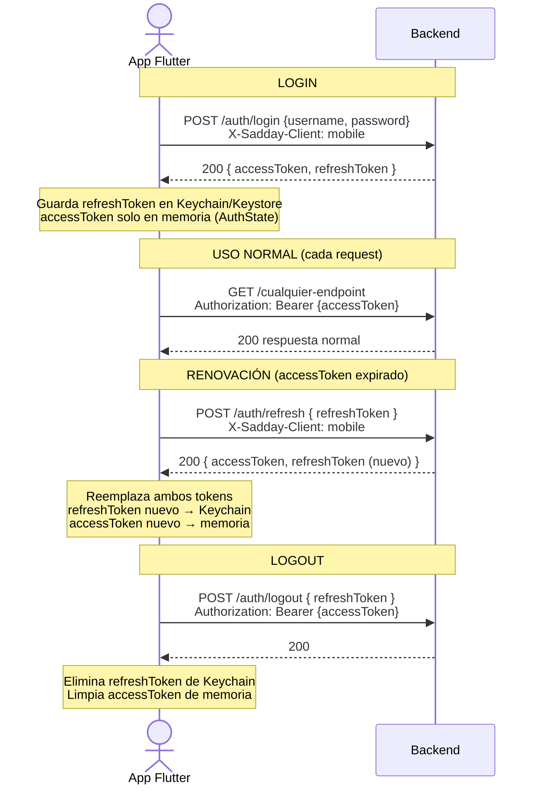

# FR-017: Flujo Nativo de Refresh Token para Mobile

**Fecha:** 2026-05-27
**Estado:** En progreso
**Módulo:** Backend + Mobile Flutter — Autenticación / Sesión
**Prioridad:** Alta
**Rama Git:** `feat/mobile-native-refresh-token`
**Relacionado con:** [Flujo 02 — Acceso al Sistema](../flujos/02-acceso-al-sistema.md) · [Flujo 17 — Segundo Factor Mobile](../flujos/17-segundo-factor-mobile.md)

---

## 1. Resumen Ejecutivo

Separar completamente los mecanismos de sesión de web y mobile. Hoy ambos clientes dependen de la cookie HttpOnly para transportar el refresh token, lo que obliga a la app Flutter a usar un `CookieJar` en disco (solución transitoria frágil). El objetivo es que mobile reciba el refresh token directamente en el body JSON, lo almacene en el Keychain/Keystore del dispositivo, y lo envíe explícitamente en cada renovación de sesión. Esto elimina la dependencia de cookies en mobile y eleva el nivel de seguridad del almacenamiento.

---

## 2. Motivación

### Problema actual

| Aspecto | Web (correcto) | Mobile (actual — transitorio) |
|---------|---------------|-------------------------------|
| Transporte del refresh token | Cookie `HttpOnly; Secure; SameSite=Strict` | Cookie HttpOnly gestionada por `PersistCookieJar` |
| Almacenamiento | Browser (cifrado, sandbox del SO) | Directorio de app en disco (no cifrado a nivel hardware) |
| Renovación de sesión | Browser envía cookie automáticamente | `CookieManager` de Dio adjunta cookie desde el jar |
| Logout | Cookie expirada por el backend + eliminada por browser | `deleteAll()` en el jar — no garantizado si falla la red |
| Resistencia a extracción | Alta (HttpOnly, browser sandbox) | Media (directorio privado de app, vulnerable en jailbreak) |

### Objetivo

| Aspecto | Mobile (objetivo) |
|---------|------------------|
| Transporte del refresh token | Body JSON en respuesta de login/refresh |
| Almacenamiento | iOS Keychain (`when_unlocked`) / Android Keystore (`EncryptedSharedPreferences`) |
| Renovación de sesión | App envía `{ refreshToken }` en body explícitamente |
| Logout | App envía `{ refreshToken }` para revocar + elimina de SecureStorage |
| Resistencia a extracción | Alta (Secure Enclave / hardware-backed keystore) |

---

## 3. Diseño Técnico

### 3.1 Detección del tipo de cliente

El backend detecta si el cliente es web o mobile mediante el header:
```
X-Sadday-Client: spa     → flujo cookie (web)
X-Sadday-Client: mobile  → flujo body (mobile)
```

Este header ya es validado como protección CSRF en `/auth/refresh` (ver `AuthController.VALID_CSRF_CLIENTS`).

### 3.2 Cambios en Backend

#### `LoginResponse.java` — nuevo campo opcional
```java
@JsonInclude(JsonInclude.Include.NON_NULL)
String refreshToken   // null para web, populated para mobile
```

#### `POST /auth/login` — bifurcación por cliente
```
X-Sadday-Client: spa    → comportamiento actual (Set-Cookie, sin refreshToken en body)
X-Sadday-Client: mobile → Set-Cookie NO se emite; refreshToken incluido en body JSON
```

#### `POST /auth/mfa/login` — misma bifurcación
```
X-Sadday-Client: mobile → refreshToken en body JSON
```

#### `POST /auth/country-challenge/verify` — misma bifurcación
```
X-Sadday-Client: mobile → refreshToken en body JSON
```

#### `POST /auth/refresh` — nuevo path para mobile
```
X-Sadday-Client: spa    → comportamiento actual (lee cookie, devuelve Set-Cookie)
X-Sadday-Client: mobile → lee { refreshToken } del body JSON
                          devuelve { accessToken, refreshToken } en body
                          NO emite Set-Cookie
```

Nuevo DTO de request para mobile:
```java
public record MobileRefreshRequest(
    @NotBlank String refreshToken
) {}
```

#### `POST /auth/logout` — revocación explícita para mobile
```
X-Sadday-Client: spa    → comportamiento actual (lee cookie refresh_token)
X-Sadday-Client: mobile → lee { refreshToken } del body y lo revoca
```

Nuevo DTO de request para mobile:
```java
public record MobileLogoutRequest(
    @NotBlank String refreshToken
) {}
```

> **Nota de seguridad:** La rotación de refresh tokens y la detección de reutilización (token theft detection) aplican igual para ambos flujos. El backend no hace distinción en la lógica de validación — solo en el transporte.

### 3.3 Cambios en Mobile (Flutter)

#### `SecureStorageService` — sin cambios estructurales
`saveRefreshToken` / `getRefreshToken` / `deleteRefreshToken` ya existen. Agregar opciones de seguridad:
```dart
iOptions: IOSOptions(accessibility: KeychainAccessibility.when_unlocked)
aOptions: AndroidOptions(encryptedSharedPreferences: true)
```

#### `auth_remote_data_source.dart`
- `login()` — extraer `refreshToken` del body y retornarlo junto al `accessToken`
- `verifyMfa()` — ídem
- `verifyCountryChallenge()` — ídem
- `refresh()` — enviar `{ refreshToken }` en body, retornar `{ accessToken, refreshToken }`
- `logout()` — enviar `{ refreshToken }` en body

#### `auth_repository.dart`
- Tras login exitoso: llamar `SecureStorageService.saveRefreshToken(refreshToken)`
- Propagar `refreshToken` a `AuthNotifier`

#### `auth_provider.dart`
- `build()`: leer `refreshToken` de SecureStorage → si null → `AuthUnauthenticated`; si existe → llamar `_doRefresh(refreshToken)`
- `_doRefresh(String refreshToken)`: enviar en body, recibir nuevo `refreshToken`, guardarlo en SecureStorage, actualizar state
- `logout()`: enviar `refreshToken` al backend + `deleteRefreshToken()` de SecureStorage

#### Eliminar dependencia de cookies
- `PersistCookieJar` ya no es necesario para la sesión
- `main_dev/staging/prod.dart`: remover inicialización de `PersistCookieJar` y override del provider
- `cookie_jar_provider.dart`: puede eliminarse o mantenerse en modo no-op
- `CookieManager` puede quitarse de los interceptores (el backend no enviará cookies para `mobile`)

### 3.4 Diagrama del flujo objetivo



---

## 4. Seguridad

### Propiedades del nuevo esquema

| Propiedad | Detalle |
|-----------|---------|
| **Almacenamiento** | iOS Keychain con `when_unlocked` — solo accesible con pantalla desbloqueada. Android Keystore con `encryptedSharedPreferences`. |
| **Transporte** | HTTPS siempre. El refresh token viaja en body JSON (no en header ni URL). |
| **Rotación** | El backend emite un nuevo `refreshToken` en cada renovación. El anterior queda revocado. |
| **Detección de robo** | Si el backend recibe un `refreshToken` ya revocado, revoca todos los tokens del usuario (comportamiento existente, sin cambios). |
| **Sin CSRF** | El body JSON no puede ser enviado por un site externo vía formulario HTML. El header `X-Sadday-Client: mobile` es un segundo factor de validación. |
| **Sin cookies** | Mobile no recibe ni almacena cookies. `CookieManager` puede eliminarse de los interceptores de Dio. |

### Riesgos residuales

| Riesgo | Mitigación |
|--------|------------|
| Jailbreak/Root — extracción del Keychain | `when_unlocked` dificulta la extracción en background. No hay protección absoluta en dispositivos comprometidos. |
| `refreshToken` capturado en tránsito | TLS obligatorio. Certificate pinning descartado — CA pública del sistema es suficiente para este perfil de amenaza (ver `mobile-security.md` G-04). |
| `accessToken` en memoria — crash dump | Tiempo de vida corto (15 min). Solo en memoria RAM, no en disco. |

---

## 5. Criterios de Aceptación

- [ ] `POST /auth/login` con `X-Sadday-Client: mobile` devuelve `{ accessToken, refreshToken }` en body; no emite `Set-Cookie`.
- [ ] `POST /auth/mfa/login` con `X-Sadday-Client: mobile` devuelve `{ accessToken, refreshToken }` en body.
- [ ] `POST /auth/country-challenge/verify` con `X-Sadday-Client: mobile` devuelve `{ accessToken, refreshToken }` en body.
- [ ] `POST /auth/refresh` con `X-Sadday-Client: mobile` acepta `{ refreshToken }` en body y devuelve `{ accessToken, refreshToken }` rotados; no emite `Set-Cookie`.
- [ ] `POST /auth/logout` con `X-Sadday-Client: mobile` acepta `{ refreshToken }` en body y lo revoca.
- [ ] El flujo web (`X-Sadday-Client: spa`) no tiene cambios de comportamiento en ningún endpoint.
- [ ] La app Flutter guarda el `refreshToken` en `SecureStorage` con `IOSOptions(accessibility: KeychainAccessibility.when_unlocked)` y `AndroidOptions(encryptedSharedPreferences: true)`.
- [ ] Cold start: la app lee el `refreshToken` de SecureStorage, llama a `/auth/refresh`, y restaura la sesión sin pedir credenciales.
- [ ] Logout: el `refreshToken` es revocado en el backend y eliminado de SecureStorage.
- [ ] El `PersistCookieJar` y su override en `ProviderScope` son eliminados.
- [ ] `dart analyze` sin warnings en los archivos modificados.
- [ ] Tests unitarios de `AuthNotifier` cubren: cold start con token válido, cold start sin token, refresh exitoso, refresh con token expirado, logout.

---

## 6. Plan de Implementación

### Fase 1 — Backend
1. Añadir campo `refreshToken` (nullable) a `LoginResponse`
2. Modificar `AuthController`: bifurcar `login`, `mfaLogin`, `countryChallenge`, `refresh`, `logout` según `X-Sadday-Client`
3. Crear DTOs `MobileRefreshRequest` y `MobileLogoutRequest`
4. Actualizar tests de integración de `AuthController`

### Fase 2 — Mobile
1. Actualizar `SecureStorageService` con opciones de seguridad correctas
2. Refactorizar `auth_remote_data_source` para los nuevos contratos
3. Refactorizar `auth_repository` y `auth_provider`
4. Eliminar `PersistCookieJar` de los entry points
5. Actualizar `LoginApiResponse` para incluir `refreshToken`

### Fase 3 — Documentación y limpieza
1. Actualizar diagramas de secuencia en `docs/security/diagramas/02_flujos_autenticacion.md`
2. Marcar solución transitoria como eliminada en `02-acceso-al-sistema.md`
3. Actualizar `docs/flutter-mobile-spec.md` sección de seguridad

---

## 7. Notas de Migración

Los usuarios con sesión activa en la app antes del deploy de esta feature perderán su sesión (el `PersistCookieJar` ya no se usa). Deberán volver a hacer login una vez. Esto es aceptable dado que:
- La sesión anterior dependía de un mecanismo transitorio menos seguro.
- El backend no necesita migración de datos (los refresh tokens existentes siguen válidos; simplemente el nuevo flujo los usará vía body en lugar de cookie).
