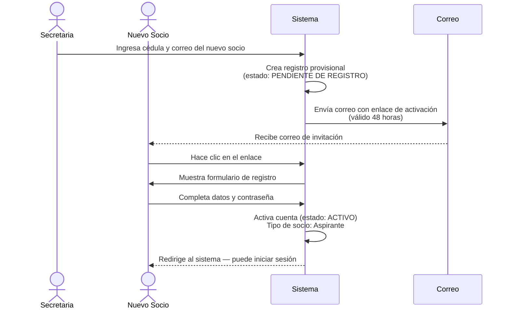
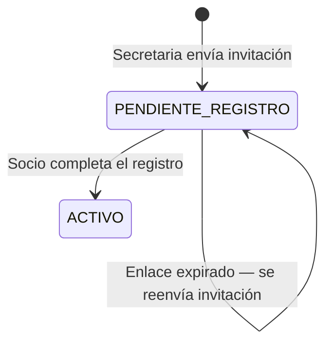

# Flujo 1 — Invitación y Registro de Socios

## ¿Qué es este flujo?

Cuando el club quiere dar de alta a una persona nueva, la secretaria (o el admin) no crea la cuenta directamente. En cambio, **envía una invitación** por correo electrónico. La persona recibe ese correo, hace clic en el enlace, y completa su propio registro con sus datos personales y una contraseña.

Esto garantiza que cada socio tenga control de su propia cuenta desde el primer momento.

---

## Historia de usuario

> **Como secretaria**, quiero invitar a un nuevo socio ingresando solo su cédula y correo electrónico, para que él mismo complete su registro y active su cuenta de forma segura.

---

## Paso a paso

### 1. La secretaria envía la invitación

Desde **Socios → Nuevo socio**, la secretaria ingresa:
- Cédula del socio
- Correo electrónico

El sistema crea un registro provisional con estado de acceso `PENDIENTE DE REGISTRO` y tipo de socio `Aspirante`. Luego envía automáticamente un correo con un **enlace de activación que expira en 48 horas**.

### 2. El socio completa su registro

El socio hace clic en el enlace del correo, que lo lleva a un formulario donde ingresa:
- Nombre y apellido
- Contraseña (elegida por él)
- Datos adicionales de su perfil

### 3. Activación automática

Al completar el formulario, el sistema:
1. Activa la cuenta con estado de acceso `ACTIVO`
2. Confirma el tipo de socio como `Aspirante`
3. Permite al socio iniciar sesión de inmediato

---

## Diagrama del flujo

---

## ¿Qué pasa si el enlace expira?

Si el socio no completa el registro en 48 horas, el enlace caduca. La secretaria puede **reenviar la invitación** desde el detalle del socio en el panel de administración. El estado del socio permanece como `PENDIENTE DE REGISTRO` hasta que complete el proceso.

---

## Estados durante el proceso

---

## Reglas de negocio importantes

| Regla | Detalle |
|-------|---------|
| La invitación no crea la contraseña | La secretaria nunca ve ni define la contraseña del socio |
| El enlace es de un solo uso | Una vez usado, no se puede reutilizar |
| La cédula debe ser única | No se puede invitar a alguien con una cédula ya registrada |
| Solo Secretaria o Admin pueden invitar | Un socio regular no puede agregar otros socios |
