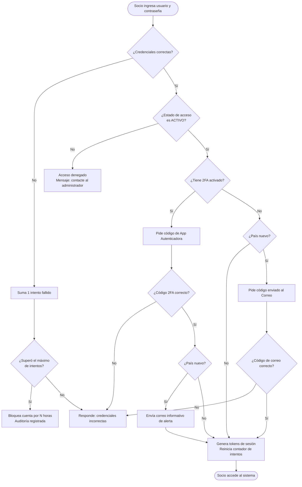
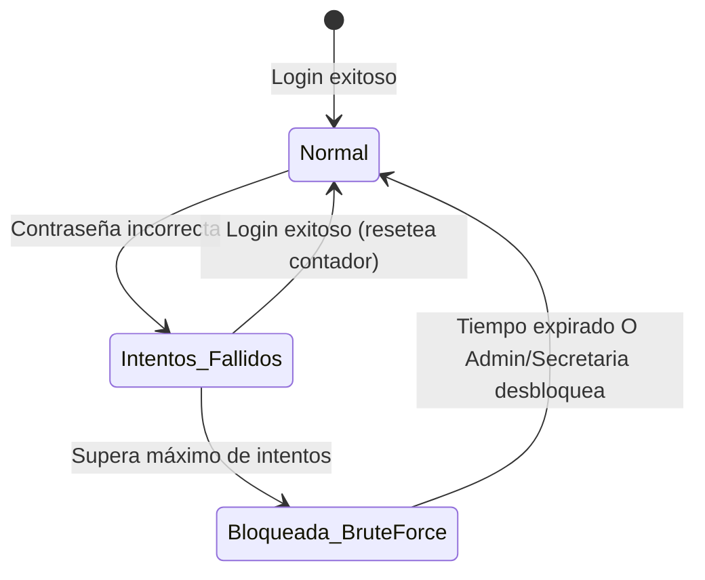

# Flujo 2 — Acceso al Sistema (Login)

## ¿Qué es este flujo?

Describe cómo un socio inicia sesión en la aplicación, qué verificaciones se realizan, qué pasa si falla el intento, y cómo funciona la autenticación de dos factores (2FA).

---

## Historia de usuario

> **Como socio**, quiero iniciar sesión con mi usuario y contraseña, para acceder a mis datos y a las actividades del club.

> **Como administrador**, quiero que el sistema bloquee automáticamente una cuenta tras varios intentos fallidos, para proteger el acceso ante intentos no autorizados.

---

## Paso a paso

### 1. Intento de login

El socio ingresa su **nombre de usuario** (o correo) y su **contraseña**.

El sistema verifica en orden:
1. ¿Existe el usuario?
2. ¿La contraseña es correcta?
3. ¿El estado de acceso de la cuenta es `ACTIVO`? (ver [Estados de Acceso](./03-estados-de-acceso.md))
4. ¿La cuenta no está bloqueada por intentos fallidos?

Si todo está bien, continúa. Si algo falla, registra el intento y puede bloquear la cuenta.

### 2. Verificación 2FA (Autenticación de dos factores)

Si el socio tiene activada la **autenticación de dos factores (2FA)**, luego de la contraseña debe ingresar el código temporal de 6 dígitos desde su aplicación autenticadora (Google Authenticator, Authy, etc.).

La 2FA es opcional para los socios generales pero altamente recomendada, especialmente para roles de Admin y Secretaria. Si el socio tiene 2FA habilitado, queda exento del bloqueo por país desconocido descrito en el siguiente paso.

### 3. Verificación de Ubicación (País Desconocido)

El sistema analiza automáticamente la dirección IP del socio durante el login. Si se detecta un inicio de sesión desde un **país diferente a los habituales** (historial de 90 días), se aplica una regla de seguridad dependiendo de si el usuario usa 2FA o no:

- **Si NO tiene 2FA activado:** El inicio de sesión se **pausa automáticamente**. El sistema envía un código temporal de 6 dígitos al correo electrónico registrado. El socio debe ingresar este código en la pantalla de "Verificación de Ubicación" (Globo Terráqueo) para poder entrar.
- **Si SÍ tiene 2FA activado:** El sistema le permite entrar directamente (ya que validó su identidad con su celular en el paso anterior), pero envía una **alerta informativa** al correo avisando que se detectó un inicio de sesión desde una nueva ubicación.

Además, independientemente del país, si se detecta un dispositivo (navegador/PC) completamente nuevo, se enviará una notificación por correo.

### 4. Sesión activa

Al ingresar correctamente, el sistema genera dos tokens:
- **Token de acceso** — dura 15 minutos, se usa en cada solicitud.
- **Token de refresco** — dura 30 días, renueva el token de acceso automáticamente sin que el socio tenga que volver a ingresar.

---

## Diagrama del flujo de login

---

## Bloqueo por intentos fallidos

Si un socio (o alguien que intenta adivinar su contraseña) falla más veces de las permitidas, la cuenta se **bloquea automáticamente** por un número de horas configurable.

Durante el bloqueo:
- El socio no puede iniciar sesión aunque tenga la contraseña correcta.
- La secretaria o el admin pueden **desbloquear manualmente** desde **Administración → Cuentas de acceso**.

> **Nota:** Este bloqueo es diferente al "Estado de Acceso". El bloqueo por intentos fallidos es automático y temporal. El Estado de Acceso lo gestiona manualmente la secretaria.

---

## Recuperación de contraseña

Si un socio olvidó su contraseña, puede solicitarla desde la pantalla de login. El sistema envía un correo con un enlace temporal para definir una nueva contraseña.

También la secretaria o el admin pueden **activar el proceso de recuperación** desde el perfil del socio.

---

## Cierre de sesión forzado

Desde **Administración → Cuentas de acceso**, la secretaria o el admin puede **cerrar todas las sesiones activas** de un socio. Esto invalida inmediatamente todos sus tokens, incluso en dispositivos móviles.

---

## Parámetros configurables

Los siguientes valores se pueden ajustar desde **Administración → Configuración**:

| Parámetro | Descripción | Valor por defecto |
|-----------|-------------|-------------------|
| Máximo de intentos fallidos | Cuántos fallos antes del bloqueo automático | 5 |
| Horas de bloqueo | Cuánto tiempo dura el bloqueo automático | 24 horas |
