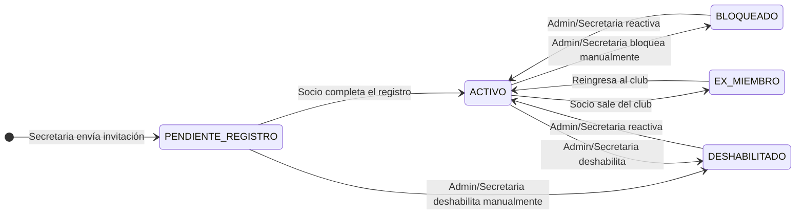
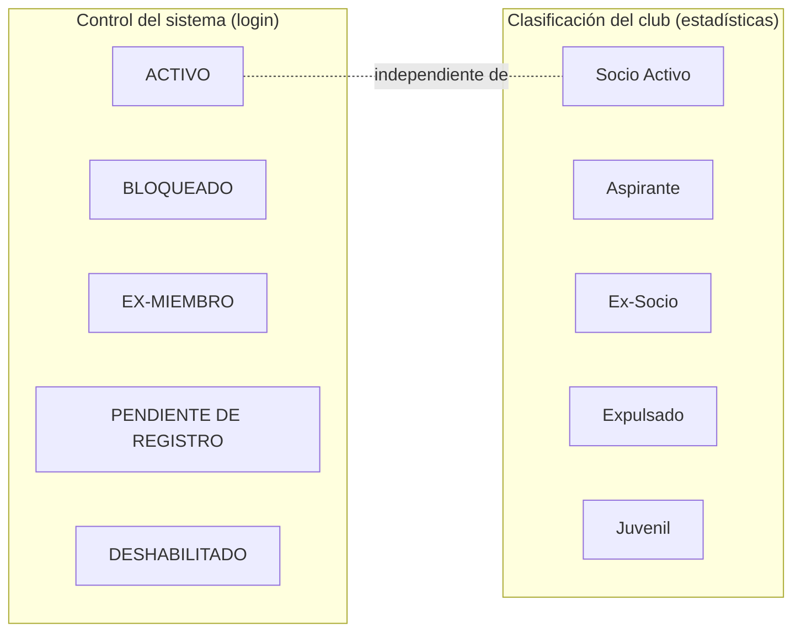

# Flujo 3 — Estados de Acceso al Sistema

## ¿Qué es un estado de acceso?

El **estado de acceso** determina si una persona puede o no iniciar sesión en la aplicación. Es independiente de su clasificación dentro del club (si es socio activo, aspirante, ex-socio, etc.).

Solo los socios con estado **ACTIVO** pueden ingresar al sistema.

---

## Los cinco estados

| Estado | ¿Puede entrar? | ¿Cuándo se usa? |
|--------|---------------|-----------------|
| `ACTIVO` | ✅ Sí | Cuenta normal, sin restricciones |
| `PENDIENTE DE REGISTRO` | ❌ No | Se envió la invitación pero el socio aún no completó el registro |
| `BLOQUEADO` | ❌ No | Bloqueado manualmente por la secretaria o admin (ej: mora, conflicto) |
| `EX-MIEMBRO` | ❌ No | Persona que dejó el club oficialmente |
| `DESHABILITADO` | ❌ No | Cuenta deshabilitada por razón técnica o administrativa |

---

## Diagrama de transiciones

---

## Historia de usuario

> **Como secretaria**, quiero poder restringir el acceso al sistema de un socio sin eliminarlo, para manejar situaciones como mora en cuotas o salida temporal del club.

> **Como administrador**, quiero que el sistema evite bloquear o deshabilitar cuentas de otros administradores, para garantizar que siempre haya al menos un administrador activo.

---

## ¿Cómo se cambia el estado?

Desde **Administración → Cuentas de acceso**, la secretaria o el admin puede cambiar el estado de acceso de cualquier socio usando el selector de la fila correspondiente.

El cambio:
- Aplica de inmediato.
- Cierra todas las sesiones activas del socio si el nuevo estado no es `ACTIVO`.
- Queda registrado en la auditoría.

---

## Protecciones del sistema

El sistema tiene reglas que no se pueden saltarse:

| Regla | Razón |
|-------|-------|
| Un **Admin nunca puede ser bloqueado o deshabilitado** | Garantiza que siempre haya acceso de emergencia al sistema |
| Siempre debe haber **al menos una Secretaria activa** | Evita dejar el club sin quien gestione el sistema |

---

## Diferencia entre "Bloqueado por intentos" y "Estado BLOQUEADO"

Es importante no confundirlos:

- **Bloqueado por intentos fallidos** — ocurre automáticamente cuando alguien falla el login muchas veces. Es temporal. Se muestra como una advertencia separada en la tabla de cuentas.
- **Estado BLOQUEADO** — es una restricción manual que pone la secretaria o el admin. No tiene tiempo de expiración automático.

Un socio puede estar en estado `ACTIVO` pero aún así tener el acceso bloqueado temporalmente por intentos fallidos. Ambas cosas se muestran por separado en la pantalla de administración.

---

## Clasificación del club vs. acceso al sistema

El sistema separa deliberadamente dos cosas:

La **clasificación del club** es para reportes y estadísticas internas. El **estado de acceso** es la llave que abre o cierra la puerta al sistema. La secretaria puede cambiarlos de forma independiente.
