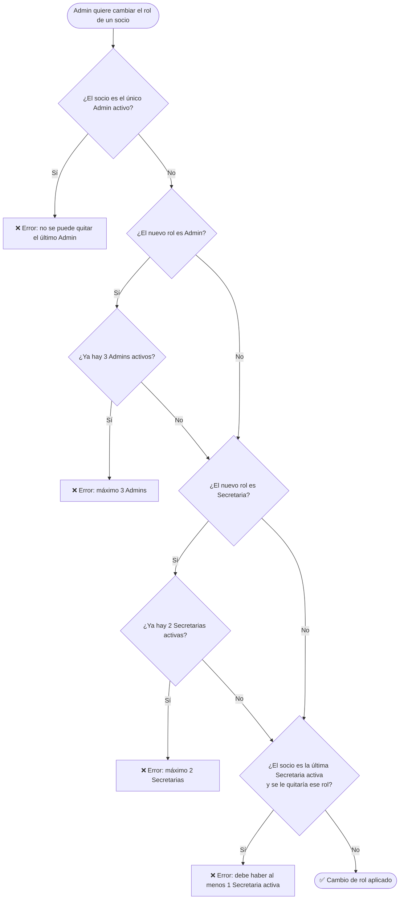

# Flujo 4 — Roles y Permisos

## ¿Qué es un rol?

Cada socio tiene un **rol en el sistema** que define qué puede ver y hacer dentro de la aplicación. El rol no es la misma cosa que el tipo de socio (ej: "Aspirante" o "Socio Activo") — ese es para el club. El rol es para el sistema.

---

## Los cuatro roles

### Admin
El acceso más alto. Sin restricciones operativas.

- Puede hacer todo lo que puede hacer la Secretaria.
- Es el único que puede **cambiar el rol** de un socio.
- Es el único que puede **eliminar** a un socio del sistema (acción irreversible).
- Su cuenta **nunca puede ser bloqueada ni deshabilitada** por otro usuario.

### Secretaria
El rol operativo principal del día a día del club.

- Invita nuevos socios (cédula + correo).
- Edita los datos de cualquier socio.
- Registra y elimina cuotas.
- Habilita e inhabilita socios para participar en salidas.
- Gestiona el estado de acceso al sistema de cualquier socio (excepto Admins).
- Crea, edita y elimina actas de reunión.
- Puede inscribir a otros socios en salidas.
- Puede forzar el cierre de sesión de cualquier cuenta.
- Accede al portal de administración (cuentas de acceso, configuración, auditoría).

### Directivo
Rol de gestión de actividades del club.

- Crea, edita y cancela salidas al calendario.
- Aprueba montañas y rutas propuestas por socios.
- Habilita e inhabilita socios.
- Puede inscribir a otros socios en salidas.
- Puede marcar a alguien como Jefe de Salida.
- Accede a estadísticas y reportes.

### Socio
El rol base de cualquier miembro registrado.

- Ve el calendario de salidas y actividades.
- Se inscribe en salidas (con validación de nivel técnico).
- Puede proponer nuevas montañas o rutas (sujetas a aprobación).
- Ve y edita su propio perfil (solo datos personales).
- Ve su historial de salidas y estadísticas propias.

---

## Tabla de permisos

| Acción | Admin | Secretaria | Directivo | Socio |
|--------|:-----:|:----------:|:---------:|:-----:|
| Cambiar rol de un socio | ✅ | ❌ | ❌ | ❌ |
| Invitar nuevo socio | ✅ | ✅ | ❌ | ❌ |
| Editar datos de un socio | ✅ | ✅ | ❌ | Solo el propio |
| Registrar / eliminar cuotas | ✅ | ✅ | ❌ | ❌ |
| Habilitar / Inhabilitar socio | ✅ | ✅ | ✅ | ❌ |
| Cambiar estado de acceso al sistema | ✅ | ✅ | ❌ | ❌ |
| Crear / editar salidas | ✅ | ✅ | ✅ | ❌ |
| Cambiar estado de una salida | ✅ | ❌ | ✅ | ❌ |
| Inscribir a otros socios en salidas | ✅ | ✅ | ✅ | ❌ |
| Inscribirse en salidas | ✅ | ✅ | ✅ | ✅ |
| Gestionar actas de reunión | ✅ | ✅ | ❌ | ❌ |
| Ver auditoría del sistema | ✅ | ✅ | ❌ | ❌ |
| Desbloquear cuenta (brute-force) | ✅ | ❌ | ❌ | ❌ |
| Eliminar socio | ✅ | ❌ | ❌ | ❌ |
| Actualizar nivel técnico | ✅ | ✅ | ✅ | ❌ |
| Aprobar montañas y rutas | ✅ | ✅ | ✅ | ❌ |
| Proponer montañas o rutas | ✅ | ✅ | ✅ | ✅ |

---

## Restricciones del sistema al cambiar roles

El sistema impone límites automáticos para evitar dejar el club sin gestión:

---

## Límites por rol

| Rol | Máximo en el sistema |
|-----|---------------------|
| Admin | 3 activos |
| Secretaria | 2 activas |
| Directivo | Sin límite |
| Socio | Sin límite |

---

## Historia de usuario

> **Como administrador**, quiero ser el único que puede cambiar roles, y que el sistema me impida dejar al club sin Secretaria activa o sin Admin, para garantizar la continuidad operativa.

---

## ¿Cómo se cambia el rol de alguien?

Desde el perfil del socio en **Socios → [nombre] → pestaña Datos**, el Admin puede cambiar el rol desde un selector. El cambio aplica de inmediato y queda registrado en la auditoría.
