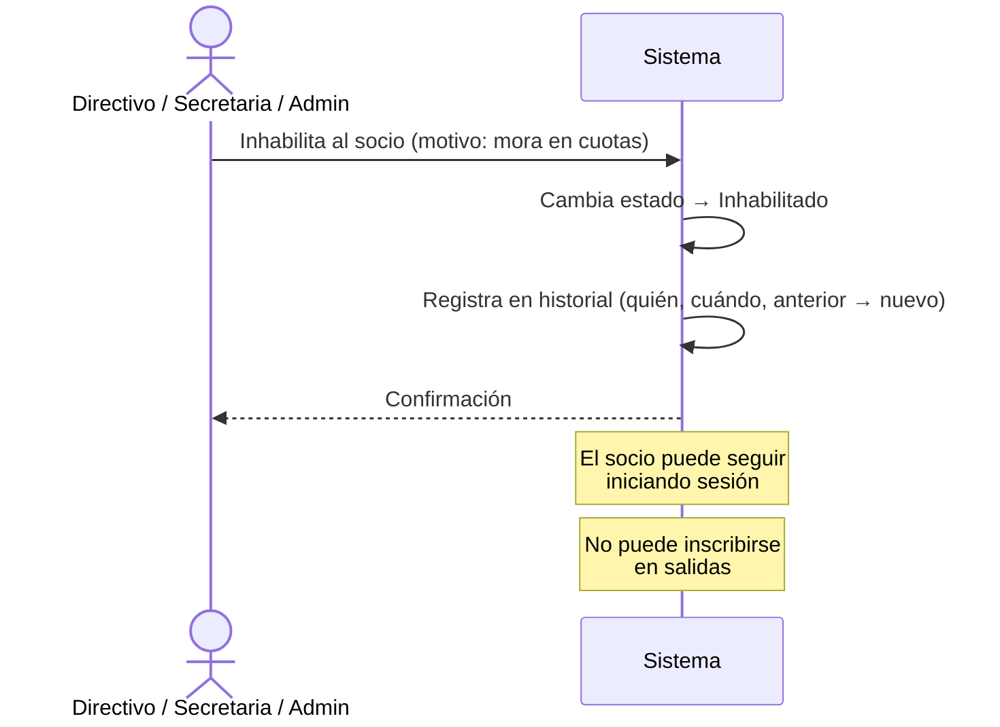
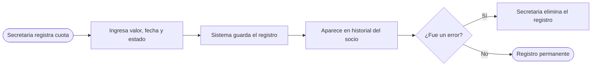
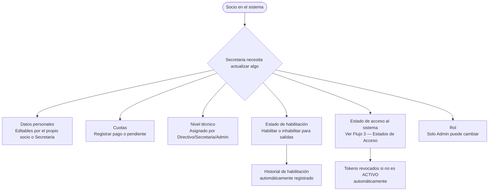

# Flujo 5 — Gestión de Socios

## ¿Qué cubre este flujo?

Todo lo relacionado con el ciclo de vida de un socio una vez que ya está registrado en el sistema: editar datos, manejar cuotas, habilitar o inhabilitar para salidas, asignar nivel técnico, y ver el historial.

---

## Historia de usuario

> **Como secretaria**, quiero tener una vista completa del perfil de cada socio con sus datos, cuotas e historial, para gestionar el club desde un solo lugar.

> **Como directivo**, quiero poder inhabilitar a socios que no estén al día con sus cuotas, para que el sistema les impida inscribirse en salidas.

---

## Datos de un socio

Cada socio tiene dos tipos de datos:

**Datos personales** (editables por el propio socio o por Secretaria/Admin):
- Nombre, apellido, cédula, correo, teléfono, dirección
- Fecha de nacimiento, tipo de sangre
- Contactos de emergencia (hasta 2)

**Clasificación del club** (editable por Secretaria/Admin/Directivo):
- Tipo de socio (Activo, Aspirante, Ex-Socio, etc.)
- Estado de habilitación (Habilitado, Inhabilitado, Socio Vitalicio)
- Nivel técnico (para salidas con requisitos mínimos)
- Rol en el sistema (solo Admin puede cambiar)

---

## Habilitación e inhabilitación

La **habilitación** controla si un socio puede inscribirse en salidas. Es independiente del acceso al sistema.

Un socio **inhabilitado** puede seguir iniciando sesión y viendo la aplicación, pero **no puede inscribirse** en salidas (si el sistema tiene activado el bloqueo de inhabilitados en configuración).

| Estado | ¿Puede iniciar sesión? | ¿Puede inscribirse en salidas? |
|--------|:----------------------:|:-------------------------------:|
| Habilitado | ✅ | ✅ |
| Inhabilitado | ✅ | ❌ (si el bloqueo está activo) |
| Socio Vitalicio | ✅ | ✅ (no puede ser inhabilitado) |

### ¿Quién puede habilitar o inhabilitar?
Admin, Secretaria y Directivo. **No se puede inhabilitar a un Admin ni a una Secretaria.**

### Historial de habilitación
Cada cambio de estado queda registrado con: quién lo hizo, cuándo, y el estado anterior y nuevo. Se puede consultar en el perfil del socio → pestaña **Historial**.

---

## Cuotas

La secretaria o el admin pueden registrar el historial de pagos de cuotas de cada socio.

Cada registro de cuota tiene:
- **Valor** en dólares
- **Fecha** del pago
- **Estado**: Pagado o Pendiente
- **Registrado por**: quién lo cargó al sistema

Las cuotas se pueden eliminar si fueron registradas por error. No hay cálculo automático de deudas — es un registro histórico simple.

---

## Nivel técnico

El nivel técnico indica la experiencia del socio en montañismo. Aplica cuando se crean salidas con un **nivel mínimo requerido**.

Los niveles están ordenados de menor a mayor dificultad. Si un socio intenta inscribirse en una salida para la que no tiene el nivel suficiente, su inscripción queda en estado **PENDIENTE DE APROBACIÓN** hasta que un Directivo o el Jefe de Salida la apruebe.

Quien puede asignar o cambiar el nivel técnico: Admin, Secretaria, Directivo.

---

## Flujo completo del perfil de un socio

---

## Eliminación de un socio

Solo el **Admin** puede eliminar un socio del sistema. Esta acción es **permanente** e irreversible.

En la mayoría de los casos es mejor cambiar el estado de acceso a `EX-MIEMBRO` o `DESHABILITADO` en lugar de eliminar, para conservar el historial de participación.

---

## Invitar a un socio que dejó el club y vuelve

Si un ex-miembro quiere reingresar al club, la secretaria puede cambiar su estado de acceso de `EX-MIEMBRO` a `ACTIVO` directamente desde **Administración → Cuentas de acceso**, sin necesidad de crear una cuenta nueva.
