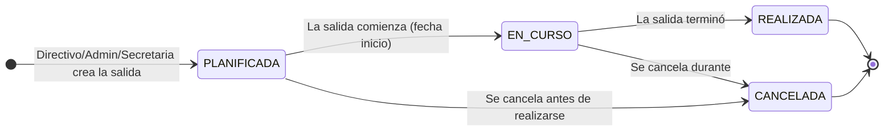
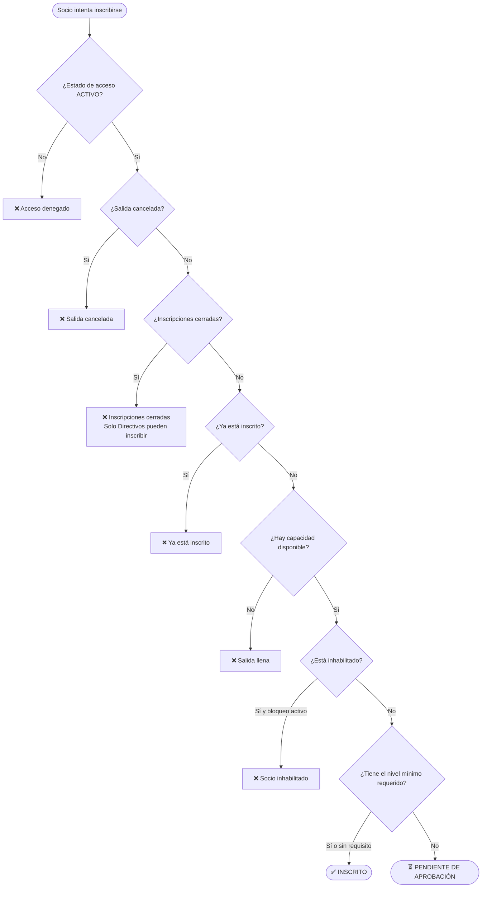
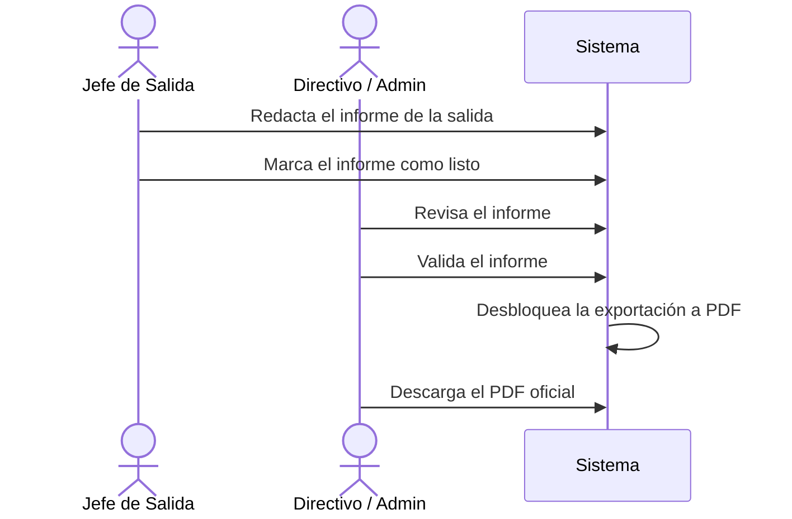
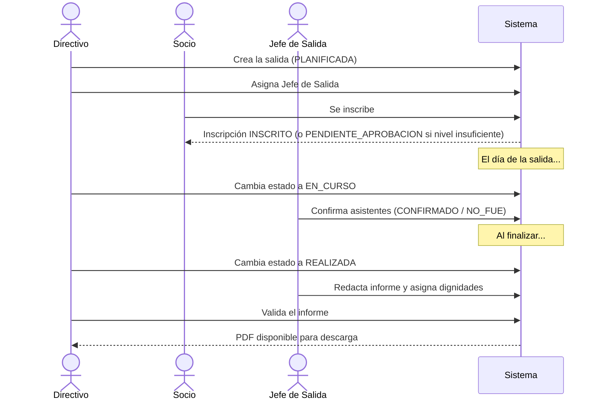

# Flujo 6 — Salidas e Inscripciones

## ¿Qué es una salida?

Una **salida** es una actividad del club: una excursión de montaña, trekking, escalada o ciclismo. Tiene una fecha, una ruta, una capacidad máxima y puede requerir un nivel técnico mínimo para inscribirse.

---

## Historia de usuario

> **Como directivo**, quiero crear salidas en el calendario con todos los datos necesarios (ruta, fechas, nivel mínimo), para que los socios puedan inscribirse.

> **Como socio**, quiero inscribirme en una salida y saber si mi nivel técnico es suficiente, para participar en las actividades del club.

> **Como jefe de salida**, quiero poder confirmar la asistencia de los participantes y generar el informe al finalizar, para dejar registro oficial de la actividad.

---

## Ciclo de vida de una salida

| Estado | Descripción |
|--------|-------------|
| `PLANIFICADA` | Publicada, acepta inscripciones |
| `EN_CURSO` | La salida está sucediendo |
| `REALIZADA` | Terminó. Solo Admin/Directivo pueden cambiar a este estado |
| `CANCELADA` | Cancelada. No acepta más inscripciones |

---

## Tipos de actividad

Una salida puede ser de cuatro tipos:

| Tipo | Descripción |
|------|-------------|
| **Alpinismo** | Ascenso a cumbres. Puede requerir nivel técnico alto |
| **Trekking** | Caminatas y senderismo |
| **Escalada** | Escalada en roca o hielo |
| **Ciclismo** | Salidas en bicicleta |

---

## Crear una salida

**¿Quién puede crear salidas?** Admin, Secretaria, Directivo.

Al crear una salida se define:
- Nombre
- Fechas de inicio y fin
- Hora de encuentro en el club
- Ruta y montaña
- Tipo de actividad
- Formato de salida (ej: salida de un día, campamento)
- Público objetivo (ej: todos, solo avanzados)
- Capacidad máxima de participantes
- Nivel técnico mínimo requerido (opcional)

El sistema avisa si las fechas se solapan con otra salida ya planificada.

---

## Inscripción de socios

### ¿Quién puede inscribirse?
Cualquier socio autenticado con estado de acceso `ACTIVO`.

### ¿Quién puede inscribir a otros?
Admin, Secretaria, Directivo y el Jefe de Salida asignado.

### Validaciones al inscribirse

---

## Estados de inscripción

| Estado | ¿Qué significa? |
|--------|-----------------|
| `PENDIENTE_APROBACION` | Nivel insuficiente, espera aprobación de un Directivo o el Jefe de Salida |
| `INSCRITO` | Inscripción confirmada |
| `CONFIRMADO` | El participante confirmó su asistencia (día de la salida) |
| `CANCELADO` | El socio canceló su inscripción |
| `NO_FUE` | Estaba inscrito pero no asistió |

---

## Nivel técnico y aprobación

Si una salida requiere nivel mínimo (ej: nivel 3 — Intermedio) y un socio tiene un nivel inferior o no tiene nivel asignado, su inscripción queda en **PENDIENTE DE APROBACIÓN**.

Un Directivo o el Jefe de Salida puede:
- **Aprobar** la inscripción (pasa a `INSCRITO`)
- **Rechazar** la inscripción (pasa a `CANCELADO`)

Esto permite que socios aspirantes con experiencia informal participen bajo la responsabilidad de quien aprueba.

---

## Dignidades

Durante o después de la salida, el Jefe de Salida puede asignar **dignidades** a los participantes. Son roles o reconocimientos dentro de esa salida específica:

- **Jefe de Salida** — quien lideró la actividad
- **Guía** — guió técnicamente el grupo
- **Escoba** — fue el último del grupo, cuidó que nadie se quedara atrás
- (y otras que el club defina)

Las dignidades quedan registradas en el historial de cada socio y se contabilizan en sus estadísticas.

---

## Cierre de una salida: informe

Al terminar la salida, el Jefe de Salida redacta el **informe de la salida** dentro del sistema:

1. Describe lo que ocurrió (texto con formato markdown).
2. Confirma o ajusta los participantes y sus dignidades.
3. Indica si la cima fue alcanzada.

El informe luego debe ser **validado** por un Directivo o Admin. Solo cuando está validado puede exportarse como **PDF oficial**.

---

## Cancelar una salida

**¿Quién puede cancelar?** Admin, Secretaria, Directivo.

Al cancelar se debe ingresar un **motivo**. La cancelación:
- Cierra automáticamente las inscripciones.
- No elimina los registros — la salida queda con estado `CANCELADA`.
- Queda registrada en la auditoría con quién la canceló y cuándo.

Una salida `REALIZADA` **no puede** ser cancelada.

---

## Diagrama completo del ciclo salida → inscripción → informe

