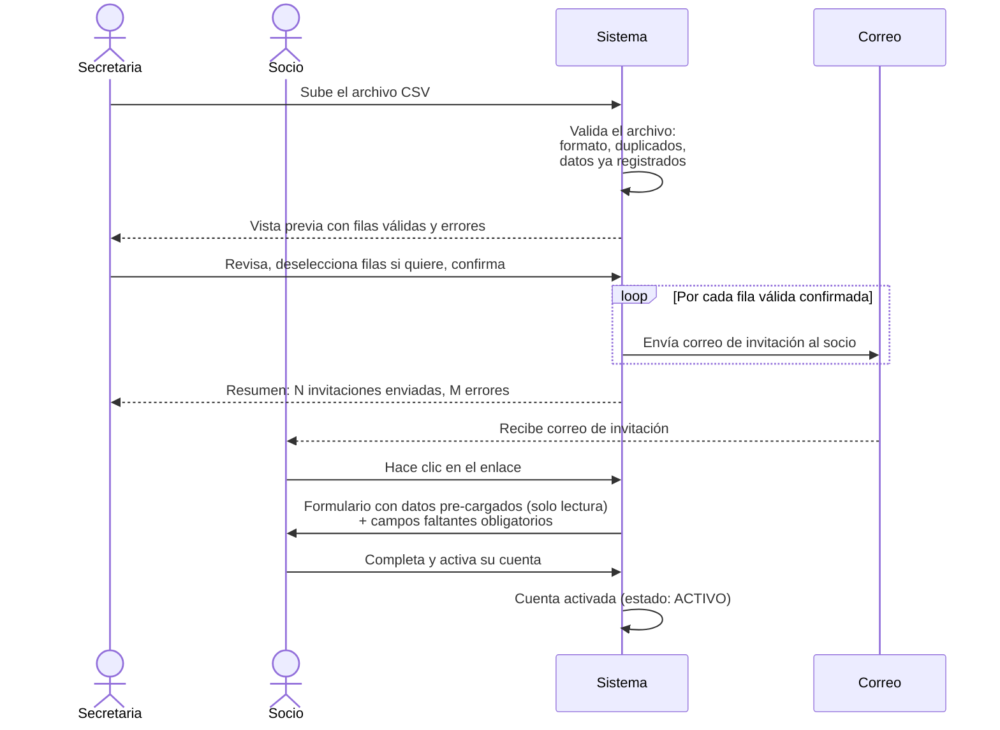
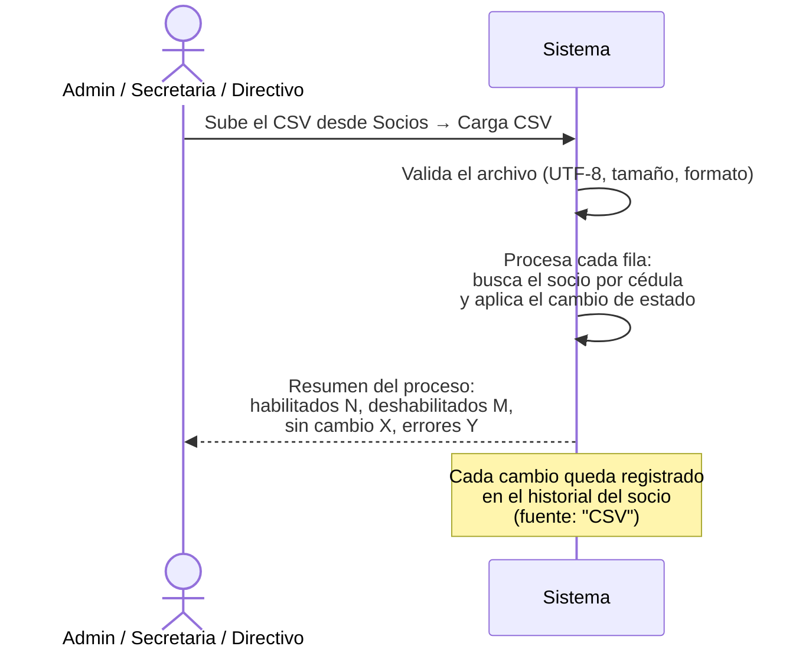
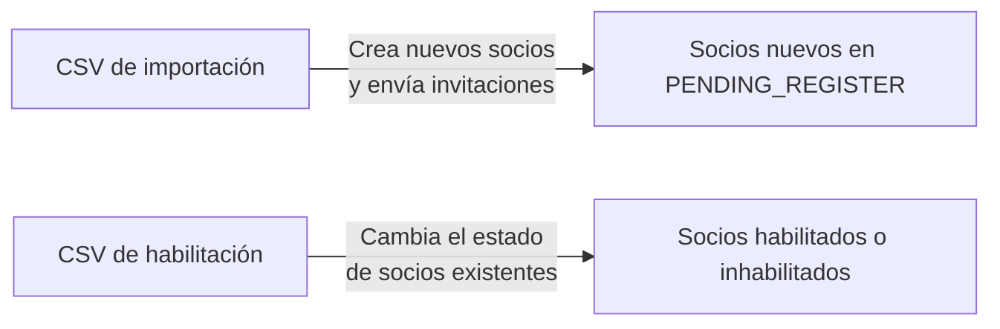

# Flujo 7 — Cargas Masivas desde CSV

## ¿Qué son las cargas masivas?

El sistema permite dos tipos de operaciones masivas mediante archivos CSV, útiles cuando hay muchos socios que procesar a la vez:

| Operación | ¿Para qué sirve? | ¿Quién puede hacerlo? |
|-----------|-----------------|----------------------|
| **Importar socios** | Dar de alta a varios socios existentes del club que aún no están en el sistema | Admin, Secretaria |
| **Carga de habilitación** | Cambiar el estado habilitado/inhabilitado de varios socios a la vez | Admin, Secretaria, Directivo |

Ambas operaciones están disponibles en **Socios** desde los botones en la parte superior de la pantalla.

---

## Operación 1 — Importar socios existentes

### ¿Cuándo usar esto?

Cuando el club ya tiene socios registrados en planillas físicas o en otro sistema, y se quiere incorporarlos a la plataforma sin tener que invitarlos uno por uno.

### Historia de usuario

> **Como secretaria**, quiero subir un archivo CSV con los datos de los socios existentes del club para que el sistema les envíe automáticamente su correo de activación, sin tener que agregarlos uno por uno.

### Datos que va en el CSV

| Columna | ¿Obligatorio? | Ejemplo |
|---------|:------------:|---------|
| `cedula` | ✅ | `1712345678` |
| `nombre` | ✅ | `Juan Carlos` |
| `apellido` | ✅ | `Pérez Rodríguez` |
| `correo` | ✅ | `juan@gmail.com` |
| `telefono` | No | `0991234567` |
| `tipoSocio` | No | `Activo` |
| `nivelTecnico` | No | `Intermedio` |

Ejemplo de archivo:
```
cedula,nombre,apellido,correo,telefono,tipoSocio,nivelTecnico
1712345678,Juan Carlos,Pérez,juan@gmail.com,0991234567,Activo,Intermedio
0912345678,María,González,maria@gmail.com,,Activo,
1809876543,Pedro,Suárez,pedro@gmail.com,0987654321,Aspirante,
```

### ¿Qué datos completa el socio al activar?

Cuando el socio recibe el correo y activa su cuenta, el sistema ya tiene sus datos del CSV pre-cargados. Le pide que complete los datos faltantes, que son **obligatorios**:

- Fecha de nacimiento
- Dirección
- Nombre y teléfono del contacto de emergencia
- Contraseña

El nombre, apellido, cédula, tipo de socio y nivel técnico aparecen como solo lectura — el socio los ve pero no puede cambiarlos.

### Paso a paso



### Vista previa antes de confirmar

El sistema no envía los correos de inmediato. Primero muestra una **vista previa** con:
- Filas válidas listas para importar (con checkbox para deseleccionar individualmente)
- Filas con errores que no se importarán (y el motivo del error)

Solo al confirmar se envían los correos.

### Errores comunes y cómo resolverlos

| Error | Causa | Solución |
|-------|-------|----------|
| `Cédula ya registrada en el sistema` | El socio ya tiene cuenta | No es necesario importarlo |
| `Correo ya registrado en el sistema` | El correo está en uso | Verificar si ya tiene cuenta con otro correo |
| `Cédula duplicada en el CSV` | La misma cédula aparece dos veces en el archivo | Revisar y eliminar la fila duplicada |
| `Tipo de socio no reconocido` | El valor no coincide con los tipos del sistema | Usar exactamente: `Activo`, `Aspirante`, `Ex-Socio`, etc. |
| `Nivel técnico no reconocido` | El valor no coincide con los niveles del sistema | Verificar los nombres exactos en la plataforma |

### Reglas de negocio

- El archivo debe ser `.csv` en codificación **UTF-8**, máximo 500 KB.
- Si el CSV tiene una cédula o correo que ya existe en la BD, esa fila se marca como error pero las demás se procesan igual.
- El enlace de activación que recibe el socio **expira en 72 horas**. Si no activa a tiempo, la secretaria puede reenviar la invitación desde el perfil del socio.
- Los socios importados quedan en estado `PENDIENTE DE REGISTRO` hasta que completen el registro.

---

## Operación 2 — Carga de habilitación (CSV)

### ¿Cuándo usar esto?

Cuando hay que habilitar o inhabilitar a muchos socios a la vez. El caso más común es al inicio de cada año o período: la secretaria exporta la lista de socios desde su sistema de cuotas y sube el CSV para actualizar el estado de todos de un golpe.

### Historia de usuario

> **Como secretaria**, quiero subir un archivo CSV con el estado de habilitación de todos los socios para actualizar masivamente quién está al día y quién no, sin tener que hacerlo uno por uno.

### Datos que va en el CSV

| Columna | ¿Obligatorio? | Valores aceptados |
|---------|:------------:|------------------|
| `cedula` | ✅ | Número de cédula |
| `estado` | ✅ | `Habilitado` o `Deshabilitado` |
| `nombre` | No | Se usa solo para identificar visualmente |
| `notas` | No | Motivo del cambio (ej: "Mora en cuotas") |

Ejemplo de archivo:
```
Nombre,Cedula,Estado,Notas
Juan Pérez,1712345678,Habilitado,Al día
María González,0912345678,Deshabilitado,Mora en cuotas
Pedro Suárez,1809876543,Habilitado,
```

> **Nota:** Las columnas pueden estar en cualquier orden y con variaciones de mayúsculas/minúsculas. El sistema identifica las columnas por nombre.

### Paso a paso



### Resultado de la operación

El sistema devuelve un resumen con cuántos socios fueron:
- **Habilitados** — estaban inhabilitados y ahora están habilitados
- **Deshabilitados** — estaban habilitados y ahora están inhabilitados
- **Sin cambio** — el estado ya era el correcto
- **Errores** — fila no procesada (cédula no encontrada, formato inválido, etc.)

### Reglas de negocio

- El archivo debe ser `.csv` en codificación **UTF-8**, máximo 500 KB, máximo 1.000 filas.
- Si Excel agrega el BOM (marca de orden de bytes) al guardar como CSV, el sistema lo elimina automáticamente.
- Los **Socios Vitalicios** no pueden ser inhabilitados — su fila se salta con un mensaje de error.
- Los socios con rol **Admin** o **Secretaria** no pueden ser inhabilitados mediante CSV (protección del sistema).
- Cada cambio queda registrado en el historial de habilitación del socio con la fuente `CSV`.
- La operación no tiene vista previa — se aplica directamente. Si hubo un error masivo, hay que subir un CSV corregido.

### Diferencia entre los dos CSV



| | CSV de importación | CSV de habilitación |
|--|:-----------------:|:-------------------:|
| ¿Crea socios? | ✅ Sí | ❌ No |
| ¿Modifica socios existentes? | ❌ No | ✅ Sí |
| ¿Envía correos? | ✅ Sí (invitación) | ❌ No |
| ¿Tiene vista previa? | ✅ Sí | ❌ No |
| ¿Quién puede usarlo? | Admin, Secretaria | Admin, Secretaria, Directivo |
