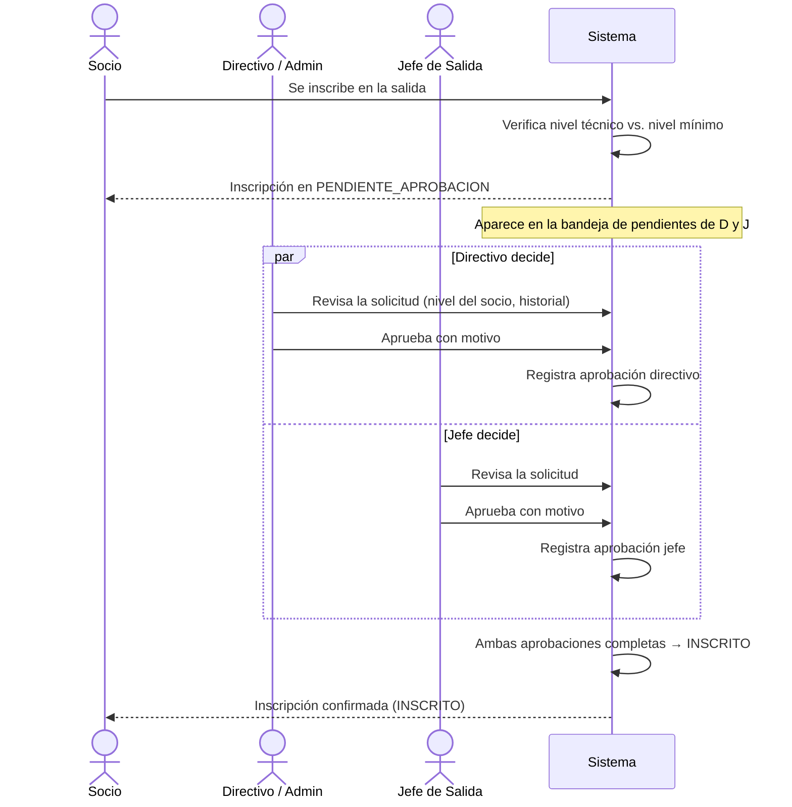
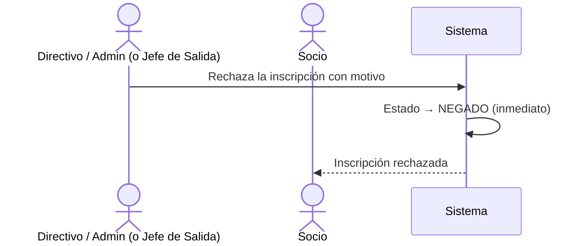
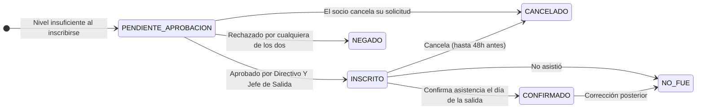

# Flujo 8 — Aprobaciones de Inscripción por Nivel Técnico

## ¿Qué es una aprobación de inscripción?

Cuando una salida requiere un nivel técnico mínimo (ej: nivel 3 — Avanzado) y un socio quiere inscribirse sin tener ese nivel, el sistema no lo rechaza automáticamente. En cambio, deja la inscripción en **espera** y avisa a las personas responsables para que decidan si el socio puede participar bajo su responsabilidad.

Este mecanismo existe porque el nivel técnico registrado en el sistema puede no reflejar la experiencia real de un socio. El Directivo y el Jefe de Salida son quienes mejor conocen a los participantes y pueden tomar esa decisión.

---

## Historia de usuario

> **Como socio**, quiero inscribirme en una salida aunque no tenga el nivel mínimo requerido, para que el Directivo o Jefe de Salida evalúen si puedo participar.

> **Como directivo**, quiero ver qué inscripciones están pendientes de aprobación por nivel insuficiente, para revisar cada caso y decidir con fundamento.

> **Como jefe de salida**, quiero aprobar o rechazar a los participantes con nivel insuficiente en mi salida, para garantizar la seguridad del grupo.

---

## ¿Cuándo se activa este flujo?

La inscripción queda en `PENDIENTE_APROBACION` cuando se cumplen **las dos condiciones**:

1. La salida tiene un **nivel técnico mínimo** configurado.
2. El socio tiene un nivel **inferior** al mínimo, o directamente **no tiene nivel asignado**.

Si la salida no tiene nivel mínimo, o el socio lo cumple, la inscripción pasa directamente a `INSCRITO`.

---

## Regla de doble aprobación

Para que una inscripción pase de `PENDIENTE_APROBACION` a `INSCRITO` se necesita la aprobación de **dos personas independientes**:

| Quién | Rol |
|-------|-----|
| Un **Directivo o Admin** | Firma la aprobación institucional |
| El **Jefe de Salida** | Firma la aprobación operativa |

Ambas firmas son necesarias. Si solo una persona aprueba, la inscripción sigue en `PENDIENTE_APROBACION`.

> **Caso especial:** si el Directivo que aprueba _también_ es el Jefe de Salida asignado a esa salida, puede firmar en ambos slots en una sola acción y la inscripción pasa directamente a `INSCRITO`.

### Negación inmediata

Cualquiera de los dos (Directivo/Admin o Jefe de Salida) puede **negar** la inscripción en cualquier momento. La negación es inmediata — no requiere la confirmación del otro. La inscripción pasa a `NEGADO`.

En ambos casos (aprobación o negación), el **motivo es obligatorio**.

---

## Diagrama del flujo completo

### Si alguno niega:

---

## Estados de inscripción relacionados

| Estado | Descripción |
|--------|-------------|
| `PENDIENTE_APROBACION` | Esperando decisión de Directivo y Jefe de Salida |
| `INSCRITO` | Ambas aprobaciones completadas (o nivel suficiente desde el inicio) |
| `NEGADO` | Rechazado. Estado final — no se puede revertir |
| `CANCELADO` | El socio retiró su solicitud |

---

## Bandeja de aprobaciones pendientes

Directivos/Admin y Jefes de Salida tienen acceso a una lista de inscripciones que esperan su aprobación. La lista que ve cada uno es distinta:

| Quién ve | ¿Qué muestra? |
|----------|---------------|
| **Directivo / Admin** | Todas las inscripciones en `PENDIENTE_APROBACION` donde aún no ha aprobado ningún Directivo |
| **Jefe de Salida** | Inscripciones en `PENDIENTE_APROBACION` en sus propias salidas donde aún no ha aprobado el Jefe |

Por cada solicitud pendiente se muestra:
- Nombre y apellido del socio
- Nivel técnico del socio (puede ser "sin nivel asignado")
- Nivel mínimo requerido por la salida
- Nombre y fecha de la salida
- Si el otro rol ya aprobó o no

---

## Revocar una aprobación ya dada

Si alguien aprueba por error, puede **revocar su propia aprobación** siempre que la inscripción esté en `PENDIENTE_APROBACION` o en `INSCRITO`.

- Si la inscripción estaba en `INSCRITO` (ambas aprobaciones completas), al revocar **vuelve a `PENDIENTE_APROBACION`** automáticamente.
- Cada rol solo puede revocar su propia aprobación: el Directivo revoca la del slot directivo; el Jefe revoca la del slot jefe.

---

## ¿El socio ocupa un cupo al inscribirse?

**Sí.** Una inscripción en `PENDIENTE_APROBACION` **cuenta para el aforo** de la salida igual que una inscripción confirmada. Esto evita que la salida se llene mientras hay solicitudes pendientes que probablemente se aprueben.

Si la solicitud es negada o el socio cancela, el cupo se libera.

---

## El socio puede cancelar su solicitud

Mientras la inscripción está en `PENDIENTE_APROBACION`, el socio puede **cancelarla en cualquier momento** sin restricción de tiempo (es solo una solicitud, no un compromiso confirmado).

Una vez aprobado (`INSCRITO`), el plazo de cancelación es de hasta **48 horas antes** del inicio de la salida.

---

## Resumen de permisos

| Acción | Quién puede |
|--------|------------|
| Inscribirse en salida con nivel insuficiente | Cualquier socio ACTIVO |
| Aprobar la inscripción (slot directivo) | Admin, Directivo |
| Aprobar la inscripción (slot jefe) | Jefe de Salida asignado |
| Negar la inscripción | Admin, Directivo, Jefe de Salida |
| Revocar aprobación propia | Admin, Directivo (slot directivo) / Jefe de Salida (slot jefe) |
| Ver la bandeja de pendientes | Admin, Directivo, Jefe de Salida |
| Cancelar su propia solicitud pendiente | El socio mismo |

---

## Reglas de negocio

- El **motivo es obligatorio** al aprobar o negar — queda registrado en el historial de auditoría.
- La negación es **irreversible** — no existe la transición de `NEGADO` a ningún otro estado.
- Si el Directivo que firma también es Jefe de Salida, **cubre ambos slots** en una sola acción.
- Si la salida no tiene nivel mínimo configurado, este flujo **no se activa** — toda inscripción va directamente a `INSCRITO`.
- Si el socio no tiene nivel asignado en el sistema, se trata como si tuviera nivel insuficiente para cualquier salida con requisito.
