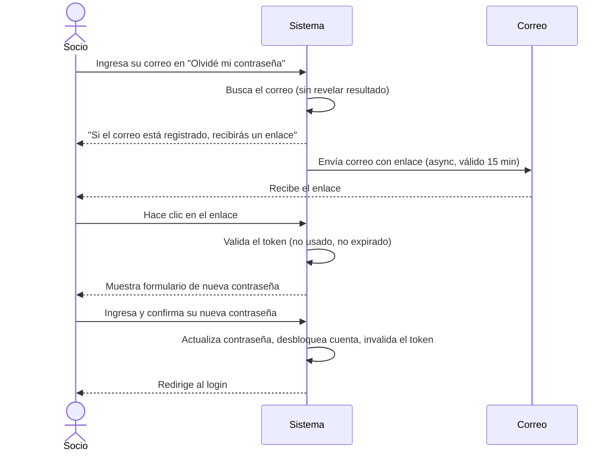
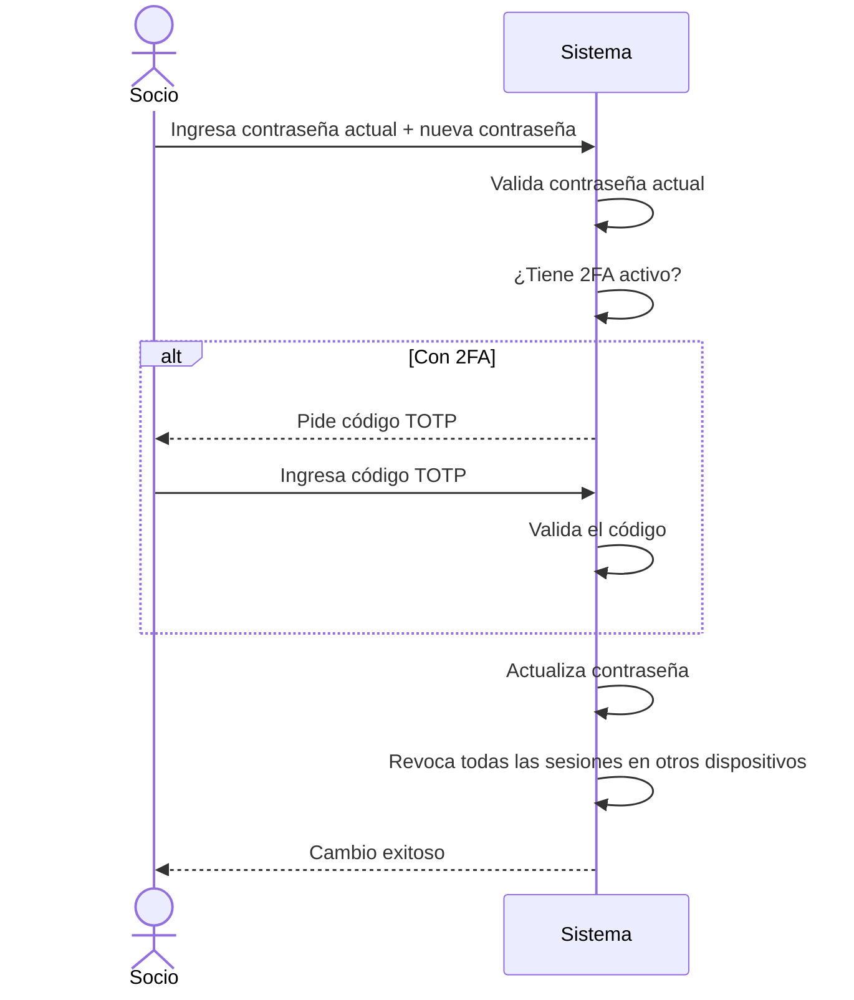
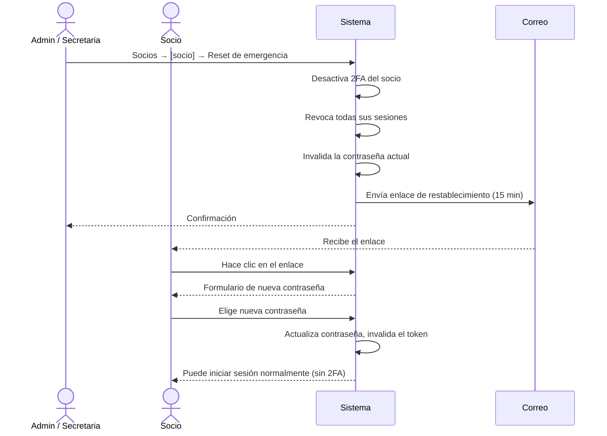

# Flujo 18 — Recuperación y Cambio de Contraseña

## ¿Qué cubre este flujo?

Hay tres situaciones distintas relacionadas con contraseñas:

| Situación | ¿Quién la inicia? | ¿Requiere sesión activa? |
|-----------|:-----------------:|:------------------------:|
| **Olvidé mi contraseña** — el socio no puede ingresar | El socio mismo | ❌ No |
| **Cambio de contraseña** — el socio quiere actualizarla | El socio autenticado | ✅ Sí |
| **Reset de emergencia** — el socio perdió su teléfono con 2FA | Secretaria o Admin | ✅ Sí (la secretaria) |

---

## Flujo A — Olvidé mi contraseña

### Historia de usuario

> **Como socio**, quiero poder recuperar el acceso a mi cuenta si olvidé mi contraseña, sin necesidad de contactar a la secretaria.

### Paso a paso

#### 1. El socio solicita el enlace

Desde la pantalla de login (web o mobile), el socio hace clic en **"¿Olvidaste tu contraseña?"** e ingresa su correo electrónico.

El sistema responde siempre con el mismo mensaje genérico — ya sea que el correo esté registrado o no. Esto evita que alguien pueda descubrir qué correos están registrados en el sistema.

#### 2. El socio recibe el correo

Si el correo existe, el sistema envía un enlace de recuperación válido por **15 minutos**. El socio puede hacer clic en ese enlace desde su computador o desde la app móvil.

El token del enlace:
- Es de **un solo uso** — una vez usado, el enlace queda inválido.
- Invalida cualquier token anterior que el socio haya solicitado.

#### 3. El socio elige una nueva contraseña

Al hacer clic en el enlace, el socio ve un formulario para ingresar su nueva contraseña (y confirmarla). Al guardar:

- La contraseña se actualiza.
- Si la cuenta estaba bloqueada por intentos fallidos, se desbloquea automáticamente.
- El contador de intentos fallidos se resetea a cero.

#### 4. El socio inicia sesión con la nueva contraseña

Tras el cambio exitoso, la pantalla redirige directamente al login.

### Límites de seguridad (rate limiting)

El sistema acepta un máximo de **3 solicitudes de recuperación en 15 minutos** por socio. Si se supera ese límite, las solicitudes siguientes se ignoran silenciosamente (el sistema responde igual que si el correo no existiera).

---

## Flujo B — Cambio de contraseña (sesión activa)

El socio autenticado puede cambiar su contraseña desde su perfil, sin necesidad de un enlace por correo.

### Paso a paso

1. Desde **Perfil → Seguridad**, el socio ingresa su contraseña actual y la nueva contraseña (con confirmación).
2. Si el socio tiene **2FA activo**, el sistema pide adicionalmente un código TOTP antes de aplicar el cambio.
3. Al confirmar:
   - La contraseña se actualiza.
   - **Todas las sesiones activas en otros dispositivos quedan cerradas** — el socio deberá iniciar sesión nuevamente en cada uno de ellos.
   - La sesión actual (desde la que se hizo el cambio) se mantiene activa.

### Validaciones

- La contraseña nueva **no puede ser igual** a la contraseña actual.
- Se requiere la contraseña actual para confirmar identidad (el sistema no permite el cambio sin verificarla).
- Si el código TOTP es incorrecto, el cambio no se aplica.

---

## Flujo C — Reset de emergencia (secretaria / admin)

Este flujo existe para el caso en que un socio perdió acceso a su app de autenticación (teléfono roto, app desinstalada) y **no puede usar el 2FA**. Dado que el 2FA bloquea el login aunque el socio sepa su contraseña, la secretaria o el admin pueden ejecutar un reset de emergencia.

> **Precondición:** el socio debe tener el 2FA activo. Si no lo tiene, este flujo no aplica — en ese caso basta con que el socio use el Flujo A (olvidé mi contraseña).

### ¿Qué hace el reset de emergencia?

En una sola acción, el sistema:

1. **Desactiva el 2FA** del socio (borra el secret TOTP).
2. **Revoca todas las sesiones activas** del socio.
3. **Invalida la contraseña actual** — el socio no puede iniciar sesión con su contraseña antigua.
4. **Envía un correo de restablecimiento de contraseña** al socio.
5. Registra la acción en la auditoría.

### ¿Quién puede ejecutarlo?

Solo **Admin** y **Secretaria**.

Tras el reset, el socio puede volver a activar el 2FA desde su perfil cuando lo desee.

---

## Requisitos de contraseña

Toda contraseña nueva (en cualquiera de los tres flujos) debe cumplir:

| Requisito | Detalle |
|-----------|---------|
| Longitud mínima | **12 caracteres** |
| Letras | Al menos una minúscula y una mayúscula |
| Dígitos | Al menos un número (0–9) |
| Símbolo | Al menos un carácter especial (!, @, #, $, %, etc.) |

El backend valida estos requisitos y devuelve error si no se cumplen.

---

## Seguridad del token de recuperación

| Aspecto | Implementación |
|---------|---------------|
| Generación | 32 bytes aleatorios (`SecureRandom`) → Base64 URL-safe |
| Almacenamiento | Solo el hash SHA-256 en BD; el token real nunca se guarda |
| Expiración | 15 minutos |
| Uso único | El token se marca como `used=true` al completar el flujo |
| Tokens previos | Al emitir un token nuevo, los anteriores del mismo socio se invalidan |
| Enumeración de correos | El endpoint siempre responde 200 con el mismo mensaje |
| Timing attack | El correo se envía de forma asíncrona (desacopla el tiempo de respuesta del SMTP) |
| Rate limiting | Máximo 3 solicitudes por socio en 15 minutos |

---

## Mobile

Los tres flujos están disponibles en la app móvil (Flutter):

**Flujo A — Olvidé mi contraseña:**
- El enlace **"¿Olvidaste tu contraseña?"** en la pantalla de login abre `ForgotPasswordScreen`.
- El socio ingresa su correo y ve una confirmación de envío.
- El enlace del correo usa un deep link que abre directamente `ResetPasswordScreen` en la app (`/reset-password?token=...`), si la app está instalada.
- Al completar el reset, la pantalla redirige al login.

**Flujo B — Cambio de contraseña:**
- Disponible desde la pantalla de **Perfil → Seguridad** en la app.
- El flujo es idéntico al de la web: pide contraseña actual, nueva contraseña y código TOTP si aplica.

**Flujo C — Reset de emergencia:**
- Solo ejecutable desde la aplicación web por la secretaria o el admin.
- El socio recibe el correo con el enlace de restablecimiento, que puede abrir desde mobile.
