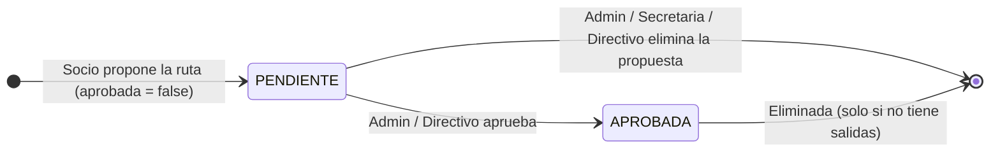
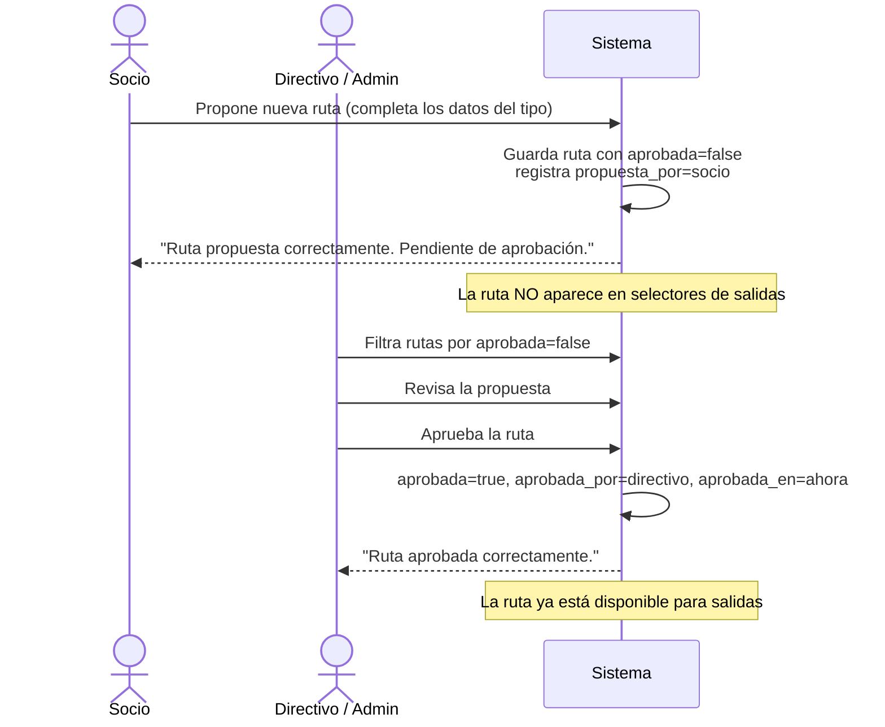

# Flujo 19 — Gestión de Montañas y Rutas

## ¿Qué es este flujo?

El sistema mantiene un **catálogo de montañas y rutas** que es la base sobre la que se construyen las salidas. Ambas entidades tienen roles y reglas distintas:

| | Montaña | Ruta |
|---|---|---|
| ¿Qué es? | Cumbre o lugar de referencia (nombre, región, altitud) | Itinerario concreto: acceso, dificultad, distancia, desnivel |
| ¿Tiene aprobación? | ❌ No — se crea directamente | ✅ Sí — debe aprobarse antes de usarse en salidas |
| ¿Quién puede crear? | Admin, Secretaria, Directivo | Cualquier socio autenticado (web); Admin, Secretaria, Directivo (mobile) |
| ¿Quién puede aprobar? | — | Admin, Directivo |
| ¿Puede usarse en salidas sin aprobación? | — | ❌ No |

Una ruta siempre pertenece a una montaña **o** describe un lugar de referencia libre (ej. una zona de trekking sin cima definida).

---

## Montañas

### Datos de una montaña

| Campo | Descripción |
|-------|-------------|
| Nombre | Nombre oficial de la cumbre o lugar |
| Región | Provincia o cordillera |
| Altitud | En metros sobre el nivel del mar |
| País | País donde se ubica |

### ¿Quién puede hacer qué?

| Acción | Admin | Secretaria | Directivo | Socio |
|--------|:-----:|:----------:|:---------:|:-----:|
| Ver listado y detalle | ✅ | ✅ | ✅ | ✅ |
| Crear | ✅ | ✅ | ✅ | ❌ |
| Editar | ✅ | ✅ | ✅ | ❌ |
| Eliminar | ✅ | ✅ | ✅ | ❌ |

> Una montaña **no puede eliminarse** si tiene rutas asociadas. Primero deben eliminarse todas sus rutas.

Las montañas no tienen flujo de aprobación — son registros de referencia del catálogo.

---

## Rutas

### ¿Qué datos tiene una ruta?

**Campos comunes a todos los tipos:**

| Campo | Descripción |
|-------|-------------|
| Nombre | Nombre de la ruta |
| Tipo de actividad | `ALPINISMO`, `ESCALADA`, `TREKKING` o `CICLISMO` |
| Montaña | Opcional — puede ser un lugar libre (ej. zona de senderismo) |
| Lugar de referencia | Texto libre si no se elige montaña |
| Sector / zona | Sector específico dentro de la montaña o zona |
| Longitud (km) | Distancia total del recorrido |
| Desnivel (m) | Desnivel positivo acumulado |
| Duración | En días (expediciones) o en horas (salidas de un día) |
| Nivel mínimo del socio | Nivel técnico requerido para inscribirse en salidas de esta ruta |
| Requiere permisos | Indica si la ruta necesita documentación de acceso (ej. parque nacional) |
| URL del track GPS | Enlace al archivo GPX o mapa |
| Peligros y notas | Texto libre sobre riesgos, condiciones o información relevante |

**Campos específicos por tipo de actividad:**

| Tipo | Campos adicionales requeridos |
|------|-------------------------------|
| **ALPINISMO** | Escala alpina IFAS, dificultad de roca (UIAA), dificultad de hielo, compromiso, Yosemite, nivel técnico Sadday, nivel físico Sadday |
| **ESCALADA** | Dificultad de roca, tipo de escalada, número de cintas, altura de la vía, tipo de roca |
| **TREKKING** | Dificultad de senderismo, si es circular, si hay fuentes de agua, tipo de terreno |
| **CICLISMO** | Tipo de bicicleta, dificultad técnica, superficie predominante, % de ciclabilidad |

---

## Flujo de propuesta y aprobación de rutas

### Historia de usuario

> **Como socio**, quiero proponer una ruta que conozco para que el club la tenga en su catálogo y pueda usarse en futuras salidas.

> **Como directivo**, quiero revisar las rutas propuestas y aprobar las que considero seguras y adecuadas para las salidas del club.

### Paso a paso

#### 1. El socio propone la ruta

Cualquier socio autenticado puede proponer una ruta desde el catálogo de rutas (web). Al crear la ruta, queda registrado como **"propuesta por"** y el campo `aprobada` se inicializa en `false`.

La ruta aparece en el listado con estado **no aprobada**. No puede usarse en ninguna salida mientras no sea aprobada.

#### 2. El Directivo o Admin revisa y aprueba

Desde el listado de rutas, filtrando por `aprobada = false`, un Directivo o Admin revisa las propuestas pendientes.

Al aprobar, el sistema registra:
- Quién aprobó (`aprobada_por`)
- Cuándo (`aprobada_en`)

No hay estado de "rechazada". Si una propuesta no es adecuada, un Admin, Secretaria o Directivo puede eliminarla directamente (siempre que no tenga salidas asociadas).

#### 3. La ruta aprobada ya está disponible

Una vez aprobada, la ruta aparece en los selectores al crear salidas y puede usarse normalmente.

### ¿Qué pasa si la propuesta no es adecuada?

No existe un flujo de rechazo formal. Si una ruta propuesta no es apropiada:

1. Un Admin, Secretaria o Directivo puede **eliminarla** directamente.
2. O puede dejarse en estado pendiente indefinidamente sin aprobar.

El socio que la propuso no recibe ninguna notificación automática.

---

## Datos adicionales de una ruta

### Documentos de permiso

Si la ruta `requiere permisos`, se pueden adjuntar los documentos de acceso (autorizaciones del área natural, permisos de ingreso, etc.).

| Aspecto | Detalle |
|---------|---------|
| Formatos admitidos | PDF, Word (.doc/.docx), Excel (.xls/.xlsx) |
| Tamaño máximo | 10 MB por archivo |
| ¿Quién puede subir? | Admin, Secretaria, Directivo |
| ¿Quién puede ver y descargar? | Cualquier socio autenticado |

### Contactos de la ruta

Guardas, guías externos, gestores de área u otras personas de contacto relevantes para la ruta.

| Aspecto | Detalle |
|---------|---------|
| ¿Quién puede vincular/desvincular? | Admin, Secretaria, Directivo |
| ¿Quién puede ver? | Cualquier socio autenticado |

Los contactos son entidades globales que pueden vincularse a varias rutas.

---

## Efecto de la aprobación sobre las salidas

Al crear una salida, el selector de rutas muestra **solo rutas aprobadas**. Una ruta pendiente de aprobación no puede seleccionarse como ruta de una salida, aunque exista en el catálogo.

---

## Tabla de permisos — resumen

| Acción | Admin | Secretaria | Directivo | Socio |
|--------|:-----:|:----------:|:---------:|:-----:|
| Ver catálogo de montañas y rutas | ✅ | ✅ | ✅ | ✅ |
| Crear montaña | ✅ | ✅ | ✅ | ❌ |
| Editar montaña | ✅ | ✅ | ✅ | ❌ |
| Eliminar montaña | ✅ | ✅ | ✅ | ❌ |
| Proponer ruta | ✅ | ✅ | ✅ | ✅ (web) |
| Aprobar ruta | ✅ | ❌ | ✅ | ❌ |
| Editar ruta | ✅ | ✅ | ✅ | ❌ |
| Eliminar ruta | ✅ | ✅ | ✅ | ❌ |
| Subir / eliminar documentos de permiso | ✅ | ✅ | ✅ | ❌ |
| Descargar documentos de permiso | ✅ | ✅ | ✅ | ✅ |
| Vincular / desvincular contactos | ✅ | ✅ | ✅ | ❌ |
| Ver contactos | ✅ | ✅ | ✅ | ✅ |

---

## Mobile

La app móvil (Flutter) permite consultar el catálogo de montañas y rutas y proponer nuevas rutas.

### Montañas

En mobile, las montañas son de **solo lectura**. Los socios pueden consultar el listado con búsqueda por nombre, y ver el detalle de cada montaña. No hay pantalla de creación o edición de montañas en la app.

### Rutas

| Acción | Web | Mobile |
|--------|:---:|:------:|
| Ver listado y filtros | ✅ | ✅ |
| Ver detalle de una ruta | ✅ | ✅ |
| Proponer nueva ruta | ✅ (cualquier socio) | ✅ (Admin, Secretaria, Directivo) |
| Aprobar ruta | ✅ | ❌ (web únicamente) |
| Subir documentos de permiso | ✅ | ❌ (web únicamente) |
| Ver y descargar documentos | ✅ | ✅ |
| Gestionar contactos | ✅ | ❌ (web únicamente) |

En la app móvil, la pantalla de rutas muestra un botón flotante **"Proponer nueva ruta"** que solo es visible para Admin, Secretaria y Directivo. Los socios con rol Socio pueden ver el catálogo pero no tienen acceso al formulario de propuesta desde mobile (aunque sí lo tienen desde la web).

La aprobación de rutas pendientes se hace exclusivamente desde la web.
