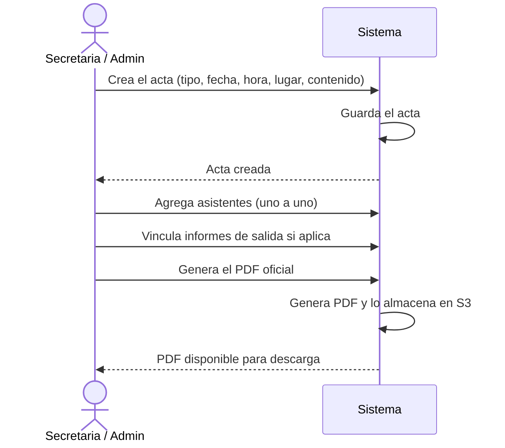
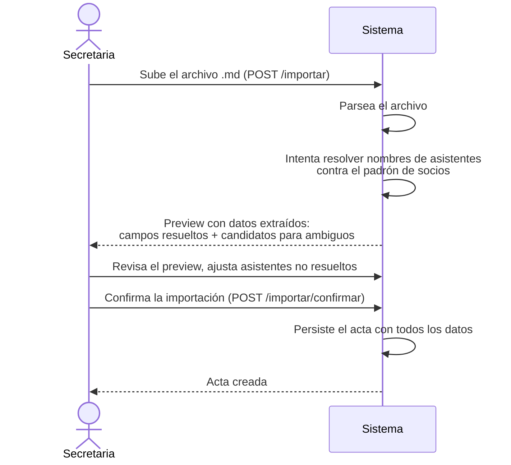

# Flujo 20 — Gestión de Actas de Reunión

## ¿Qué es un acta?

Un acta es el registro oficial de una reunión del club: quién asistió, qué se trató, qué acuerdos se tomaron. El sistema gestiona dos tipos de reuniones con distintos niveles de acceso.

---

## Tipos de acta

| Tipo | ¿Qué es? | ¿Quién puede verla? |
|------|----------|---------------------|
| `SOCIOS` | Reunión general con todos los socios | Cualquier socio autenticado |
| `DIRECTIVA` | Reunión interna de la junta directiva | Admin, Secretaria y Directivo |

Un socio con rol Socio no puede ver ni acceder a las actas de tipo DIRECTIVA, aunque esté autenticado.

---

## Historia de usuario

> **Como secretaria**, quiero registrar el acta de cada reunión con los asistentes y acuerdos, y poder exportarla como PDF oficial, para que quede constancia formal de lo tratado.

> **Como socio**, quiero poder consultar las actas de las reuniones generales del club, para mantenerme informado de las decisiones y actividades.

---

## Datos de un acta

| Campo | Descripción |
|-------|-------------|
| Tipo | `SOCIOS` o `DIRECTIVA` |
| Número de reunión | Número secuencial de la reunión (ej. 21, 2026-0001) |
| Fecha | Fecha de la reunión |
| Hora de inicio | Hora de inicio |
| Hora de cierre | Hora de fin de la reunión |
| Lugar | Dónde se realizó |
| Presidente de la reunión | Socio que presidió (puede ser distinto del Admin del sistema) |
| Secretaria de la reunión | Socio que actuó de secretaria (puede ser distinto de la Secretaria del sistema) |
| Actividades realizadas | Texto libre — resumen de lo tratado |
| Actividades por realizar | Texto libre — compromisos para la próxima reunión |
| Acuerdos | Acuerdos formales tomados en la reunión |
| Varios | Otros temas discutidos |
| Observaciones | Notas adicionales |

---

## Datos asociados a un acta

### Asistentes

Lista de socios del sistema que asistieron a la reunión. La secretaria los agrega uno a uno desde el detalle del acta. Si se importa el acta desde un archivo `.md`, los asistentes se extraen automáticamente del texto y se resuelven contra el padrón de socios.

Un socio puede aparecer en la lista como:
- **Socio vinculado** — encontrado en el padrón y asociado por ID.
- **Nombre libre** — no encontrado en el padrón (ej. invitado externo). Queda registrado como texto plano.

### Informes de salida vinculados

Si en la reunión se presentaron informes de salidas, la secretaria puede vincular esos informes al acta. El informe vinculado actúa como referencia — no se copia el contenido, solo se crea el enlace.

---

## Flujo principal: crear un acta manualmente



---

## Flujo alternativo: importar acta desde archivo Markdown

El club trabaja con un formato fijo de Markdown (`.md`) para redactar sus actas. La secretaria puede importar ese archivo directamente al sistema en lugar de ingresar los datos campo por campo.

### Formato del archivo `.md`

```
# Reunión Socios No. 21
## Datos generales
  **Fecha:** 15 de mayo de 2026
  **Hora inicio:** 19:00
  **Hora fin:** 21:30
  **Tipo de reunión:** Socios
## Identificación de autoridades y participantes
  **Preside la Reunión:** Juan Pérez
  **Secretaria:** María García
  **Asistentes:** Juan Pérez, María García, Carlos López, ...
## Desarrollo de la reunión y compromisos
  ### 1. Actividades realizadas
  ...texto...
  ### 2. Actividades por realizar
  ...texto...   **Acuerdo:** Realizar salida el primer sábado de junio.
  ### 3. Varios
  ...texto...
```

Las líneas con `**Acuerdo:**` se extraen automáticamente y se consolidan en el campo de acuerdos.

### Pasos del flujo de importación



Si un nombre de asistente no coincide exactamente con ningún socio, el sistema devuelve candidatos para que la secretaria elija el correcto. Los asistentes no identificados quedan registrados como nombre libre.

> La importación desde `.md` está disponible **solo para la Secretaria** (no para el Admin).

---

## Generación del PDF oficial

El PDF del acta se genera bajo demanda y se almacena en S3. Si ya existe un PDF previo para el mismo acta, se regenera.

Los metadatos del archivo (nombre, tamaño, checksum SHA-256 y ETag MD5) quedan guardados en la base de datos como parte del acta.

| Acción | ¿Quién puede? |
|--------|:-------------:|
| Generar / regenerar PDF | Admin, Secretaria |
| Descargar PDF | Cualquier socio autenticado (con restricción de tipo: socios solo descargan actas SOCIOS) |

---

## Búsqueda de actas

El listado de actas soporta búsqueda por texto completo en español (`plainto_tsquery('spanish', q)`) sobre todos los campos de contenido del acta, usando un índice GIN en PostgreSQL. El campo `search_vector` es mantenido por un trigger de base de datos.

También se puede filtrar por tipo (`SOCIOS` o `DIRECTIVA`). Los socios regulares que intenten filtrar por `DIRECTIVA` recibirán un error de acceso denegado.

---

## Tabla de permisos

| Acción | Admin | Secretaria | Directivo | Socio |
|--------|:-----:|:----------:|:---------:|:-----:|
| Ver actas SOCIOS | ✅ | ✅ | ✅ | ✅ |
| Ver actas DIRECTIVA | ✅ | ✅ | ✅ | ❌ |
| Crear acta | ✅ | ✅ | ❌ | ❌ |
| Editar acta | ✅ | ✅ | ❌ | ❌ |
| Eliminar acta | ✅ | ✅ | ❌ | ❌ |
| Agregar / quitar asistentes | ✅ | ✅ | ❌ | ❌ |
| Vincular / desvincular informes | ✅ | ✅ | ❌ | ❌ |
| Generar PDF | ✅ | ✅ | ❌ | ❌ |
| Descargar PDF (SOCIOS) | ✅ | ✅ | ✅ | ✅ |
| Descargar PDF (DIRECTIVA) | ✅ | ✅ | ✅ | ❌ |
| Importar desde `.md` | ❌ | ✅ | ❌ | ❌ |

---

## Mobile

La app móvil (Flutter) implementa el módulo de actas con acceso diferenciado por rol.

**Visualización:**
- La pantalla de actas muestra dos pestañas: **Socios** y **Directiva**.
- Los socios con rol Socio solo ven la pestaña Socios.
- Los Directivos, Secretarias y Admins ven ambas pestañas.

**Crear y editar:**
- Admin y Secretaria tienen el botón flotante para crear nuevas actas.
- La pantalla de creación (`ActaCrearScreen`) permite completar todos los campos del acta.
- Editar actas existentes también está disponible en mobile para Admin y Secretaria.

**Importación desde `.md`:**
- La Secretaria puede importar un acta desde un archivo `.md` directamente en la app usando el selector de archivos del dispositivo.
- El flujo es el mismo que en la web: preview → revisión → confirmación.

**PDF:**
- Admin y Secretaria pueden generar el PDF desde la app.
- Cualquier socio con acceso al tipo de acta puede descargar el PDF desde mobile.

| Acción | Web | Mobile |
|--------|:---:|:------:|
| Ver y buscar actas | ✅ | ✅ |
| Crear / editar acta | ✅ | ✅ |
| Eliminar acta | ✅ | ✅ |
| Generar / descargar PDF | ✅ | ✅ |
| Importar desde `.md` | ✅ | ✅ |
| Agregar / quitar asistentes | ✅ | ❌ (web únicamente) |
| Vincular / desvincular informes | ✅ | ❌ (web únicamente) |
