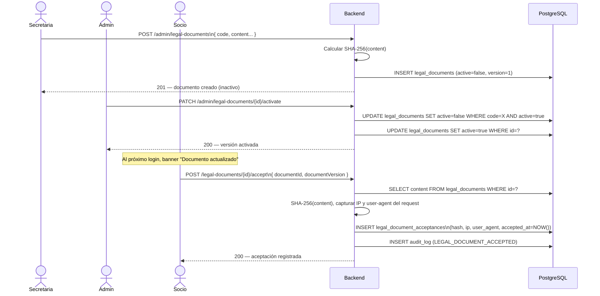
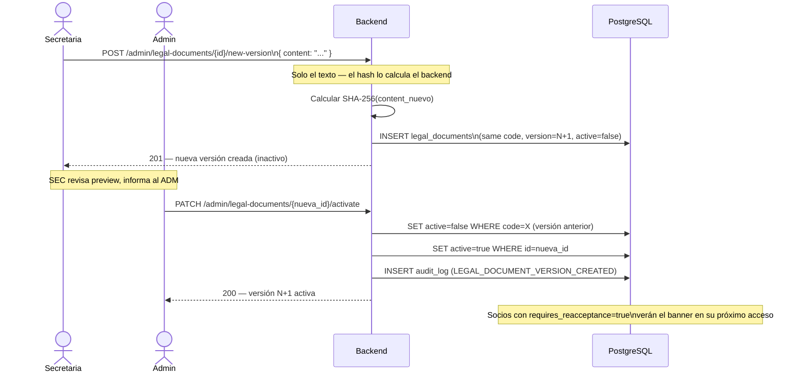

# Flujo 23 — Gestión de Documentos Legales y Consentimientos

## ¿Qué es este flujo?

El sistema maneja documentos legales versionados que los socios deben aceptar: políticas de datos, consentimientos médicos y declaraciones de riesgo. Cada aceptación queda registrada con trazabilidad legal completa (versión exacta del documento, hash del contenido, IP, dispositivo y timestamp del servidor).

Relacionado con: [Flujo 24 — Registro multi-paso](./24-registro-multistep.md) · [Flujo 25 — Completitud de perfil](./25-perfil-completo.md) · [Flujo 26 — Riesgo por actividad](./26-riesgo-por-actividad.md)

---

## Documentos del sistema

| Código | Descripción | Etapa |
|--------|-------------|-------|
| `DATA_PROCESSING_POLICY` | Política de Tratamiento de Datos Personales | Registro |
| `MEDICAL_DATA_CONSENT` | Consentimiento para tratamiento de datos médicos | Registro |
| `DATA_RETENTION_POLICY` | Política de Conservación y Eliminación de Datos | Completitud de perfil |
| `LIABILITY_WAIVER` | Declaración de Conocimiento de Riesgos y Descargo | Completitud de perfil |

El **Reglamento Interno** no requiere aceptación versionada — permanece como contenido estático en web y mobile.

---

## Historia de usuario

> **Como secretaria**, quiero publicar una nueva versión de la política de datos personales para que todos los socios deban aceptarla antes de continuar usando el sistema.

> **Como socio**, quiero ver los documentos que he aceptado y cuándo los acepté, para tener constancia de mis consentimientos.

---

## Ciclo de vida de un documento

### Creación

La secretaria o admin crea un documento nuevo desde el panel de administración:
1. Ingresa código, título, tipo, etapa, si es obligatorio y si requiere re-aceptación en nueva versión
2. Escribe o carga el contenido en Markdown
3. El documento queda en estado **inactivo** (pendiente de activación)

### Activación

Solo el ADMIN puede activar una versión:
1. Presiona "Activar" sobre la versión pendiente
2. El backend pone `active = true` en la nueva versión y `active = false` en la anterior
3. Los socios que tienen la versión anterior verán un banner de "documento actualizado — debes aceptarlo de nuevo"

### Aceptación por el socio

Cuando el socio acepta un documento:
1. El frontend envía solo `{ documentId, documentVersion }`
2. El backend captura automáticamente: IP del request, user-agent, timestamp del servidor, y recalcula el SHA-256 del contenido desde la base de datos
3. Se guarda una fila en `legal_document_acceptances` — esta tabla es **inmutable** (no se modifica ni elimina)

---

## Diagrama — gestión de versiones

---

## Diagrama — nueva versión de un documento existente

---

## Panel de administración — ¿qué puede ver la secretaria?

### Tab A — Documentos

Lista de documentos con: código, título, versión activa, estado, fecha de aprobación.

Al seleccionar un documento:
- Contenido renderizado en Markdown (solo lectura)
- Historial de versiones completo
- Botón "Crear nueva versión" → editor con preview en tiempo real
- Botón "Activar versión" (solo ADMIN)

### Tab B — Aceptaciones

Filtros por: documento, versión, socio, estado.

Tabla: socio, documento, versión, fecha de aceptación, IP, estado.

Vista "Pendientes": socios que no han aceptado la versión activa de un documento obligatorio, con opción de enviarles una notificación recordatorio.

---

## Reglas de negocio

| Regla | Detalle |
|-------|---------|
| Solo una versión activa por código | Activar una nueva desactiva la anterior automáticamente |
| Las aceptaciones son inmutables | Nunca se modifican ni eliminan — son evidencia legal |
| El hash se calcula en el backend | El frontend nunca envía el hash del documento |
| La IP y el user-agent vienen del servidor | El frontend nunca envía datos de trazabilidad |
| Si el documento requiere re-aceptación | El socio debe volver a aceptar la nueva versión antes de continuar |
| Solo ADMIN puede activar versiones | La secretaria puede crear; solo el admin publica |

---

## Mobile

En la app Flutter, los socios pueden:
- Ver sus documentos aceptados desde **Perfil → Mis documentos**
- Ver el contenido completo de cada documento (Markdown renderizado)
- Aceptar documentos pendientes directamente desde la app
- Ver un banner en la pantalla principal cuando tienen documentos pendientes

Para ADMIN y SECRETARIA en mobile:
- Pantalla de gestión de documentos con Tab A y Tab B
- Editor de texto con preview en tiempo real
- Activación de versiones
