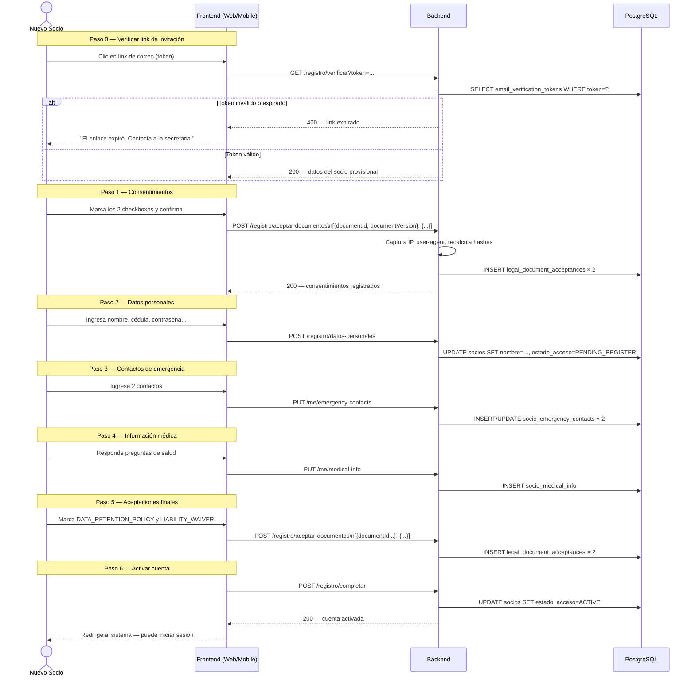
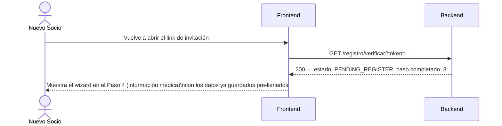

# Flujo 24 — Registro Multi-paso con Consentimientos

## ¿Qué es este flujo?

Con el módulo de gestión documental, el registro de un nuevo socio pasó de un formulario simple de 4 campos a un **wizard de 6 pasos** que captura: consentimientos legales, datos personales, contactos de emergencia, información médica y aceptaciones de política de retención. El progreso se guarda en la base de datos, así que el socio puede cerrar el navegador y retomar desde donde dejó.

Relacionado con: [Flujo 1 — Invitación y Registro](./01-invitacion-y-registro.md) · [Flujo 23 — Gestión Documental](./23-gestion-documental.md) · [Flujo 25 — Completitud de Perfil](./25-perfil-completo.md)

---

## Historia de usuario

> **Como aspirante**, quiero completar mi registro en varios pasos y poder retomarlo más tarde, sin tener que empezar desde cero si me interrumpen.

> **Como secretaria**, quiero que todos los socios hayan aceptado formalmente las políticas de datos y el descargo de responsabilidad antes de quedar activos en el sistema.

---

## Los 6 pasos del wizard

### Paso 0 — Verificación del link (sin cambios)

El socio hace clic en el link de invitación recibido por correo. El sistema valida que el token sea válido y no haya expirado (48 horas para invitaciones individuales, 72 horas para importaciones CSV).

### Paso 1 — Consentimientos iniciales (obligatorios)

Dos checkboxes **independientes**:
- ☐ He leído y acepto la **Política de Tratamiento de Datos Personales**
- ☐ Autorizo el **tratamiento de mis datos de salud** para fines de emergencia en montaña

Sin ambos marcados, no se puede continuar. Cada checkbox genera su propia fila en `legal_document_acceptances` con hash, IP, user-agent y timestamp del servidor.

> Por qué dos checkboxes separados: bajo la LOPDP ecuatoriana (Art. 23), los datos de salud son categoría especial y requieren consentimiento explícito y granular. No se puede bundlear el consentimiento médico dentro de una aceptación general.

### Paso 2 — Datos personales

- Nombre y apellido
- Cédula de identidad
- Teléfono
- Dirección
- Fecha de nacimiento
- Contraseña y confirmación

Se guarda con `estado_acceso = PENDING_REGISTER`.

### Paso 3 — Contactos de emergencia (2 contactos obligatorios)

Por cada contacto:
- Nombre completo
- Relación (padre, madre, cónyuge, amigo, etc.)
- Número de celular
- Dirección (opcional)

Se guarda en `socio_emergency_contacts`. Los 2 contactos son requisito para completar el perfil.

### Paso 4 — Información médica

- Tipo de sangre (opcional)
- ¿Tiene alergias relevantes? Sí/No → si sí, ¿cuáles?
- ¿Tiene condición médica relevante? Sí/No → si sí, ¿cuál?
- ¿Usa medicación de emergencia? Sí/No → si sí, ¿cuál?
- Notas adicionales (opcional)

Se guarda en `socio_medical_info`. Requiere que `MEDICAL_DATA_CONSENT` haya sido aceptado en el Paso 1.

### Paso 5 — Aceptaciones finales

Dos checkboxes más:
- ☐ He leído y acepto la **Política de Conservación y Eliminación de Datos**
- ☐ He leído y acepto la **Declaración de Conocimiento de Riesgos y Descargo de Responsabilidad**

Cada uno genera su fila en `legal_document_acceptances`.

### Paso 6 — Registro completo

`estado_acceso` cambia de `PENDING_REGISTER` → `ACTIVE`. El socio queda habilitado con tipo de socio `Aspirante` y puede iniciar sesión.

---

## Diagrama del flujo completo

---

## Reanudación del registro

Si el socio cierra el navegador antes de terminar:

El frontend determina en qué paso retomar consultando el estado del socio y qué datos ya existen en la base de datos.

---

## Diferencias respecto al registro anterior

| Aspecto | Antes | Ahora |
|---------|-------|-------|
| Pasos | 1 formulario simple | 6 pasos progresivos |
| Consentimientos | Checkbox genérico | 4 documentos versionados con trazabilidad legal |
| Datos médicos | Solo tipo de sangre inline en `socios` | Tabla separada `socio_medical_info` con preguntas detalladas |
| Contactos de emergencia | 4 campos inline en `socios` | Tabla separada `socio_emergency_contacts` con hasta 2 contactos |
| Reanudable | No | Sí — desde cualquier paso |
| Trazabilidad | Ninguna | Hash, IP, user-agent, timestamp del servidor por aceptación |

---

## Mobile

El mismo wizard de 6 pasos está implementado en la app Flutter. Las pantallas son equivalentes al web, adaptadas al formato de pantalla pequeña. El flujo de reanudación funciona igual.

---

## Reglas de negocio

| Regla | Detalle |
|-------|---------|
| Los 2 contactos de emergencia son obligatorios | No se puede avanzar al paso 4 sin ellos |
| Los consentimientos de registro son obligatorios | Sin DATA_PROCESSING_POLICY y MEDICAL_DATA_CONSENT no se puede continuar |
| Los datos médicos requieren MEDICAL_DATA_CONSENT | El backend valida que exista la aceptación antes de guardar |
| La contraseña la elige el socio | La secretaria nunca la ve ni la define |
| El link de invitación es de un solo uso | Una vez completado el registro, el token queda invalidado |
