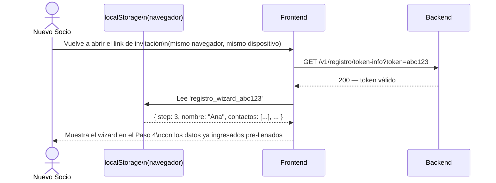

# Flujo 24 — Registro Multi-paso con Consentimientos

## ¿Qué es este flujo?

Con el módulo de gestión documental, el registro de un nuevo socio pasó de un formulario simple de 4 campos a un **wizard de 6 pasos** que captura: consentimientos legales, datos personales, contactos de emergencia, información médica y aceptaciones de política de retención. El progreso se guarda en el **`localStorage` del navegador** mientras el socio avanza, de manera que puede cerrar la pestaña y retomar desde donde dejó, siempre y cuando vuelva desde el mismo dispositivo y navegador. Si abre el link en otro dispositivo, el wizard comienza desde el Paso 1.

Relacionado con: [Flujo 1 — Invitación y Registro](./01-invitacion-y-registro.md) · [Flujo 23 — Gestión Documental](./23-gestion-documental.md) · [Flujo 25 — Completitud de Perfil](./25-perfil-completo.md)

---

## Historia de usuario

> **Como aspirante**, quiero completar mi registro en varios pasos y poder retomarlo más tarde, sin tener que empezar desde cero si me interrumpen.

> **Como secretaria**, quiero que todos los socios hayan aceptado formalmente las políticas de datos y el descargo de responsabilidad antes de quedar activos en el sistema.

---

## Los 6 pasos del wizard

### Paso 0 — Verificación del link

El socio hace clic en el link de invitación recibido por correo. El sistema valida que el token sea válido y no haya expirado. **Todos los tokens duran 72 horas** (tanto invitaciones individuales como importaciones CSV). El link permanece activo durante esas 72h — no se consume hasta que el socio completa el paso 6.

### Paso 1 — Consentimientos iniciales (obligatorios)

Dos checkboxes **independientes**:
- ☐ He leído y acepto la **Política de Tratamiento de Datos Personales**
- ☐ Autorizo el **tratamiento de mis datos de salud** para fines de emergencia en montaña

Sin ambos marcados, no se puede continuar. Cada checkbox genera su propia fila en `legal_document_acceptances` con hash, IP, user-agent y timestamp del servidor.

> Por qué dos checkboxes separados: bajo la LOPDP ecuatoriana (Art. 23), los datos de salud son categoría especial y requieren consentimiento explícito y granular. No se puede bundlear el consentimiento médico dentro de una aceptación general.

### Paso 2 — Datos personales

- Nombre y apellido
- Cédula de identidad
- Teléfono
- Dirección
- Fecha de nacimiento
- Contraseña y confirmación

> La contraseña se mantiene **únicamente en memoria** (no se guarda en `localStorage` ni en ningún storage del navegador).

### Paso 3 — Contactos de emergencia (2 contactos obligatorios)

Por cada contacto:
- Nombre completo
- Relación (padre, madre, cónyuge, amigo, etc.)
- Número de celular
- Dirección (opcional)

Los 2 contactos son requisito para completar el perfil.

### Paso 4 — Información médica

- Tipo de sangre (opcional)
- ¿Tiene alergias relevantes? Sí/No → si sí, ¿cuáles?
- ¿Tiene condición médica relevante? Sí/No → si sí, ¿cuál?
- ¿Usa medicación de emergencia? Sí/No → si sí, ¿cuál?
- Notas adicionales (opcional)

Requiere que `MEDICAL_DATA_CONSENT` haya sido aceptado en el Paso 1 (el backend lo valida al guardar).

### Paso 5 — Aceptaciones finales

Dos checkboxes más:
- ☐ He leído y acepto la **Política de Conservación y Eliminación de Datos**
- ☐ He leído y acepto la **Declaración de Conocimiento de Riesgos y Descargo de Responsabilidad**

Cada uno genera su fila en `legal_document_acceptances`.

### Paso 6 — Registro completo

El frontend envía **todos los datos recolectados en un único request** (`POST /v1/registro/complete`): token, credenciales, datos personales, contactos de emergencia, información médica e IDs de documentos a aceptar. El backend los procesa en una transacción:

1. Valida el token (válido, no expirado, no usado)
2. Crea el socio con `estado_acceso = ACTIVE`
3. Guarda `socio_emergency_contacts` (2 contactos)
4. Guarda `socio_medical_info`
5. Registra las 4 aceptaciones legales en `legal_document_acceptances` (con IP, user-agent, hash calculado en servidor)
6. Marca el token como `used = true`

El socio queda activo con tipo `Aspirante` y puede iniciar sesión inmediatamente.

---

## Diagrama del flujo completo

> El wizard tiene **2 endpoints** solamente: `GET /registro/token-info` para validar el link al inicio y `POST /registro/complete` al final. Todo lo demás ocurre en el cliente.

```mermaid
sequenceDiagram
    actor P as Nuevo Socio
    participant LS as localStorage\n(navegador)
    participant W as Frontend
    participant API as Backend
    participant DB as PostgreSQL

    P->>W: Clic en link de correo\n(?token=abc123)
    W->>API: GET /v1/registro/token-info?token=abc123
    API->>DB: SELECT * FROM email_verification_tokens\nWHERE token_hash = SHA256('abc123')
    alt Token inválido, expirado o ya usado
        API-->>W: 400
        W-->>P: "El enlace no es válido o ya expiró.\nContacta a la secretaria."
    else Token válido (used=false, expiresAt > ahora)
        API-->>W: 200 — { fromCsvImport, nombre?, apellido? }
        W->>LS: Leer 'registro_wizard_abc123'\n(si existe, retomar paso guardado)
        W-->>P: Muestra wizard en el último paso guardado\n(o Paso 1 si es la primera vez)
    end

    Note over P,W,LS: Pasos 1 al 5 — datos recolectados en el cliente

    P->>W: Avanza por cada paso
    W->>LS: Guarda en 'registro_wizard_abc123':\nnombre, apellido, contactos, datos médicos,\nIDs de documentos aceptados, paso actual\n(⚠️ la contraseña NO se guarda — solo en memoria)

    Note over P,W: Paso 6 — El socio confirma todo y envía

    W->>API: POST /v1/registro/complete\n{\n  token: "abc123",\n  username, password,\n  nombre, apellido, fechaNacimiento, direccion,\n  documentIdsToAccept: [uuid1, uuid2, uuid3, uuid4],\n  contactosEmergencia: [{...}, {...}],\n  informacionMedica: {...}\n}
    Note over API: Todo en una sola transacción
    API->>DB: Valida token (not used, not expired)
    API->>DB: INSERT socios (estado_acceso=ACTIVE)
    API->>DB: INSERT socio_emergency_contacts × 2
    API->>DB: INSERT socio_medical_info
    API->>DB: INSERT legal_document_acceptances × 4\n(hash calculado en servidor, IP, user-agent, timestamp)
    API->>DB: UPDATE email_verification_tokens SET used=true
    API-->>W: 200 — "Cuenta activada"
    W->>LS: DELETE 'registro_wizard_abc123'
    W-->>P: Redirige al login
```

---

## Reanudación del registro

Si el socio cierra el navegador antes de terminar, el progreso está en `localStorage` — no en el servidor. El link sigue siendo válido mientras no hayan pasado 72h.



**Limitación importante:** la reanudación solo funciona si el socio vuelve desde el **mismo navegador en el mismo dispositivo**. Si abre el link en otro browser, en modo incógnito, o en otro dispositivo, el wizard empieza desde el Paso 1 (el localStorage es específico por origen y navegador). La contraseña siempre debe reingresarse — no se persiste.

---

## Diferencias respecto al registro anterior

| Aspecto | Antes | Ahora |
|---------|-------|-------|
| Pasos | 1 formulario simple | 6 pasos progresivos |
| Consentimientos | Checkbox genérico | 4 documentos versionados con trazabilidad legal |
| Datos médicos | Solo tipo de sangre inline en `socios` | Tabla separada `socio_medical_info` con preguntas detalladas |
| Contactos de emergencia | 4 campos inline en `socios` | Tabla separada `socio_emergency_contacts` con hasta 2 contactos |
| Reanudable | No | Sí — en el mismo dispositivo/navegador (localStorage) |
| Trazabilidad | Ninguna | Hash, IP, user-agent, timestamp del servidor por aceptación |

---

## Mobile

El mismo wizard de 6 pasos está implementado en la app Flutter. Las pantallas son equivalentes al web, adaptadas al formato de pantalla pequeña. El flujo de reanudación funciona igual.

---

## Reglas de negocio

| Regla | Detalle |
|-------|---------|
| Los 2 contactos de emergencia son obligatorios | No se puede avanzar al paso 4 sin ellos |
| Los consentimientos de registro son obligatorios | Sin DATA_PROCESSING_POLICY y MEDICAL_DATA_CONSENT no se puede continuar |
| Los datos médicos requieren MEDICAL_DATA_CONSENT | El backend valida que exista la aceptación antes de guardar |
| La contraseña la elige el socio | La secretaria nunca la ve ni la define |
| El link de invitación es de un solo uso | Una vez completado el registro, el token queda invalidado |
