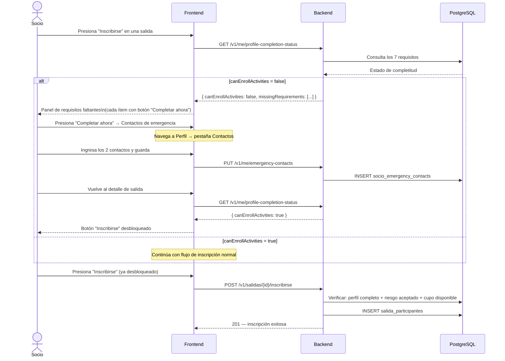

# Flujo 25 — Completitud de Perfil y Bloqueo de Inscripción

## ¿Qué es este flujo?

Un socio que completó el registro multi-paso (ver [Flujo 24](./24-registro-multistep.md)) tiene todos los requisitos base cubiertos. Pero el sistema los revisa en cada inscripción a una salida, porque:
- Un documento puede haber publicado una nueva versión (requiere re-aceptación)
- El socio puede haber sido marcado con un perfil incompleto por otros motivos

Este flujo describe cómo el sistema calcula el estado de completitud, qué pasa cuando un socio intenta inscribirse sin cumplir los requisitos, y cómo los administradores ven los socios bloqueados.

Relacionado con: [Flujo 6 — Salidas e Inscripciones](./06-salidas-e-inscripciones.md) · [Flujo 23 — Gestión Documental](./23-gestion-documental.md) · [Flujo 24 — Registro Multi-paso](./24-registro-multistep.md)

---

## Historia de usuario

> **Como socio**, cuando intento inscribirme a una salida y hay algo incompleto en mi perfil, quiero saber exactamente qué me falta y tener un botón para completarlo en ese momento.

> **Como secretaria**, quiero ver una lista de socios bloqueados para actividades, para poder contactarlos y ayudarles a completar su perfil antes de la próxima salida.

---

## Los 7 requisitos para `canEnrollActivities = true`

> **Nota:** "información médica respondida" significa que el socio completó el formulario de salud del sistema (tipo de sangre, alergias, condición médica, medicación de emergencia). **No se requiere ni se acepta ningún certificado médico, historia clínica ni documento emitido por un profesional de salud.**

| Requisito | Tabla que valida |
|-----------|-----------------|
| Datos básicos completos (nombre, cédula, teléfono, dirección) | `socios` |
| 2 contactos de emergencia registrados | `socio_emergency_contacts` (COUNT = 2) |
| Información médica respondida | `socio_medical_info` (EXISTS, not soft-deleted) |
| `MEDICAL_DATA_CONSENT` aceptado y versión vigente | `legal_document_acceptances` vs `legal_documents.active` |
| `DATA_RETENTION_POLICY` aceptada y versión vigente | `legal_document_acceptances` vs `legal_documents.active` |
| `LIABILITY_WAIVER` aceptado y versión vigente | `legal_document_acceptances` vs `legal_documents.active` |
| Sin documentos obligatorios con nueva versión activa sin aceptar | `legal_documents` vs `legal_document_acceptances` |

---

## Respuesta del endpoint `GET /v1/me/profile-completion-status`

```json
{
  "profileComplete": false,
  "canEnrollActivities": false,
  "missingRequirements": [
    "Debe registrar 2 contactos de emergencia",
    "Debe aceptar el descargo de responsabilidad vigente"
  ],
  "pendingDocuments": ["LIABILITY_WAIVER"],
  "expiredDocuments": []
}
```

Cuando todo está en orden:
```json
{
  "profileComplete": true,
  "canEnrollActivities": true,
  "missingRequirements": [],
  "pendingDocuments": [],
  "expiredDocuments": []
}
```

---

## Diagrama — intento de inscripción con perfil incompleto



---

## Panel de requisitos faltantes (UI)

Cuando el botón "Inscribirse" está bloqueado, se despliega un panel con:
- Lista de requisitos **ya cumplidos** (con ícono ✓) — para mostrar progreso
- Lista de requisitos **faltantes** — cada uno con un botón "Completar ahora" que navega directamente a la sección correspondiente

| Requisito faltante | Destino del botón "Completar ahora" |
|--------------------|------------------------------------|
| Datos básicos incompletos | Perfil → pestaña datos personales |
| Faltan contactos de emergencia | Perfil → pestaña contactos de emergencia |
| Falta información médica | Perfil → pestaña información médica |
| Documento pendiente de aceptar | Pantalla del documento con checkbox de aceptación |
| Documento con nueva versión activa | Pantalla del documento actualizado con checkbox de re-aceptación |

Este panel se muestra en web (modal o panel lateral en el diálogo de salida) y en mobile (bottom sheet).

---

## Vista de socios bloqueados (Administración)

La secretaria y el admin pueden ver una lista de socios bloqueados para actividades desde el panel de administración:

- Filtros: "Solo socios bloqueados", "Con documentos pendientes", "Con perfil incompleto"
- Por cada socio: qué requisitos cumple y cuáles le faltan (mismos campos del endpoint)
- Botón para enviar una notificación recordatorio al socio

---

## Reglas de negocio

| Regla | Detalle |
|-------|---------|
| El perfil completo es necesario pero no suficiente | Además del perfil, la inscripción requiere aceptar el riesgo específico de la salida |
| Una nueva versión activa de un documento obligatorio bloquea | Aunque el socio haya aceptado la versión anterior |
| Los datos médicos soft-deleted cuentan como faltantes | Si la info médica fue eliminada (retiro parcial), el socio aparece como bloqueado |
| El bloqueo es evaluado en tiempo real | No hay un campo de "bloqueado" — se calcula cada vez consultando las tablas |
