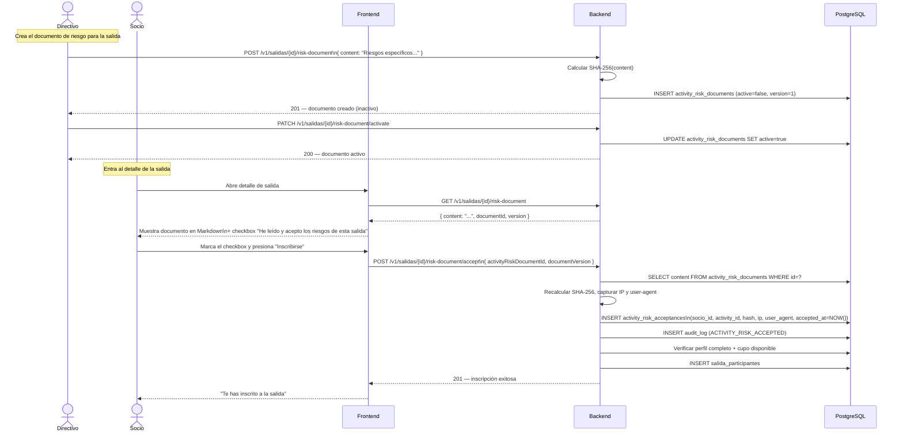

# Flujo 26 — Documento de Riesgo y Aceptación por Actividad

## ¿Qué es este flujo?

Cada salida puede tener su propio **documento de riesgo**: una descripción específica de los peligros de esa actividad en particular (condiciones del terreno, nivel de exposición, equipamiento necesario, etc.). El socio debe leer y aceptar este documento **antes de inscribirse** a esa salida concreta.

Esto es independiente del `LIABILITY_WAIVER` genérico que el socio acepta al completar su perfil. El documento de riesgo es específico a cada salida y lo crea el directivo o admin que organiza la actividad.

Relacionado con: [Flujo 6 — Salidas e Inscripciones](./06-salidas-e-inscripciones.md) · [Flujo 25 — Completitud de Perfil](./25-perfil-completo.md)

---

## Historia de usuario

> **Como directivo**, quiero adjuntar a una salida de alpinismo un documento que describa los riesgos específicos de esa ruta, para que cada participante los conozca y los acepte explícitamente antes de inscribirse.

> **Como socio**, quiero leer qué riesgos tiene la salida a la que quiero ir y confirmar que los entiendo, antes de quedar inscrito.

---

## Ciclo de vida del documento de riesgo

### 1. Crear el documento (Directivo / Admin)

Desde el detalle de la salida en el panel de administración:
1. Directivo o Admin presiona "Agregar documento de riesgo"
2. Escribe el contenido en Markdown describiendo los riesgos específicos
3. El backend calcula el SHA-256 del contenido y guarda el documento en `activity_risk_documents` con `active = false`
4. El Admin activa el documento → `active = true`

Solo puede haber un documento activo por salida.

### 2. El socio acepta antes de inscribirse

Al entrar al detalle de la salida:
- Si la salida tiene documento de riesgo activo, se muestra el contenido Markdown
- El botón "Inscribirse" está deshabilitado hasta que el socio marque el checkbox de aceptación
- Al marcar y confirmar, el backend registra la aceptación en `activity_risk_acceptances` con hash, IP, user-agent y timestamp del servidor
- Inmediatamente después se procesa la inscripción

---

## Diagrama

---

## Flujo cuando la salida NO tiene documento de riesgo

Si el organizador no adjuntó un documento de riesgo, el flujo de inscripción es el habitual: el socio solo necesita tener el perfil completo y haber aceptado el `LIABILITY_WAIVER` genérico.

---

## ¿Qué pasa si el documento de riesgo se actualiza después de inscribirse?

Una nueva versión del documento de riesgo invalida las aceptaciones previas. Los socios ya inscritos que tengan la versión anterior verán un aviso y deberán aceptar la nueva versión para mantener su inscripción. El Directivo/Admin puede ver en el panel quién tiene pendiente la re-aceptación.

---

## Reglas de negocio

| Regla | Detalle |
|-------|---------|
| Solo una versión activa por salida | Activar una nueva desactiva la anterior |
| El hash se calcula en el backend | El frontend nunca envía el hash del documento |
| La aceptación es inmutable | No se modifica ni elimina — es evidencia legal |
| La inscripción requiere la aceptación previa | No se puede inscribir sin haber aceptado el documento de riesgo activo |
| Solo Directivo y Admin crean el documento | Los socios solo pueden leerlo y aceptarlo |

---

## Mobile

En la app Flutter, el documento de riesgo se muestra como un bottom sheet con el contenido Markdown renderizado. El socio puede leerlo completo (con scroll), marcar el checkbox y confirmar la inscripción, todo dentro de la misma pantalla de detalle de la salida.
