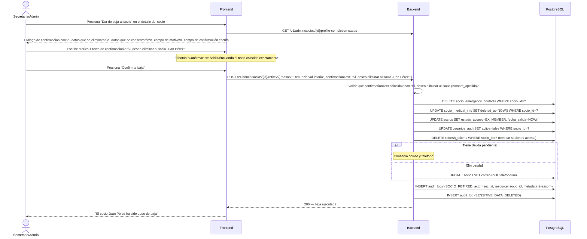

# Flujo 27 — Retiro de Socio y Gestión de Datos Sensibles

## ¿Qué es este flujo?

Dar de baja a un socio del club implica más que cambiar un estado en la base de datos: requiere eliminar sus datos médicos y contactos de emergencia (ya no son necesarios para seguridad en salidas), conservar lo mínimo legalmente requerido, y registrar todo el proceso con trazabilidad completa.

Este flujo describe cómo se ejecuta la baja, qué datos se eliminan, cuáles se conservan y por qué.

Relacionado con: [Flujo 5 — Gestión de Socios](./05-gestion-socios.md) · [Flujo 23 — Gestión Documental](./23-gestion-documental.md)

---

## Historia de usuario

> **Como secretaria**, quiero dar de baja a un socio que decidió salir del club, asegurándome de que sus datos médicos se eliminen inmediatamente, pero conservando su historial de participación para las estadísticas del club.

---

## Qué datos se eliminan y cuáles se conservan

| Dato | Acción al retiro |
|------|-----------------|
| Nombre, apellido, cédula | **Conservar** |
| Correo, teléfono | Conservar si hay deuda pendiente; eliminar si no |
| Fecha de ingreso / fecha de salida | **Conservar** |
| Tipo de socio, nivel técnico histórico | **Conservar** |
| Cargos/dignidades en salidas | **Conservar** |
| Aceptaciones legales (`legal_document_acceptances`) | **Conservar para siempre** (evidencia legal) |
| Historial financiero | **Conservar** |
| Participación en salidas (historial) | **Conservar** |
| Contactos de emergencia (`socio_emergency_contacts`) | **Eliminar** |
| Información médica (`socio_medical_info`) | **Eliminar** (soft delete → hard delete diferido) |
| `estado_acceso` | Cambiar a `EX_MEMBER` |
| Cuenta `usuarios_auth` | Desactivar (no eliminar) |

**Caso especial — deuda pendiente**: La baja procede igualmente. Los datos médicos y contactos de emergencia se eliminan sin excepción. Solo se conservan nombre, cédula, correo, teléfono y registros financieros.

---

## Flujo paso a paso (en el sistema)

### 1. La secretaria o admin presiona "Dar de baja al socio"

Desde el detalle del socio en el panel de administración.

### 2. Se abre el diálogo de confirmación

El diálogo muestra:
- El nombre completo del socio
- Resumen de datos que se **eliminarán**: contactos de emergencia, información médica
- Resumen de datos que se **conservarán**: historial de salidas, aceptaciones legales, registros financieros
- Aviso si el socio tiene deuda pendiente (con qué datos extra se conservarán)
- Un campo de texto para escribir la confirmación

### 3. Confirmación escrita obligatoria

Para habilitar el botón de confirmar, la secretaria debe escribir exactamente:

```
Si, deseo eliminar al socio NOMBRE APELLIDO
```

(donde `NOMBRE APELLIDO` es el nombre del socio que aparece en pantalla)

El botón permanece deshabilitado hasta que el texto coincida. La comparación es sin distinción de mayúsculas/minúsculas, pero el texto completo debe estar presente.

### 4. El admin/secretaria también debe ingresar el motivo

Junto a la confirmación escrita, hay un campo de texto obligatorio: **Motivo de la baja** (renuncia, incumplimiento, fallecimiento, etc.). Este texto se almacena en el registro del retiro y en el `audit_log`.

---

## Diagrama



---

## Qué ve el socio dado de baja

- Al intentar iniciar sesión: mensaje de acceso denegado (estado EX_MEMBER)
- Sus sesiones activas se cierran inmediatamente al ejecutarse la baja
- No recibe notificación automática del sistema — la comunicación es responsabilidad del club

---

## Restricciones

| Restricción | Detalle |
|-------------|---------|
| La confirmación escrita es obligatoria | No puede omitirse ni reducirse a un checkbox |
| La acción no es reversible (en datos) | Los datos médicos y contactos se eliminan definitivamente; no se puede deshacer |
| El socio puede ser reactivado | El estado EX_MEMBER se puede revertir a ACTIVE por un admin, pero los datos médicos y de contacto habrán sido eliminados |
| Solo ADMIN y SECRETARIA pueden ejecutar la baja | Los socios con rol DIRECTIVO no tienen acceso a este endpoint |

---

## Mobile

En la app Flutter, el flujo es idéntico. El diálogo de confirmación se presenta como un bottom sheet con:
- Resumen de la acción
- Campo de texto para el motivo
- Campo de texto para la confirmación escrita
- Botón "Confirmar" (deshabilitado hasta que el texto coincida)

---

## Auditoría

Todos los eventos del retiro se registran en `audit_log`:

| Evento | Cuándo |
|--------|--------|
| `SOCIO_RETIRED` | Al ejecutar la baja — incluye el motivo |
| `SENSITIVE_DATA_DELETED` | Al eliminar los datos médicos y contactos de emergencia |
