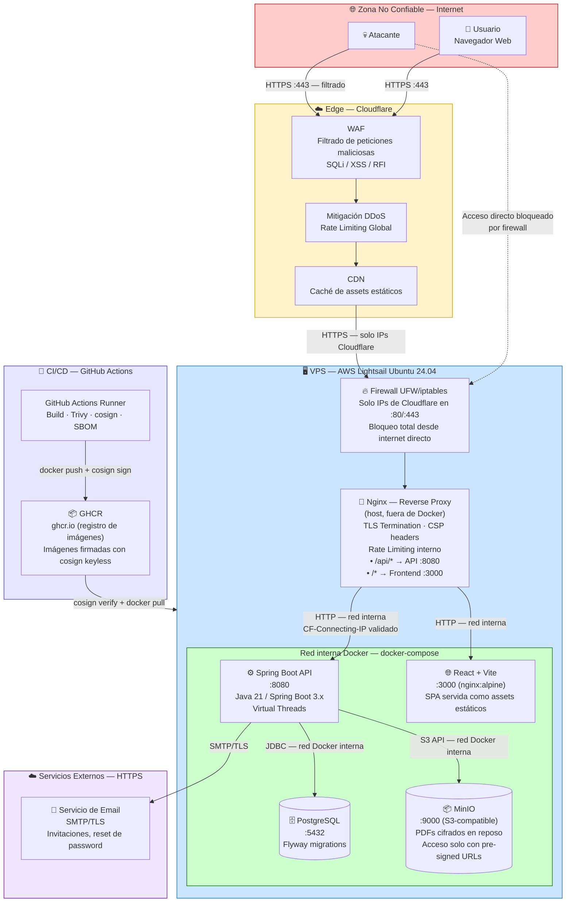
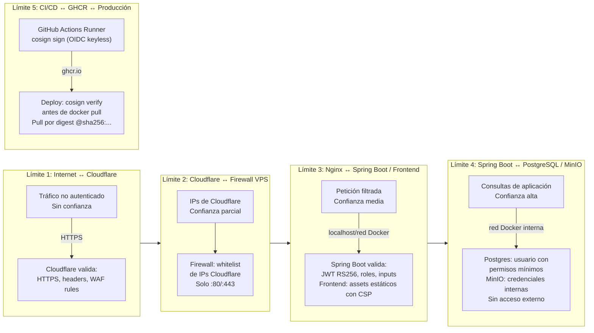
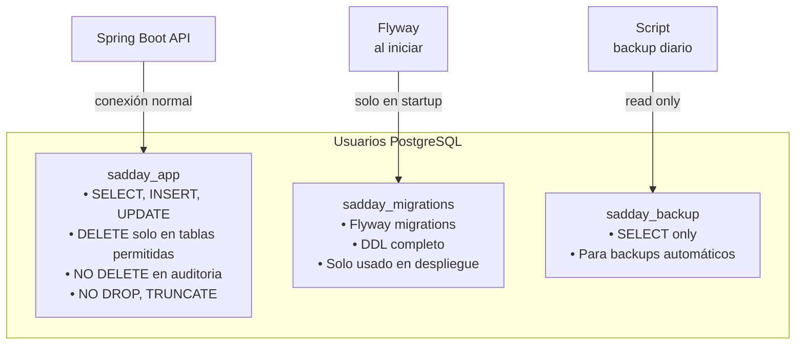

# Diagrama 01 — Arquitectura del Sistema y Límites de Confianza

## Arquitectura General

---

## Límites de Confianza (Trust Boundaries)

---

## Principio de Mínimo Privilegio — Usuarios de Base de Datos

