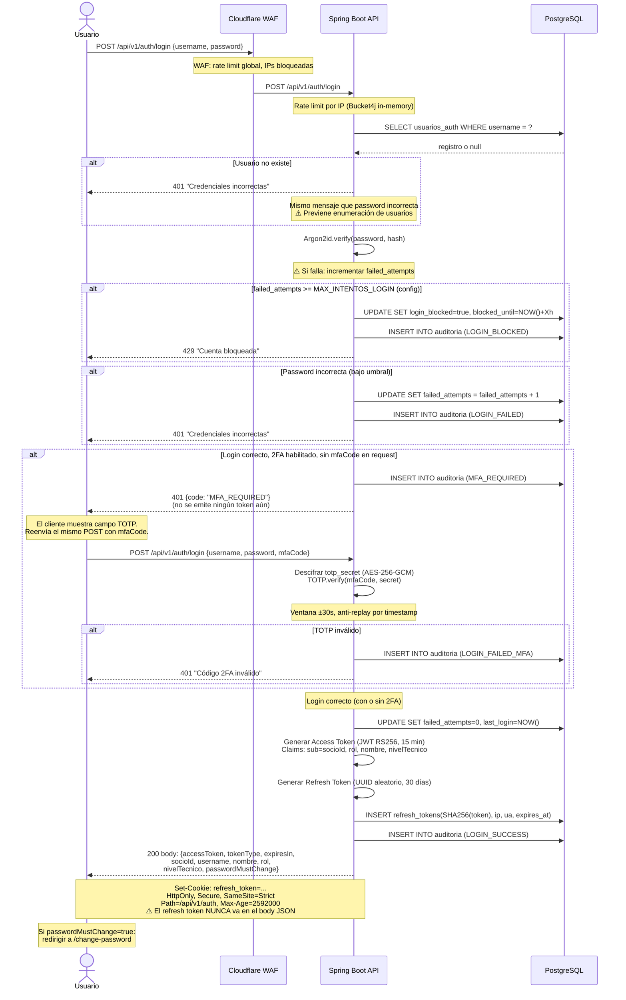
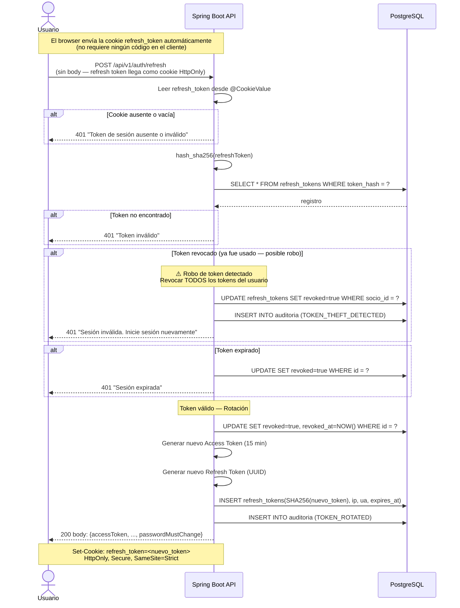
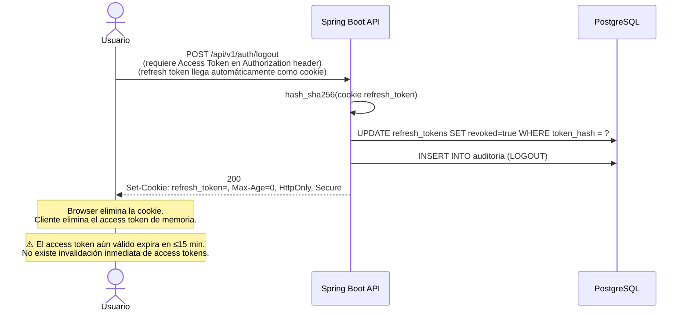
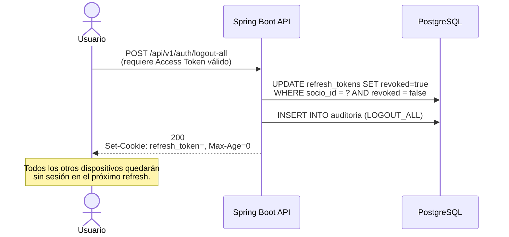
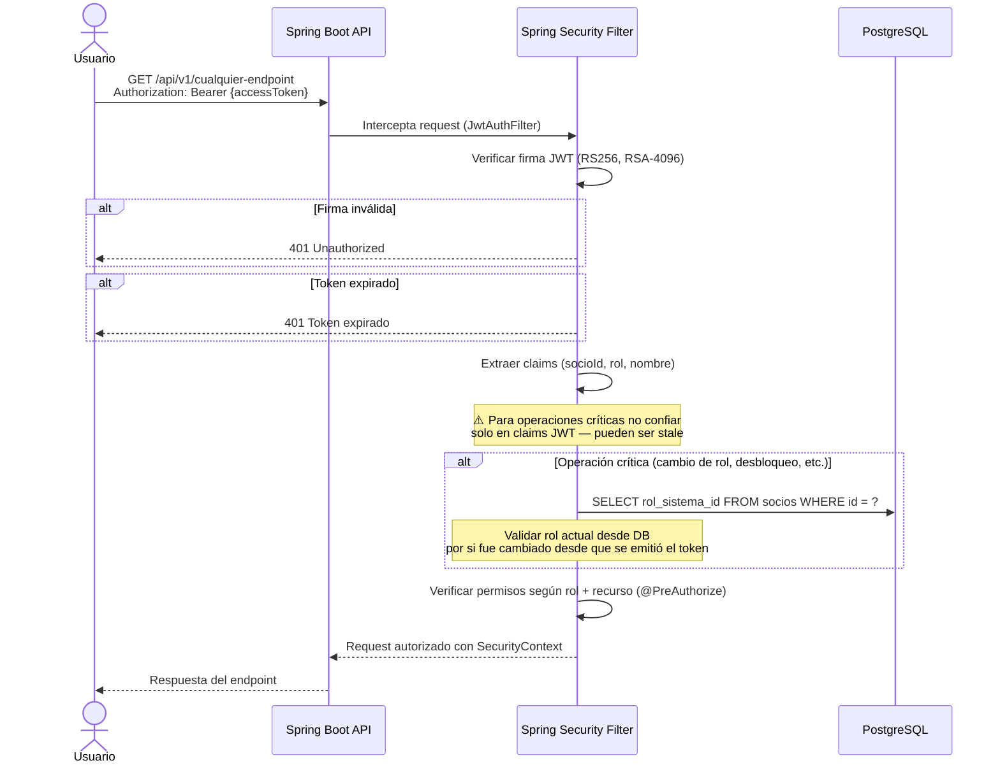
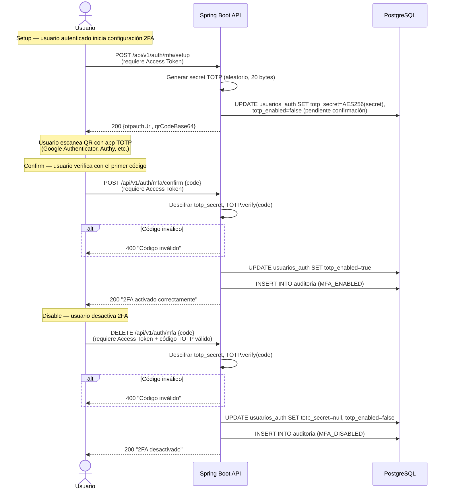

# Diagrama 02 — Flujos de Autenticación

## Flujo 1: Login (con y sin 2FA)

---

## Flujo 2: Refresh de Access Token (Rotación)

---

## Flujo 3: Logout

---

## Flujo 4: Logout en todos los dispositivos

---

## Flujo 5: Verificación de Access Token en cada Request

---

## Flujo 6: Configuración 2FA (Setup / Confirm / Disable)

