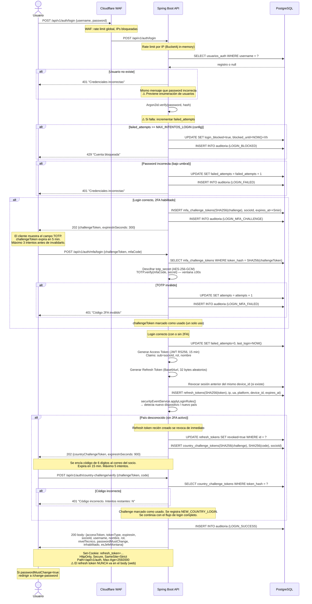
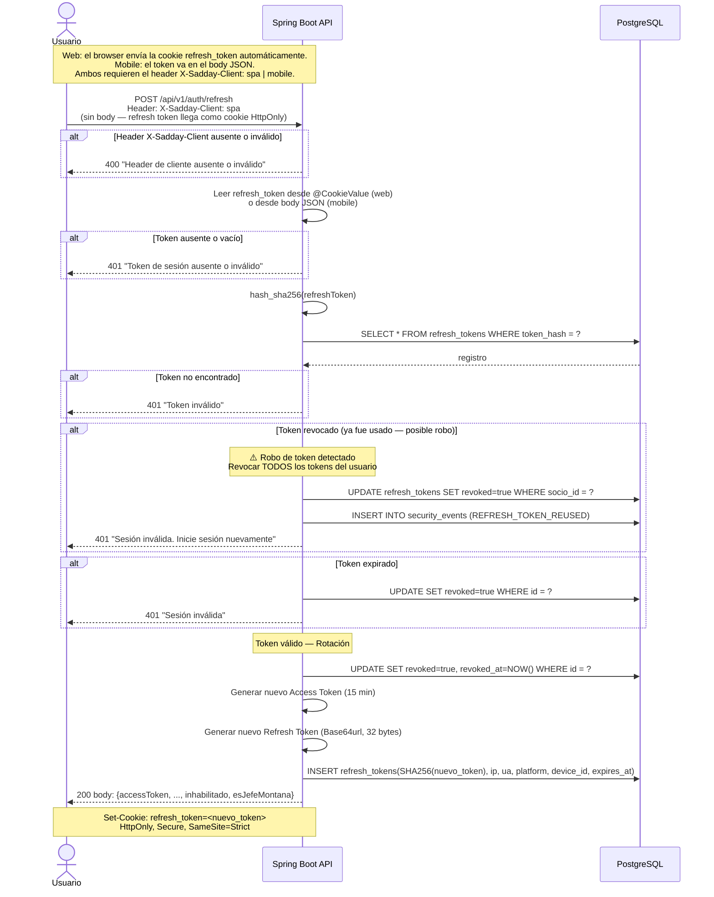
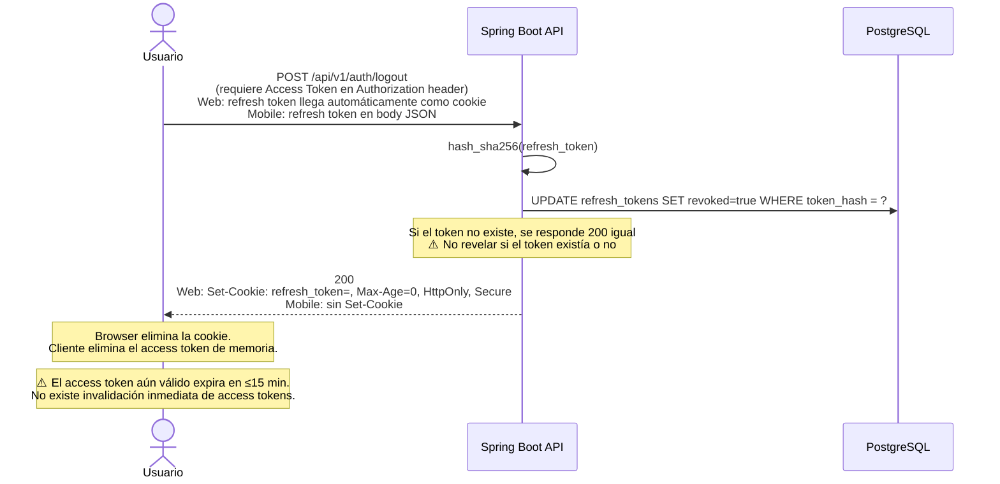
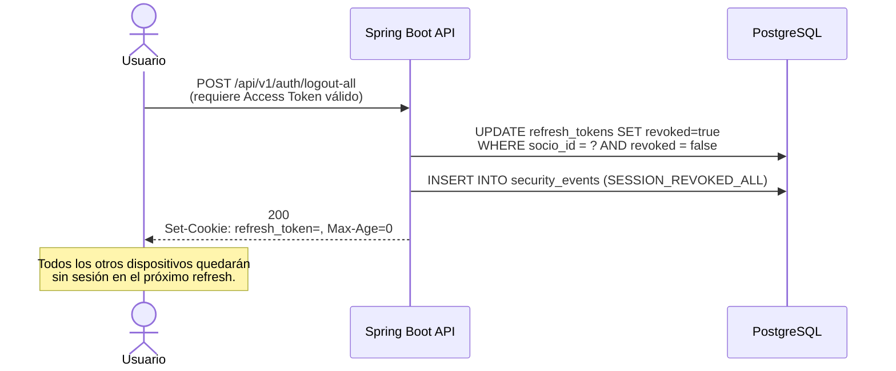
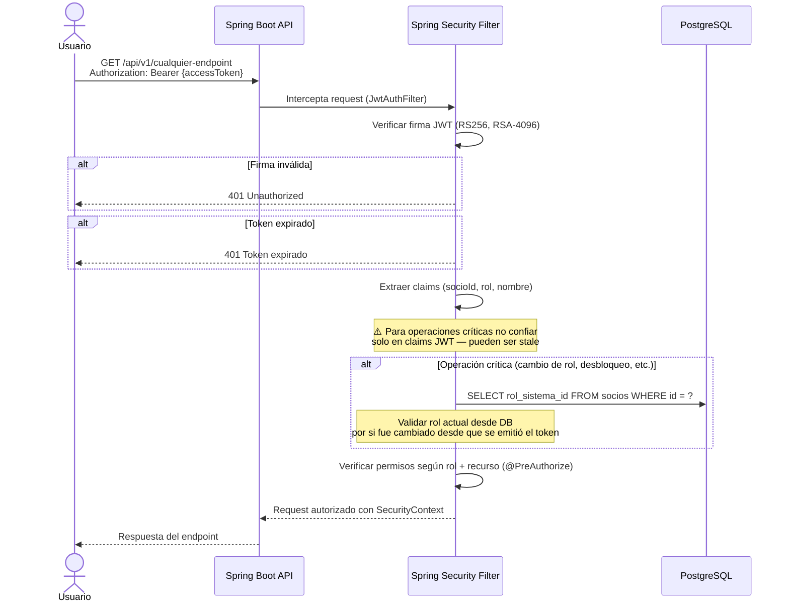
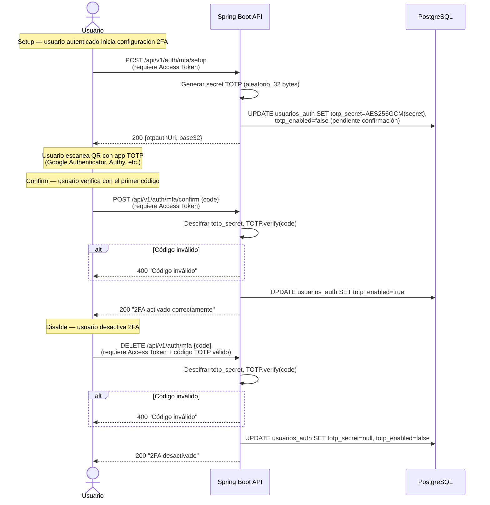
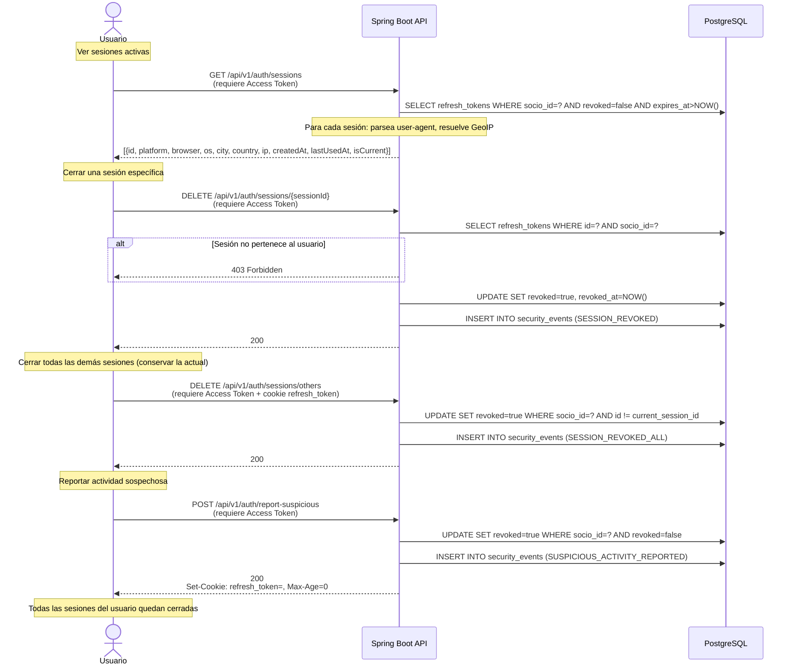
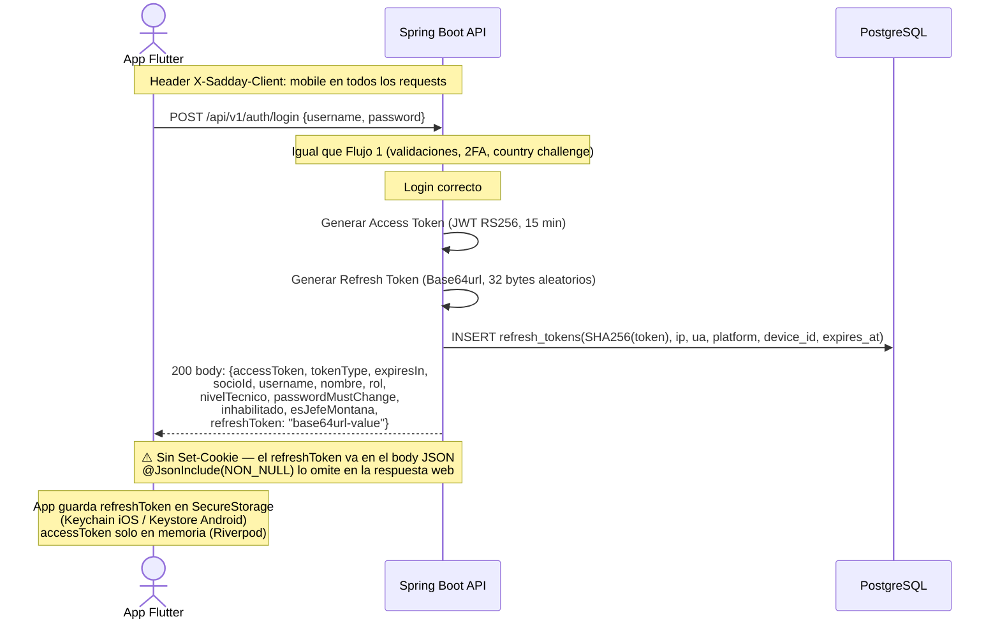
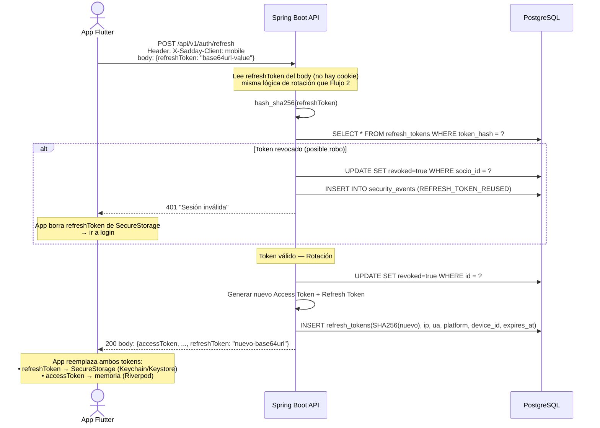
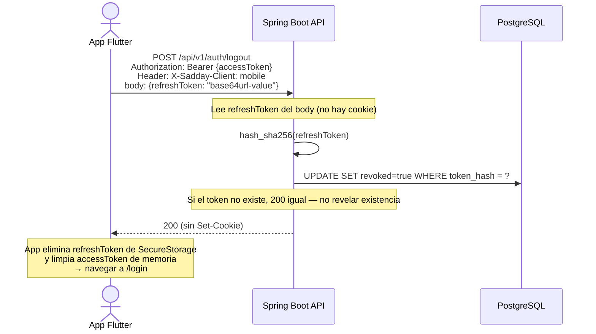

# Diagrama 02 — Flujos de Autenticación

## Flujo 1: Login (con y sin 2FA, con y sin país desconocido)

```mermaid
sequenceDiagram
    actor U as Usuario
    participant CF as Cloudflare WAF
    participant API as Spring Boot API
    participant DB as PostgreSQL

    U->>CF: POST /api/v1/auth/login {username, password}
    Note over CF: WAF: rate limit global, IPs bloqueadas

    CF->>API: POST /api/v1/auth/login
    Note over API: Rate limit por IP (Bucket4j in-memory)

    API->>DB: SELECT usuarios_auth WHERE username = ?
    DB-->>API: registro o null

    alt Usuario no existe
        API-->>U: 401 "Credenciales incorrectas"
        Note over API: Mismo mensaje que password incorrecta<br/>⚠️ Previene enumeración de usuarios
    end

    API->>API: Argon2id.verify(password, hash)
    Note over API: ⚠️ Si falla: incrementar failed_attempts

    alt failed_attempts >= MAX_INTENTOS_LOGIN (config)
        API->>DB: UPDATE SET login_blocked=true, blocked_until=NOW()+Xh
        API->>DB: INSERT INTO auditoria (LOGIN_BLOCKED)
        API-->>U: 429 "Cuenta bloqueada"
    end

    alt Password incorrecta (bajo umbral)
        API->>DB: UPDATE SET failed_attempts = failed_attempts + 1
        API->>DB: INSERT INTO auditoria (LOGIN_FAILED)
        API-->>U: 401 "Credenciales incorrectas"
    end

    alt Login correcto, 2FA habilitado
        API->>DB: INSERT mfa_challenge_tokens(SHA256(challenge), socioId, expires_at=+5min)
        API->>DB: INSERT INTO auditoria (LOGIN_MFA_CHALLENGE)
        API-->>U: 202 {challengeToken, expiresInSeconds: 300}
        Note over U: El cliente muestra el campo TOTP.<br/>challengeToken expira en 5 min.<br/>Máximo 3 intentos antes de invalidarlo.

        U->>API: POST /api/v1/auth/mfa/login {challengeToken, mfaCode}
        API->>DB: SELECT mfa_challenge_tokens WHERE token_hash = SHA256(challengeToken)
        API->>API: Descifrar totp_secret (AES-256-GCM)<br/>TOTP.verify(mfaCode, secret) — ventana ±30s

        alt TOTP inválido
            API->>DB: UPDATE SET attempts = attempts + 1
            API->>DB: INSERT INTO auditoria (LOGIN_MFA_FAILED)
            API-->>U: 401 "Código 2FA inválido"
        end
        Note over API: challengeToken marcado como usado (un solo uso)
    end

    Note over API: Login correcto (con o sin 2FA)
    API->>DB: UPDATE SET failed_attempts=0, last_login=NOW()
    API->>API: Generar Access Token (JWT RS256, 15 min)<br/>Claims: sub=socioId, rol, nombre
    API->>API: Generar Refresh Token (Base64url, 32 bytes aleatorios)
    API->>DB: Revocar sesión anterior del mismo device_id (si existe)
    API->>DB: INSERT refresh_tokens(SHA256(token), ip, ua, platform, device_id, expires_at)
    API->>API: securityEventService.applyLoginRules()<br/>→ detecta nuevo dispositivo / nuevo país

    alt País desconocido (sin 2FA activo)
        Note over API: Refresh token recién creado se revoca de inmediato
        API->>DB: UPDATE refresh_tokens SET revoked=true WHERE id = ?
        API->>DB: INSERT country_challenge_tokens(SHA256(challenge), SHA256(code), socioId)
        API-->>U: 202 {countryChallengeToken, expiresInSeconds: 900}
        Note over U,API: Se envía código de 6 dígitos al correo del socio.<br/>Expira en 15 min. Máximo 5 intentos.

        U->>API: POST /api/v1/auth/country-challenge/verify {challengeToken, code}
        API->>DB: SELECT country_challenge_tokens WHERE token_hash = ?
        alt Código incorrecto
            API-->>U: 401 "Código incorrecto. Intentos restantes: N"
        end
        Note over API: Challenge marcado como usado. Se registra NEW_COUNTRY_LOGIN.<br/>Se continúa con el flujo de login completo.
    end

    API->>DB: INSERT INTO auditoria (LOGIN_SUCCESS)

    API-->>U: 200 body: {accessToken, tokenType, expiresIn,<br/>socioId, username, nombre, rol,<br/>nivelTecnico, passwordMustChange,<br/>inhabilitado, esJefeMontana}
    Note over U,API: Set-Cookie: refresh_token=...<br/>HttpOnly, Secure, SameSite=Strict<br/>Path=/api/v1/auth, Max-Age=2592000<br/>⚠️ El refresh token NUNCA va en el body (web)
    Note over U: Si passwordMustChange=true:<br/>redirigir a /change-password
```

---

## Flujo 2: Refresh de Access Token (Rotación)

```mermaid
sequenceDiagram
    actor U as Usuario
    participant API as Spring Boot API
    participant DB as PostgreSQL

    Note over U,API: Web: el browser envía la cookie refresh_token automáticamente.<br/>Mobile: el token va en el body JSON.<br/>Ambos requieren el header X-Sadday-Client: spa | mobile.

    U->>API: POST /api/v1/auth/refresh<br/>Header: X-Sadday-Client: spa<br/>(sin body — refresh token llega como cookie HttpOnly)

    alt Header X-Sadday-Client ausente o inválido
        API-->>U: 400 "Header de cliente ausente o inválido"
    end

    API->>API: Leer refresh_token desde @CookieValue (web)<br/>o desde body JSON (mobile)

    alt Token ausente o vacío
        API-->>U: 401 "Token de sesión ausente o inválido"
    end

    API->>API: hash_sha256(refreshToken)
    API->>DB: SELECT * FROM refresh_tokens WHERE token_hash = ?
    DB-->>API: registro

    alt Token no encontrado
        API-->>U: 401 "Token inválido"
    end

    alt Token revocado (ya fue usado — posible robo)
        Note over API: ⚠️ Robo de token detectado<br/>Revocar TODOS los tokens del usuario
        API->>DB: UPDATE refresh_tokens SET revoked=true WHERE socio_id = ?
        API->>DB: INSERT INTO security_events (REFRESH_TOKEN_REUSED)
        API-->>U: 401 "Sesión inválida. Inicie sesión nuevamente"
    end

    alt Token expirado
        API->>DB: UPDATE SET revoked=true WHERE id = ?
        API-->>U: 401 "Sesión inválida"
    end

    Note over API: Token válido — Rotación
    API->>DB: UPDATE SET revoked=true, revoked_at=NOW() WHERE id = ?
    API->>API: Generar nuevo Access Token (15 min)
    API->>API: Generar nuevo Refresh Token (Base64url, 32 bytes)
    API->>DB: INSERT refresh_tokens(SHA256(nuevo_token), ip, ua, platform, device_id, expires_at)

    API-->>U: 200 body: {accessToken, ..., inhabilitado, esJefeMontana}
    Note over U,API: Set-Cookie: refresh_token=<nuevo_token><br/>HttpOnly, Secure, SameSite=Strict
```

---

## Flujo 3: Logout

```mermaid
sequenceDiagram
    actor U as Usuario
    participant API as Spring Boot API
    participant DB as PostgreSQL

    U->>API: POST /api/v1/auth/logout<br/>(requiere Access Token en Authorization header)<br/>Web: refresh token llega automáticamente como cookie<br/>Mobile: refresh token en body JSON

    API->>API: hash_sha256(refresh_token)
    API->>DB: UPDATE refresh_tokens SET revoked=true WHERE token_hash = ?
    Note over API: Si el token no existe, se responde 200 igual<br/>⚠️ No revelar si el token existía o no

    API-->>U: 200<br/>Web: Set-Cookie: refresh_token=, Max-Age=0, HttpOnly, Secure<br/>Mobile: sin Set-Cookie
    Note over U: Browser elimina la cookie.<br/>Cliente elimina el access token de memoria.
    Note over U: ⚠️ El access token aún válido expira en ≤15 min.<br/>No existe invalidación inmediata de access tokens.
```

---

## Flujo 4: Logout en todos los dispositivos

```mermaid
sequenceDiagram
    actor U as Usuario
    participant API as Spring Boot API
    participant DB as PostgreSQL

    U->>API: POST /api/v1/auth/logout-all<br/>(requiere Access Token válido)

    API->>DB: UPDATE refresh_tokens SET revoked=true<br/>WHERE socio_id = ? AND revoked = false
    API->>DB: INSERT INTO security_events (SESSION_REVOKED_ALL)

    API-->>U: 200<br/>Set-Cookie: refresh_token=, Max-Age=0
    Note over U: Todos los otros dispositivos quedarán<br/>sin sesión en el próximo refresh.
```

---

## Flujo 5: Verificación de Access Token en cada Request

```mermaid
sequenceDiagram
    actor U as Usuario
    participant API as Spring Boot API
    participant SEC as Spring Security Filter
    participant DB as PostgreSQL

    U->>API: GET /api/v1/cualquier-endpoint<br/>Authorization: Bearer {accessToken}

    API->>SEC: Intercepta request (JwtAuthFilter)
    SEC->>SEC: Verificar firma JWT (RS256, RSA-4096)

    alt Firma inválida
        SEC-->>U: 401 Unauthorized
    end

    alt Token expirado
        SEC-->>U: 401 Token expirado
    end

    SEC->>SEC: Extraer claims (socioId, rol, nombre)
    Note over SEC: ⚠️ Para operaciones críticas no confiar<br/>solo en claims JWT — pueden ser stale

    alt Operación crítica (cambio de rol, desbloqueo, etc.)
        SEC->>DB: SELECT rol_sistema_id FROM socios WHERE id = ?
        Note over SEC: Validar rol actual desde DB<br/>por si fue cambiado desde que se emitió el token
    end

    SEC->>SEC: Verificar permisos según rol + recurso (@PreAuthorize)
    SEC-->>API: Request autorizado con SecurityContext
    API-->>U: Respuesta del endpoint
```

---

## Flujo 6: Configuración 2FA (Setup / Confirm / Disable)

```mermaid
sequenceDiagram
    actor U as Usuario
    participant API as Spring Boot API
    participant DB as PostgreSQL

    Note over U: Setup — usuario autenticado inicia configuración 2FA
    U->>API: POST /api/v1/auth/mfa/setup<br/>(requiere Access Token)
    API->>API: Generar secret TOTP (aleatorio, 32 bytes)
    API->>DB: UPDATE usuarios_auth SET totp_secret=AES256GCM(secret),<br/>totp_enabled=false (pendiente confirmación)
    API-->>U: 200 {otpauthUri, base32}
    Note over U: Usuario escanea QR con app TOTP<br/>(Google Authenticator, Authy, etc.)

    Note over U: Confirm — usuario verifica con el primer código
    U->>API: POST /api/v1/auth/mfa/confirm {code}<br/>(requiere Access Token)
    API->>API: Descifrar totp_secret, TOTP.verify(code)
    alt Código inválido
        API-->>U: 400 "Código inválido"
    end
    API->>DB: UPDATE usuarios_auth SET totp_enabled=true
    API-->>U: 200 "2FA activado correctamente"

    Note over U: Disable — usuario desactiva 2FA
    U->>API: DELETE /api/v1/auth/mfa {code}<br/>(requiere Access Token + código TOTP válido)
    API->>API: Descifrar totp_secret, TOTP.verify(code)
    alt Código inválido
        API-->>U: 400 "Código inválido"
    end
    API->>DB: UPDATE usuarios_auth SET totp_secret=null, totp_enabled=false
    API-->>U: 200 "2FA desactivado"
```

---

## Flujo 7: Gestión de Sesiones Activas

```mermaid
sequenceDiagram
    actor U as Usuario
    participant API as Spring Boot API
    participant DB as PostgreSQL

    Note over U: Ver sesiones activas
    U->>API: GET /api/v1/auth/sessions<br/>(requiere Access Token)
    API->>DB: SELECT refresh_tokens WHERE socio_id=? AND revoked=false AND expires_at>NOW()
    Note over API: Para cada sesión: parsea user-agent, resuelve GeoIP
    API-->>U: [{id, platform, browser, os, city, country, ip, createdAt, lastUsedAt, isCurrent}]

    Note over U: Cerrar una sesión específica
    U->>API: DELETE /api/v1/auth/sessions/{sessionId}<br/>(requiere Access Token)
    API->>DB: SELECT refresh_tokens WHERE id=? AND socio_id=?
    alt Sesión no pertenece al usuario
        API-->>U: 403 Forbidden
    end
    API->>DB: UPDATE SET revoked=true, revoked_at=NOW()
    API->>DB: INSERT INTO security_events (SESSION_REVOKED)
    API-->>U: 200

    Note over U: Cerrar todas las demás sesiones (conservar la actual)
    U->>API: DELETE /api/v1/auth/sessions/others<br/>(requiere Access Token + cookie refresh_token)
    API->>DB: UPDATE SET revoked=true WHERE socio_id=? AND id != current_session_id
    API->>DB: INSERT INTO security_events (SESSION_REVOKED_ALL)
    API-->>U: 200

    Note over U: Reportar actividad sospechosa
    U->>API: POST /api/v1/auth/report-suspicious<br/>(requiere Access Token)
    API->>DB: UPDATE SET revoked=true WHERE socio_id=? AND revoked=false
    API->>DB: INSERT INTO security_events (SUSPICIOUS_ACTIVITY_REPORTED)
    API-->>U: 200<br/>Set-Cookie: refresh_token=, Max-Age=0
    Note over U: Todas las sesiones del usuario quedan cerradas
```

---

## Flujo 1b: Login Mobile (X-Sadday-Client: mobile)

> Complementa el Flujo 1. Cuando el header `X-Sadday-Client: mobile` está presente, el backend
> omite la cookie y devuelve el refresh token directamente en el body JSON.
> La app lo guarda en Keychain (iOS) o Keystore (Android) mediante `flutter_secure_storage`.

```mermaid
sequenceDiagram
    actor App as App Flutter
    participant API as Spring Boot API
    participant DB as PostgreSQL

    Note over App,API: Header X-Sadday-Client: mobile en todos los requests

    App->>API: POST /api/v1/auth/login {username, password}
    Note over API: Igual que Flujo 1 (validaciones, 2FA, country challenge)
    Note over API: Login correcto

    API->>API: Generar Access Token (JWT RS256, 15 min)
    API->>API: Generar Refresh Token (Base64url, 32 bytes aleatorios)
    API->>DB: INSERT refresh_tokens(SHA256(token), ip, ua, platform, device_id, expires_at)

    API-->>App: 200 body: {accessToken, tokenType, expiresIn,<br/>socioId, username, nombre, rol,<br/>nivelTecnico, passwordMustChange,<br/>inhabilitado, esJefeMontana,<br/>refreshToken: "base64url-value"}
    Note over API,App: ⚠️ Sin Set-Cookie — el refreshToken va en el body JSON<br/>@JsonInclude(NON_NULL) lo omite en la respuesta web

    Note over App: App guarda refreshToken en SecureStorage<br/>(Keychain iOS / Keystore Android)<br/>accessToken solo en memoria (Riverpod)
```

---

## Flujo 2b: Refresh de Access Token Mobile (token en body)

> Complementa el Flujo 2. Mobile envía el refresh token en el body JSON en lugar de cookie.
> El backend acepta ambos mecanismos según el header `X-Sadday-Client`.

```mermaid
sequenceDiagram
    actor App as App Flutter
    participant API as Spring Boot API
    participant DB as PostgreSQL

    App->>API: POST /api/v1/auth/refresh<br/>Header: X-Sadday-Client: mobile<br/>body: {refreshToken: "base64url-value"}
    Note over API: Lee refreshToken del body (no hay cookie)<br/>misma lógica de rotación que Flujo 2

    API->>API: hash_sha256(refreshToken)
    API->>DB: SELECT * FROM refresh_tokens WHERE token_hash = ?

    alt Token revocado (posible robo)
        API->>DB: UPDATE SET revoked=true WHERE socio_id = ?
        API->>DB: INSERT INTO security_events (REFRESH_TOKEN_REUSED)
        API-->>App: 401 "Sesión inválida"
        Note over App: App borra refreshToken de SecureStorage<br/>→ ir a login
    end

    Note over API: Token válido — Rotación
    API->>DB: UPDATE SET revoked=true WHERE id = ?
    API->>API: Generar nuevo Access Token + Refresh Token
    API->>DB: INSERT refresh_tokens(SHA256(nuevo), ip, ua, platform, device_id, expires_at)

    API-->>App: 200 body: {accessToken, ..., refreshToken: "nuevo-base64url"}
    Note over App: App reemplaza ambos tokens:<br/>• refreshToken → SecureStorage (Keychain/Keystore)<br/>• accessToken → memoria (Riverpod)
```

---

## Flujo 3b: Logout Mobile (token en body)

> Complementa el Flujo 3. Mobile envía el refresh token en el body y el access token en el header.

```mermaid
sequenceDiagram
    actor App as App Flutter
    participant API as Spring Boot API
    participant DB as PostgreSQL

    App->>API: POST /api/v1/auth/logout<br/>Authorization: Bearer {accessToken}<br/>Header: X-Sadday-Client: mobile<br/>body: {refreshToken: "base64url-value"}
    Note over API: Lee refreshToken del body (no hay cookie)

    API->>API: hash_sha256(refreshToken)
    API->>DB: UPDATE SET revoked=true WHERE token_hash = ?
    Note over API: Si el token no existe, 200 igual — no revelar existencia

    API-->>App: 200 (sin Set-Cookie)
    Note over App: App elimina refreshToken de SecureStorage<br/>y limpia accessToken de memoria<br/>→ navegar a /login
```
