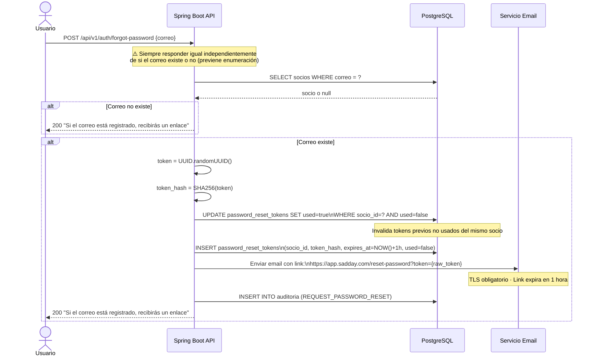
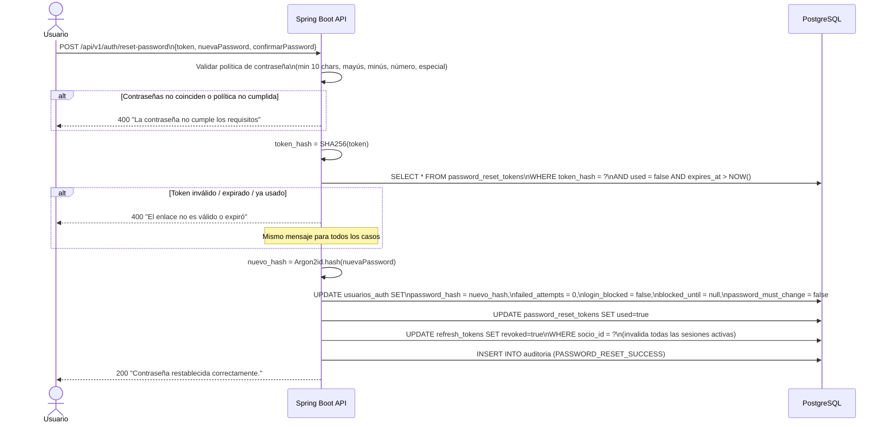
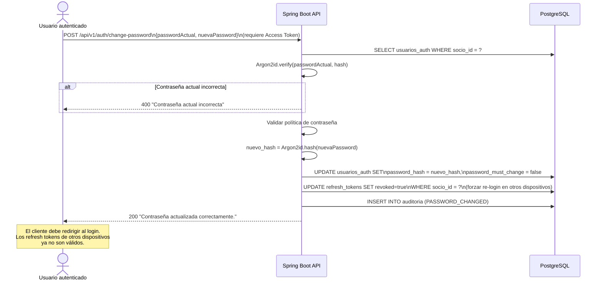
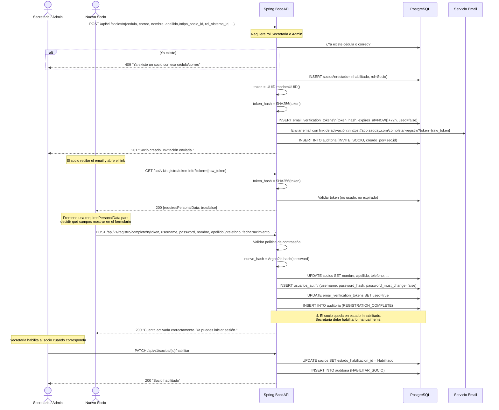
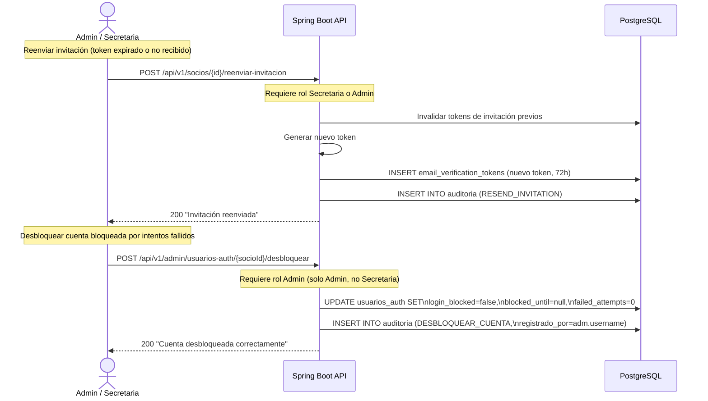

# Diagrama 03 — Flujos de Gestión de Contraseña y Registro

## Flujo 1: Solicitud de Reset de Contraseña (por el usuario)

---

## Flujo 2: Completar Reset de Contraseña

---

## Flujo 3: Cambio de Contraseña (usuario autenticado)

---

## Flujo 4: Registro Inicial de Nuevo Socio (por Secretaria/Admin)

---

## Flujo 5: Reenvío de Invitación y Desbloqueo de Cuenta

