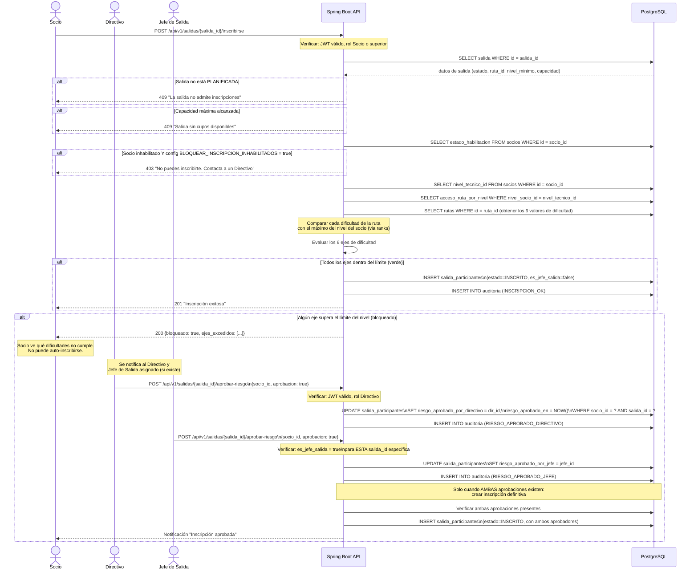
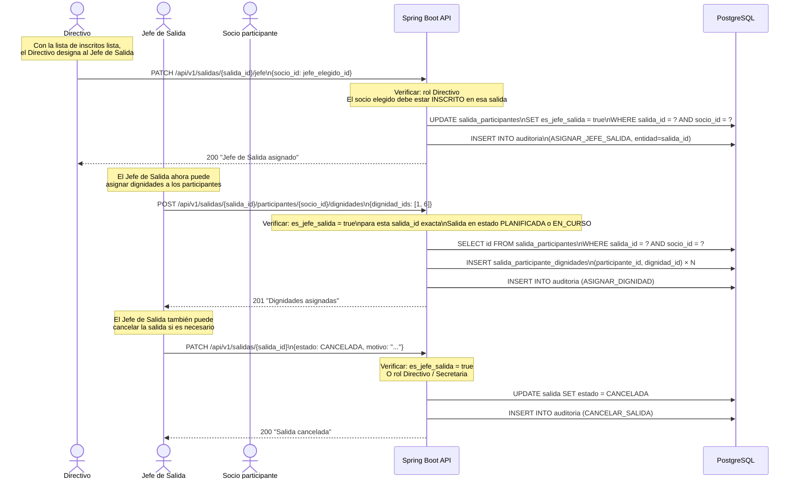
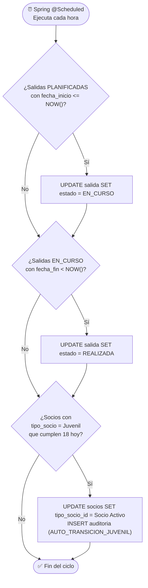

# Diagrama 04 — Flujo de Inscripción a Salida con Validación de Nivel

## Flujo Principal de Inscripción

---

## Flujo: Asignación de Jefe de Salida y Dignidades

---

## Flujo: Transición de Estado de Salida (Scheduler)

