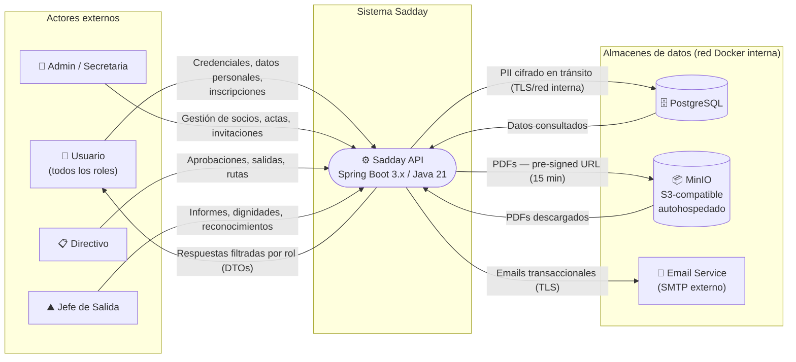
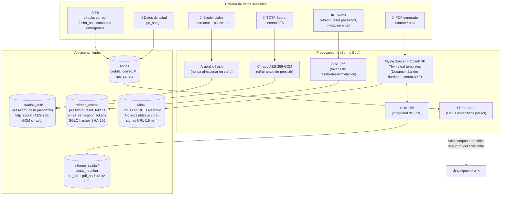
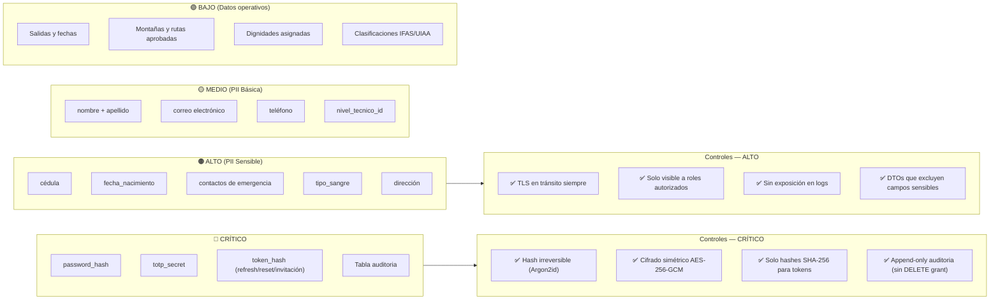
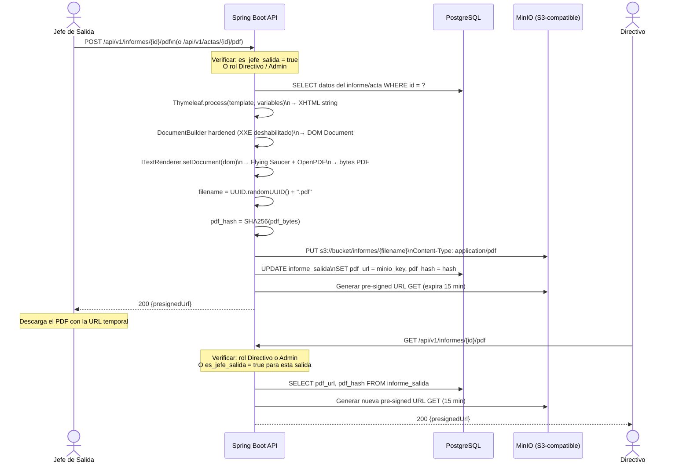

# Diagrama 05 — Flujo de Datos (DFD) y Clasificación de Datos Sensibles

## DFD Nivel 0 — Vista General del Sistema

---

## DFD Nivel 1 — Flujo de Datos Sensibles (PII y Credenciales)

---

## Clasificación de Datos y Controles Requeridos

---

## Flujo de Generación y Acceso a PDF (Informes y Actas)

