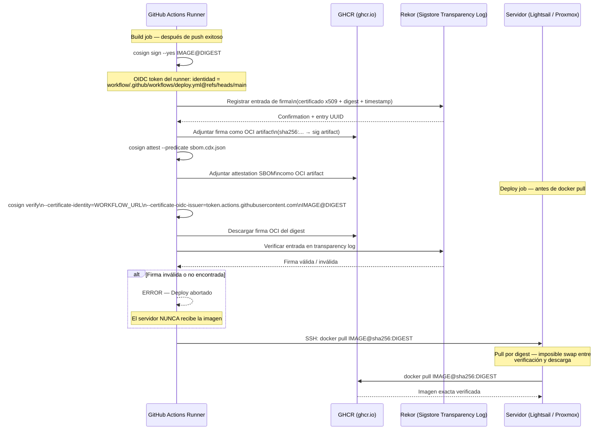
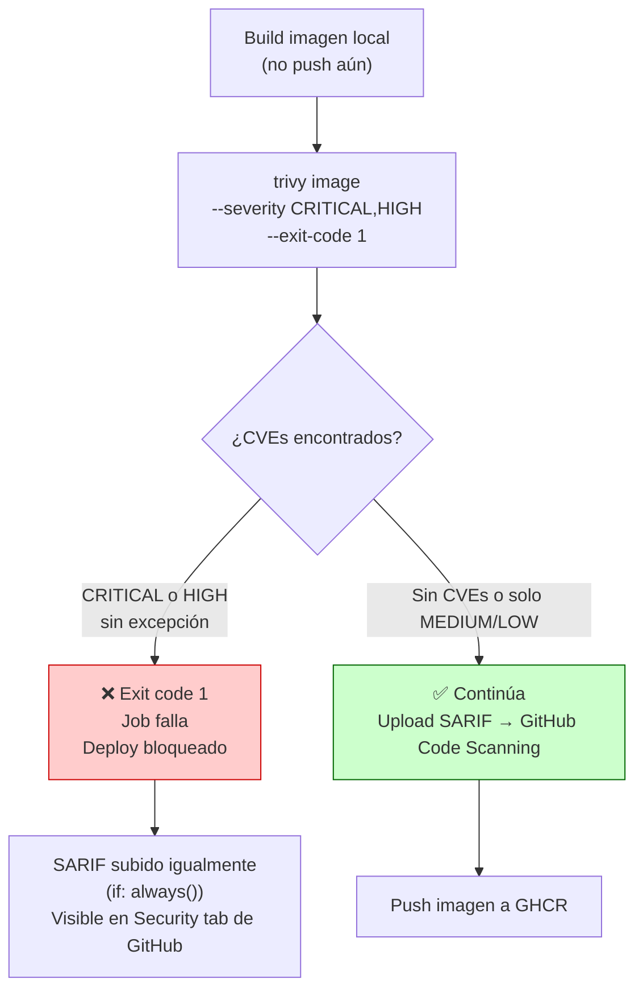
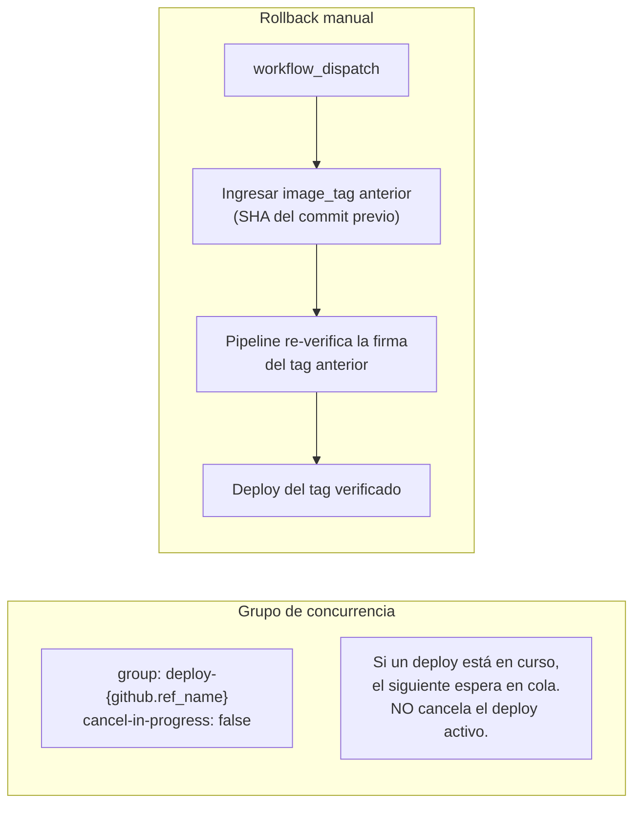

# Diagrama 06 — Pipeline CI/CD de Seguridad

## Visión General del Pipeline

```mermaid
flowchart TD
    subgraph TRIGGER["Disparadores"]
        T1["Push a main\n→ Deploy producción"]
        T2["Push a develop\n→ Deploy staging"]
        T3["workflow_dispatch\n(manual, elige ambiente)"]
    end

    subgraph CI["GitHub Actions — Jobs paralelos"]
        subgraph BB["build-backend"]
            BB1["Checkout"]
            BB2["Build imagen local\n(sin push)"]
            BB3["Trivy scan\nCRITICAL/HIGH\n→ bloquea si hay CVEs"]
            BB4["Push a GHCR\nghcr.io/org/repo:sha"]
            BB5["cosign sign\n(keyless OIDC)"]
            BB6["SBOM CycloneDX\n(anchore/sbom-action)"]
            BB7["cosign attest SBOM"]
        end

        subgraph BF["build-frontend"]
            BF1["Checkout"]
            BF2["Build imagen local\n(sin push)"]
            BF3["Trivy scan\nCRITICAL/HIGH\n→ bloquea si hay CVEs"]
            BF4["Push a GHCR\nghcr.io/org/repo-frontend:sha"]
            BF5["cosign sign\n(keyless OIDC)"]
            BF6["SBOM CycloneDX"]
            BF7["cosign attest SBOM"]
        end
    end

    subgraph DEPLOY_STAGING["deploy-staging (develop → Proxmox VM)"]
        DQ1["cosign verify\nbackend + frontend\n→ bloquea si firma inválida"]
        DQ2["SCP docker-compose al servidor"]
        DQ3["SSH: docker login GHCR"]
        DQ4["SSH: docker pull\npor digest @sha256:...\n(no por tag)"]
        DQ5["docker compose up\n--pull never"]
        DQ6["Health check\nGET /actuator/health\n(8 intentos, 10s entre c/u)"]
    end

    subgraph DEPLOY_PROD["deploy (main → Lightsail)"]
        DP1["cosign verify\nbackend + frontend\n→ bloquea si firma inválida"]
        DP2["SCP docker-compose al servidor"]
        DP3["SSH: docker login GHCR"]
        DP4["SSH: docker pull\npor digest @sha256:...\n(no por tag)"]
        DP5["docker compose up\n--pull never api frontend"]
        DP6["Health check\nGET /actuator/health\n(10 intentos, 15s entre c/u)"]
    end

    T1 & T2 & T3 --> BB & BF
    BB & BF -->|"needs: ambos builds OK"| DEPLOY_STAGING
    BB & BF -->|"needs: ambos builds OK"| DEPLOY_PROD

    BB1 --> BB2 --> BB3 --> BB4 --> BB5 --> BB6 --> BB7
    BF1 --> BF2 --> BF3 --> BF4 --> BF5 --> BF6 --> BF7
    DQ1 --> DQ2 --> DQ3 --> DQ4 --> DQ5 --> DQ6
    DP1 --> DP2 --> DP3 --> DP4 --> DP5 --> DP6

    style BB3 fill:#ffcccc,stroke:#cc0000
    style BF3 fill:#ffcccc,stroke:#cc0000
    style DQ1 fill:#ccffcc,stroke:#006600
    style DP1 fill:#ccffcc,stroke:#006600
```

---

## Flujo de Firma y Verificación cosign (Cadena de Confianza)

---

## Flujo de Escaneo Trivy (Bloqueo por Vulnerabilidades)

---

## Concurrencia y Rollback

