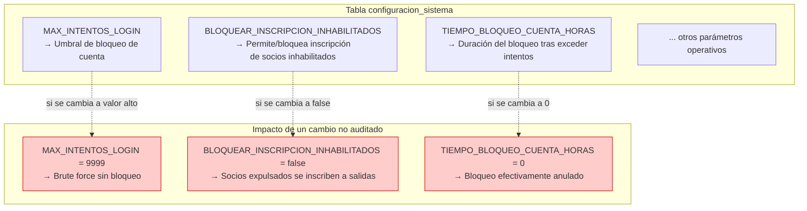
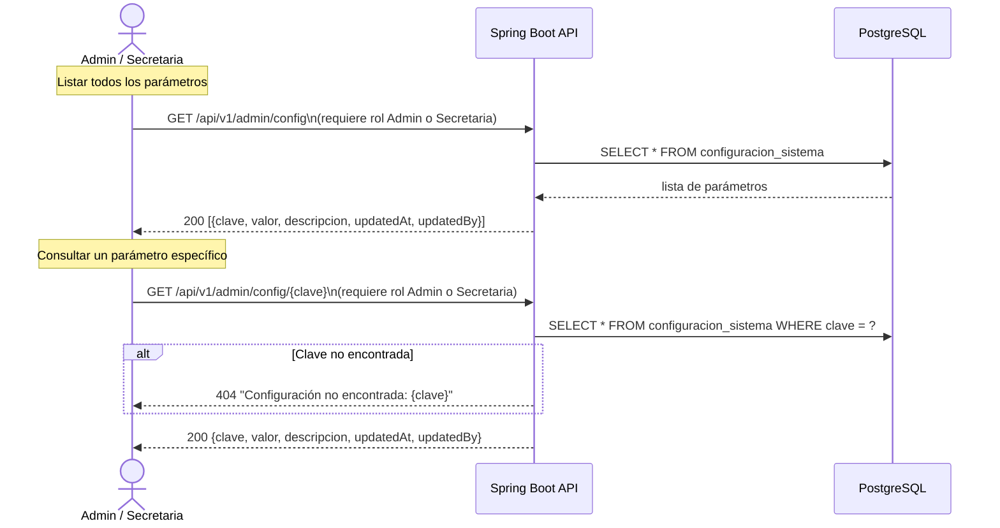
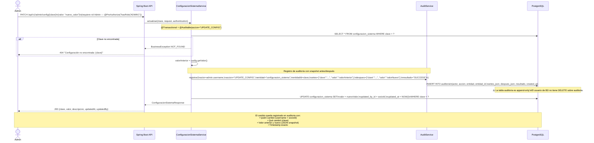
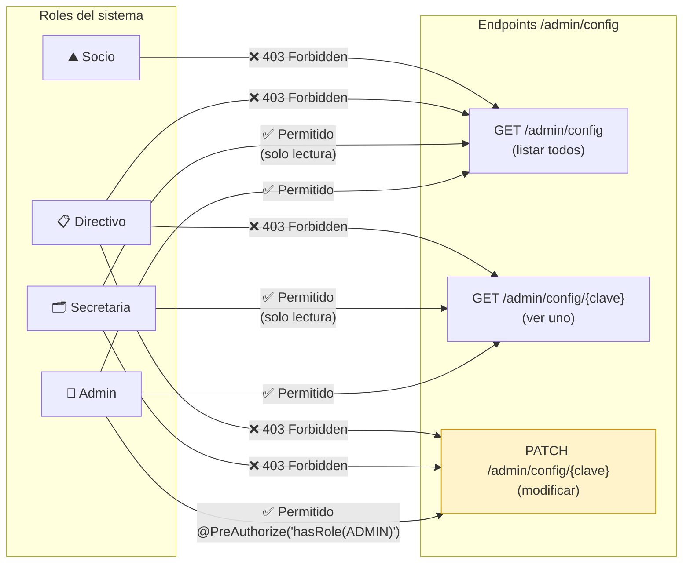

# Diagrama 07 — Gestión de Configuración del Sistema

## Parámetros de Configuración y su Impacto de Seguridad



---

## Flujo: Consulta de Configuración (Admin / Secretaria)



---

## Flujo: Actualización de Configuración (solo Admin) — Auditado



---

## Control de Acceso por Rol



---

## Registro en Auditoría — Formato del Snapshot

```mermaid
flowchart TD
    CHANGE["PATCH /admin/config/MAX_INTENTOS_LOGIN\n{valor: '5'}"]

    CHANGE --> SNAP["Snapshot generado por ConfiguracionSistemaService"]

    SNAP --> ANTES["antes_json:\n{\"clave\": \"MAX_INTENTOS_LOGIN\",\n\"valor\": \"3\"}"]
    SNAP --> DESPUES["despues_json:\n{\"clave\": \"MAX_INTENTOS_LOGIN\",\n\"valor\": \"5\"}"]

    ANTES & DESPUES --> ROW["INSERT auditoria {\n  actor: 'admin',\n  accion: 'UPDATE_CONFIG',\n  entidad: 'configuracion_sistema',\n  entidad_id: 'MAX_INTENTOS_LOGIN',\n  antes_json: '{...}',\n  despues_json: '{...}',\n  resultado: 'SUCCESS',\n  created_at: '2026-04-17T18:30:00'\n}"]
```
