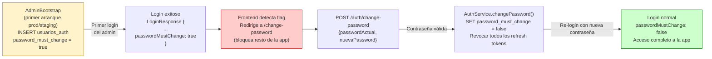
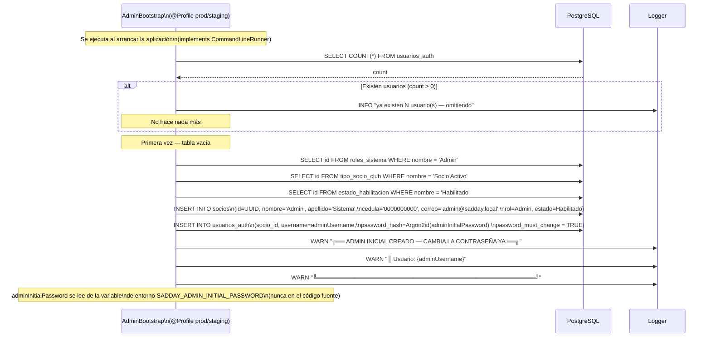
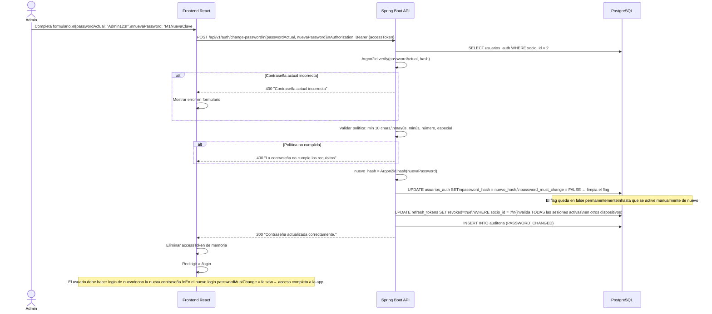
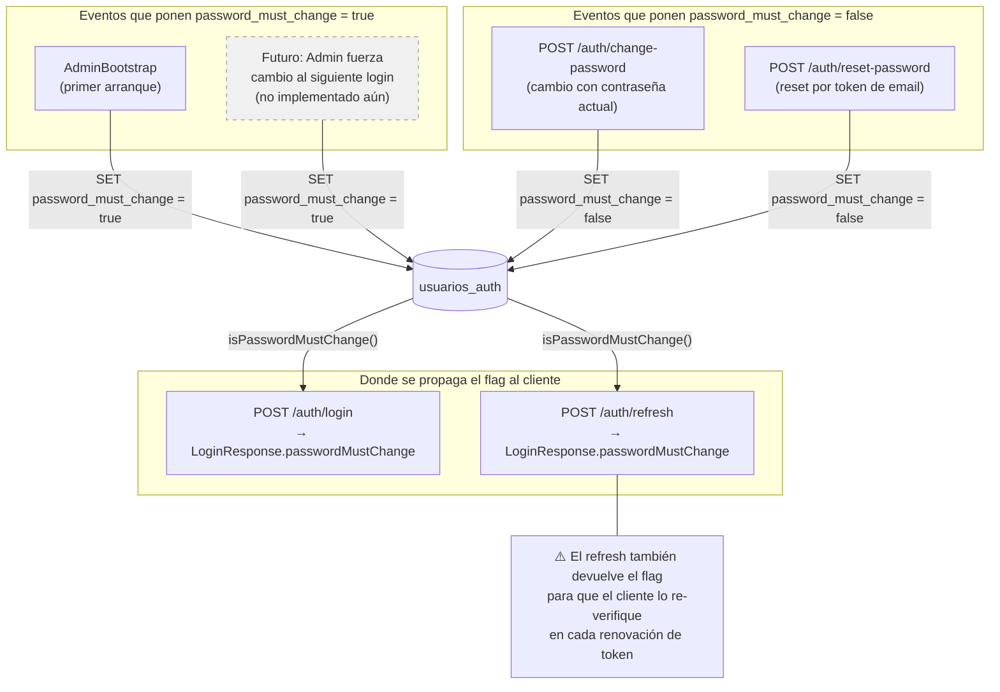

# Diagrama 08 — Ciclo password_must_change

## Visión General del Ciclo



---

## Flujo Detallado: Primer Login del Admin (AdminBootstrap)



---

## Flujo Detallado: Login con password_must_change = true

```mermaid
sequenceDiagram
    actor ADM as Admin (primer login)
    participant API as Spring Boot API
    participant DB as PostgreSQL
    participant FE as Frontend React

    ADM->>API: POST /api/v1/auth/login\n{username: "admin", password: "Admin123!"}

    API->>DB: SELECT usuarios_auth WHERE username = 'admin'
    API->>API: Argon2id.verify(password, hash) — OK
    API->>DB: UPDATE SET failed_attempts=0, last_login=NOW()
    API->>API: Generar Access Token (JWT, 15 min)
    API->>API: Generar Refresh Token
    API->>DB: INSERT refresh_tokens(...)
    API->>DB: INSERT INTO auditoria (LOGIN_SUCCESS)

    API-->>FE: 200 {\n  accessToken: "eyJ...",\n  tokenType: "Bearer",\n  expiresIn: 900,\n  socioId: "uuid...",\n  username: "admin",\n  nombre: "Admin Sistema",\n  rol: "Admin",\n  nivelTecnico: null,\n  passwordMustChange: true   ← flag\n}
    Note over API,FE: Set-Cookie: refresh_token=...; HttpOnly; Secure

    FE->>FE: Guardar accessToken en memoria
    FE->>FE: Verificar passwordMustChange === true

    alt passwordMustChange === true
        FE->>FE: Redirigir a /change-password\n⚠️ Bloquear navegación a otras rutas\nhasta que se cambie la contraseña
        Note over FE: El access token es válido para hacer\nla petición de cambio de contraseña.\nPero la UI no debe permitir otras acciones.
    end
```

---

## Flujo Detallado: Cambio de Contraseña y Limpieza del Flag



---

## Otros Eventos que Activan password_must_change


