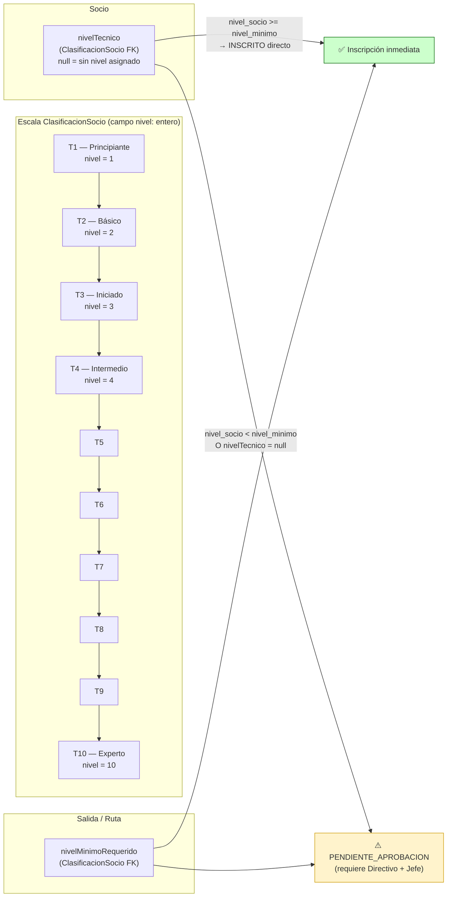
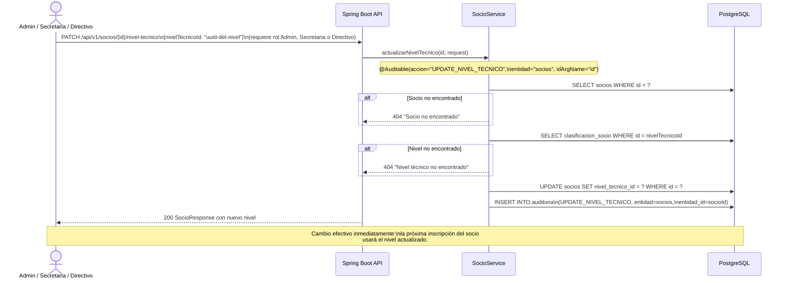
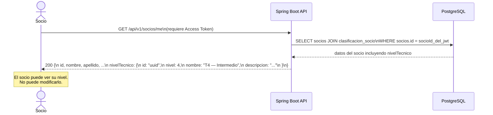
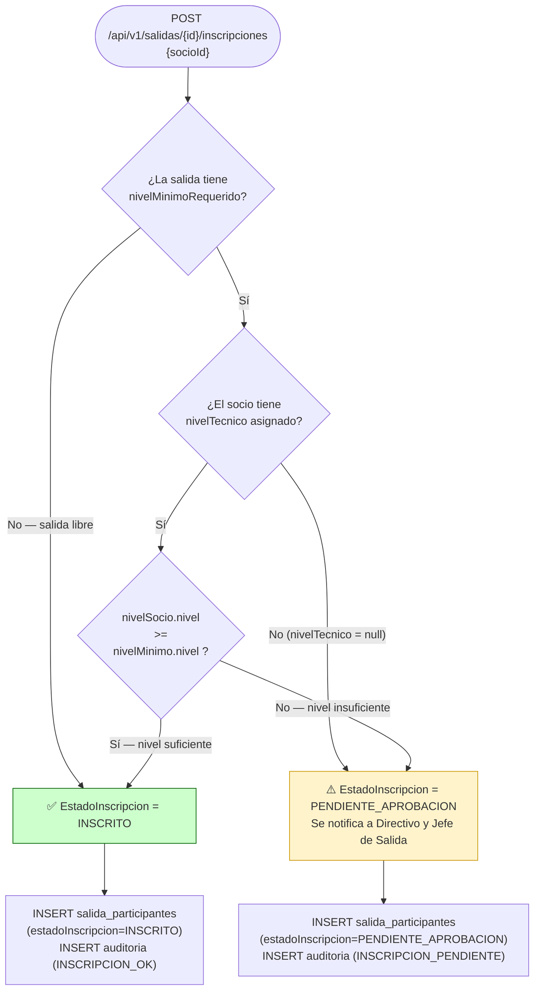
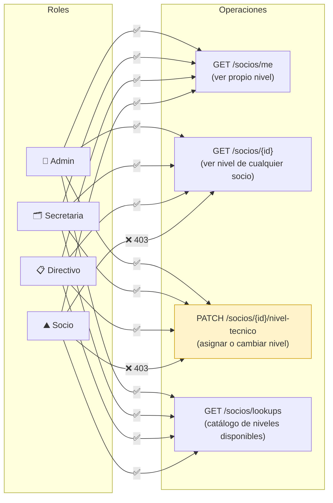

# Diagrama 09 — Gestión de Nivel Técnico y Control de Acceso a Rutas

## Estructura de Clasificación Técnica

---

## Flujo: Asignación / Actualización de Nivel Técnico

---

## Flujo: Consulta de Nivel por el Propio Socio

---

## Flujo: Validación de Nivel en Inscripción a Salida

---

## Control de Acceso por Rol — Nivel Técnico

