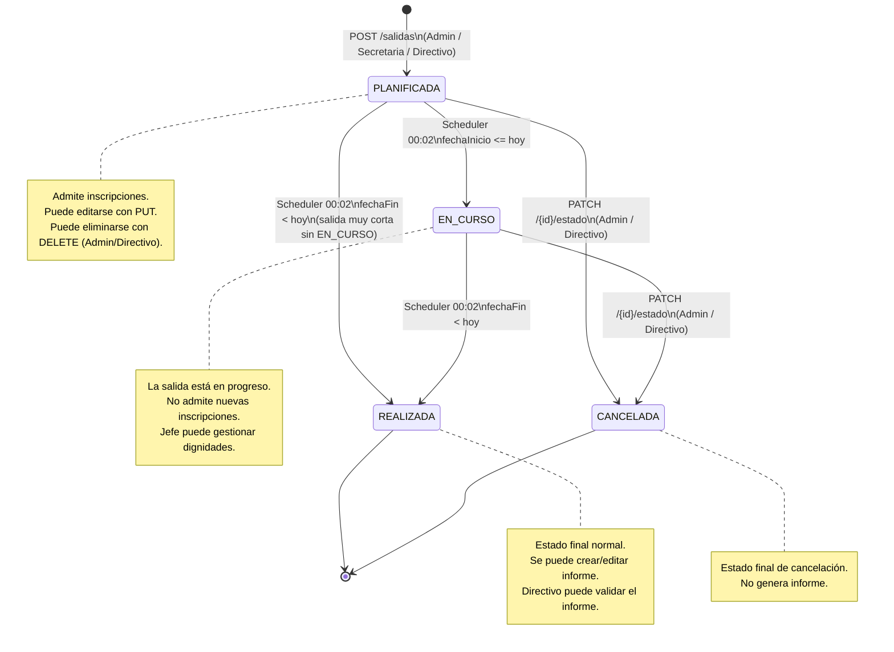
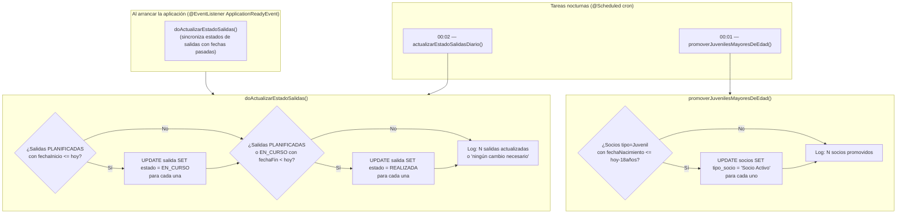
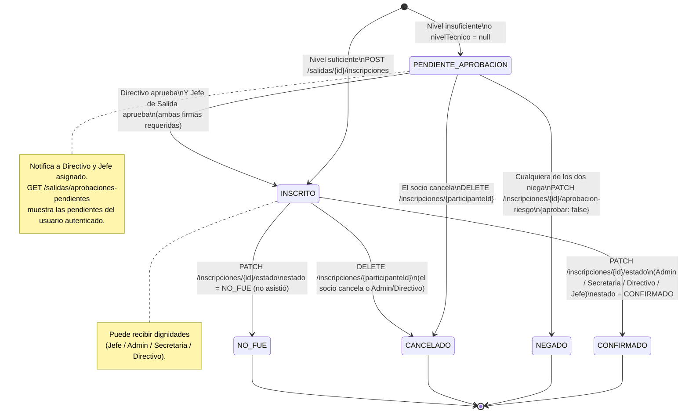
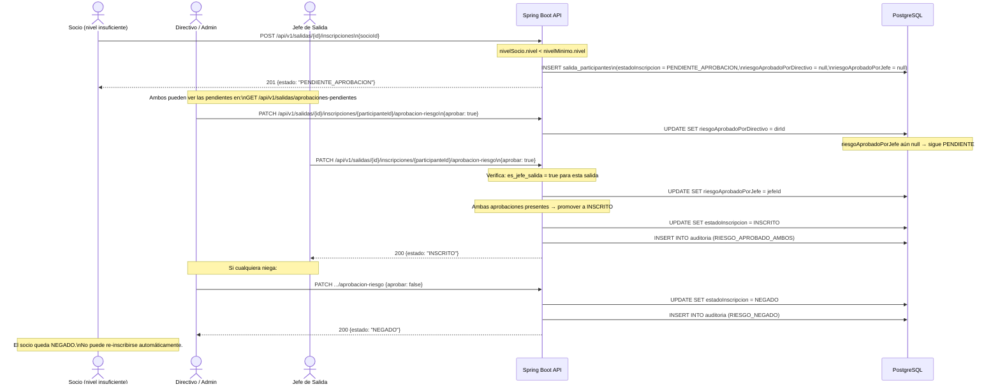

# Diagrama 10 — Ciclo de Vida de Salidas y Estados de Inscripción

## Máquina de Estados — Salida

---

## Scheduler — Transiciones Automáticas y Promoción de Juveniles

---

## Máquina de Estados — Inscripción de Participante

---

## Flujo de Aprobación de Riesgo (Doble Firma)

---

## Control de Acceso por Rol — Operaciones de Salida

```mermaid
flowchart TD
    subgraph CREAR["Crear / Editar salida"]
        C1["POST /salidas\nPUT /salidas/{id}"]
        C2["Admin / Secretaria / Directivo"]
        C1 --- C2
    end

    subgraph ESTADO["Cambiar estado manual"]
        E1["PATCH /salidas/{id}/estado"]
        E2["Admin / Directivo"]
        E1 --- E2
    end

    subgraph INSCRIBIR["Inscribir participantes"]
        I1["POST /salidas/{id}/inscripciones"]
        I2["Cualquier autenticado\n(solo se puede inscribir a sí mismo\nsalvo Admin/Secretaria/Directivo)"]
        I1 --- I2
    end

    subgraph RIESGO["Aprobar/negar riesgo"]
        R1["PATCH /inscripciones/{id}/aprobacion-riesgo"]
        R2["Directivo/Admin\nO Jefe de Salida de esa salida"]
        R1 --- R2
    end

    subgraph JEFE["Designar Jefe de Salida"]
        J1["PATCH /inscripciones/{id}/jefe"]
        J2["Admin / Secretaria / Directivo"]
        J1 --- J2
    end

    subgraph CERRAR["Abrir/cerrar inscripciones"]
        CL1["PATCH /salidas/{id}/cerrar-inscripciones"]
        CL2["Jefe de Salida\nO Admin / Directivo"]
        CL1 --- CL2
    end

    style RIESGO fill:#fff3cc,stroke:#cc9900
    style ESTADO fill:#fff3cc,stroke:#cc9900
```

