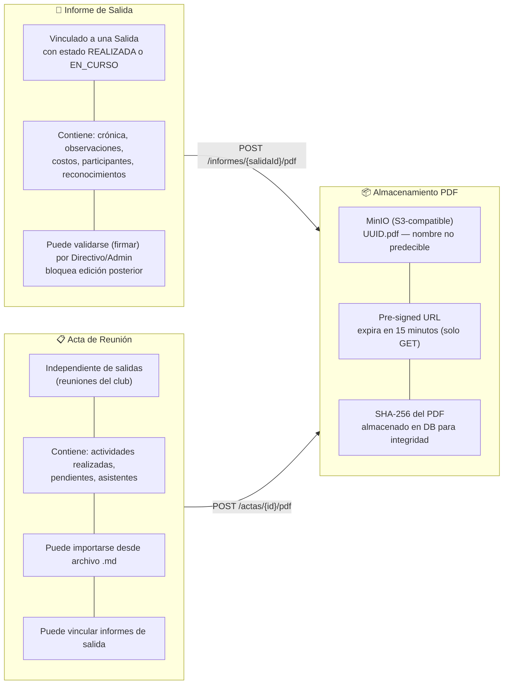
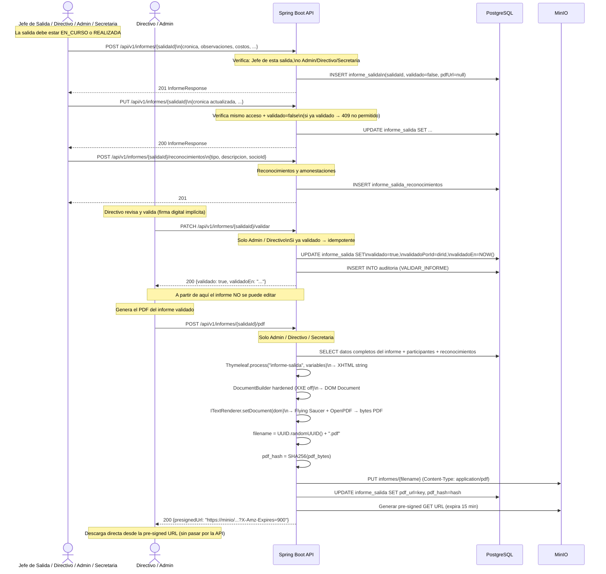
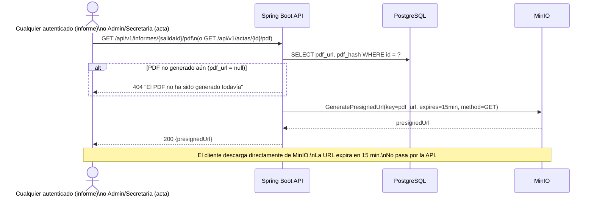
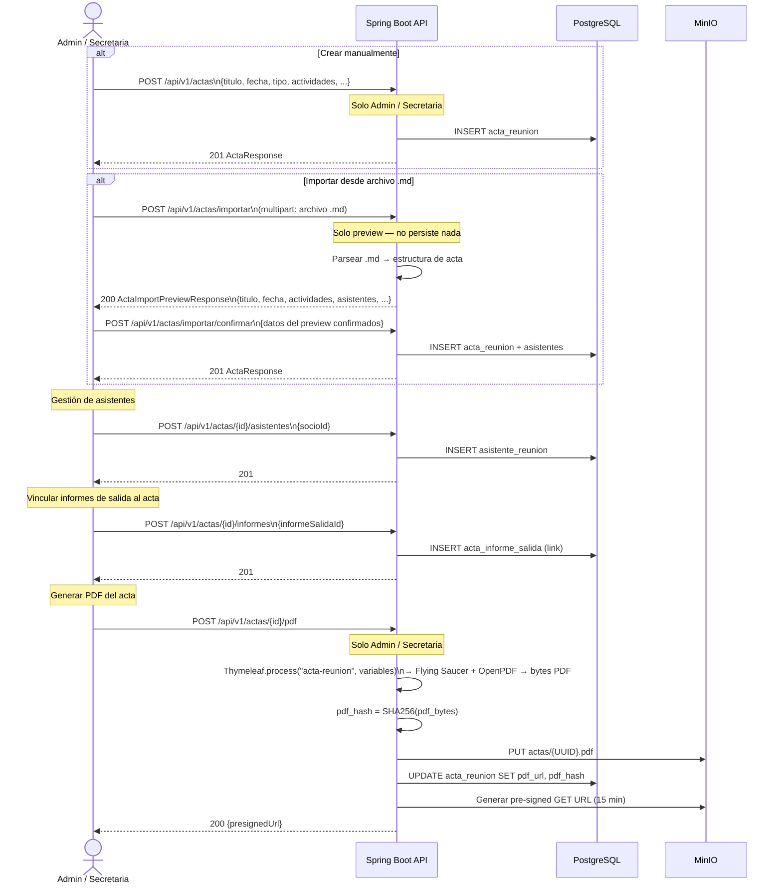
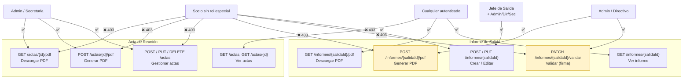
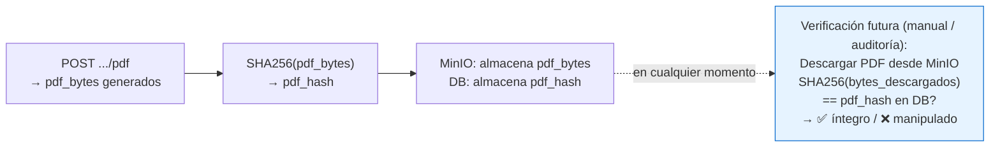

# Diagrama 11 — Documentos y Generación de PDF (Informes y Actas)

## Visión General — Tipos de Documentos

---

## Flujo Completo: Informe de Salida (Crear → Editar → Validar → PDF)

---

## Flujo: Descarga de PDF ya Generado

---

## Flujo: Acta de Reunión (con importación desde .md)

---

## Control de Acceso por Rol — Documentos

---

## Integridad del PDF — Verificación de Hash

