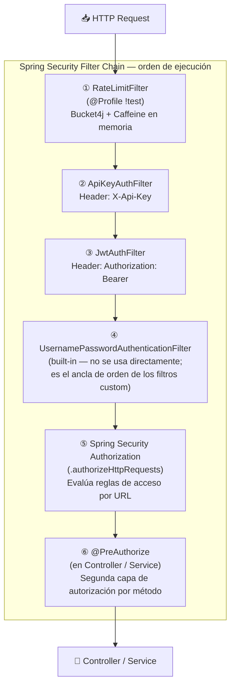
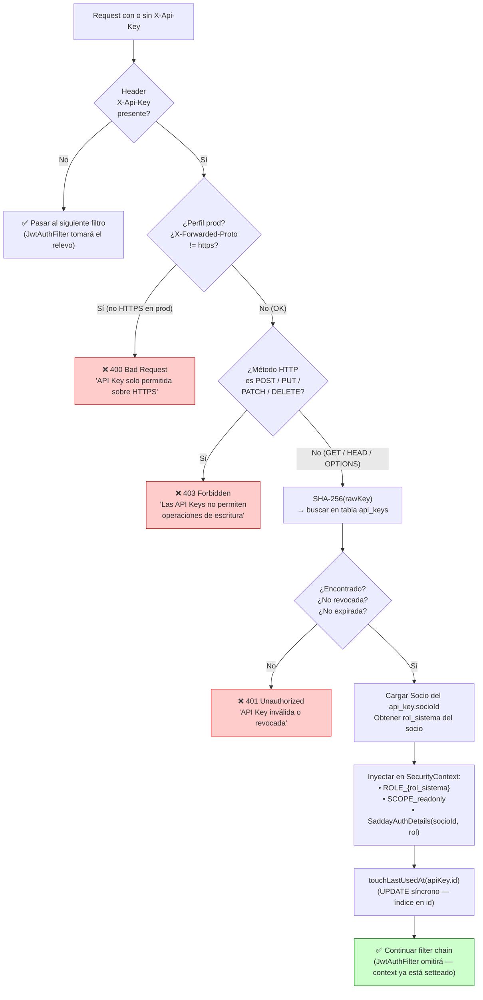
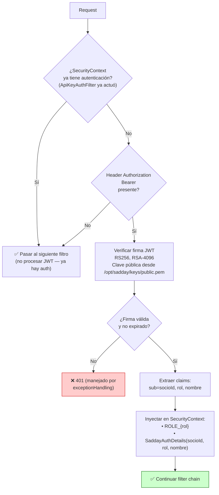
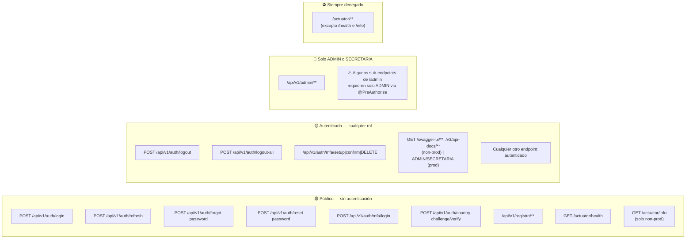

# Diagrama 12 — Cadena de Filtros Spring Security

## Orden de Ejecución



---

## ① RateLimitFilter — Límites por Endpoint y por IP

Solo actúa sobre los endpoints listados. El resto de requests pasa sin consumir ningún token.

```mermaid
flowchart TD
    IN["Request entrante"] --> MATCH{"¿El endpoint\nestá en la lista?"}

    MATCH -->|"No"| PASS["✅ Pasar al siguiente filtro\n(sin consumir tokens)"]

    MATCH -->|"POST /auth/login"| B1["Bucket: 10 req / 1 min por IP"]
    MATCH -->|"POST /auth/forgot-password"| B2["Bucket: 5 req / 5 min por IP"]
    MATCH -->|"POST /auth/reset-password"| B3["Bucket: 5 req / 5 min por IP"]
    MATCH -->|"POST /auth/refresh"| B4["Bucket: 60 req / 1 min por IP"]
    MATCH -->|"POST /registro/complete"| B5["Bucket: 10 req / 10 min por IP"]
    MATCH -->|"GET /registro/token-info"| B6["Bucket: 10 req / 10 min por IP"]

    B1 & B2 & B3 & B4 & B5 & B6 --> CONSUME{"tryConsume(1)\n¿Token disponible?"}

    CONSUME -->|"Sí"| PASS
    CONSUME -->|"No"| R429["❌ 429 Too Many Requests\n{\"message\": \"Demasiados intentos...\"}"]

    style R429 fill:#ffcccc,stroke:#cc0000
    style PASS fill:#ccffcc,stroke:#006600
```

**Implementación:** Caffeine cache (max 10.000 IPs por tipo de endpoint, expiración tras 30 min de inactividad). En producción multi-instancia debe reemplazarse con Redis + Bucket4j distribuido.

---

## ② ApiKeyAuthFilter — Autenticación por X-Api-Key



---

## ③ JwtAuthFilter — Autenticación por Bearer Token



---

## Reglas de Autorización por URL (Spring Security)



---

## Resumen del Contexto de Seguridad según método de autenticación

| Autenticación | Authorities inyectadas | Puede escribir (POST/PUT/PATCH/DELETE) |
|---|---|---|
| JWT válido | `ROLE_{rol}` | ✓ (según @PreAuthorize) |
| API Key válida | `ROLE_{rol}` + `SCOPE_readonly` | ✗ (403 en el filtro) |
| Sin autenticación en endpoint público | Ninguna | Solo endpoints `permitAll()` |
| Sin autenticación en endpoint protegido | — | ✗ 401 |
