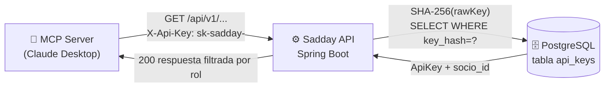
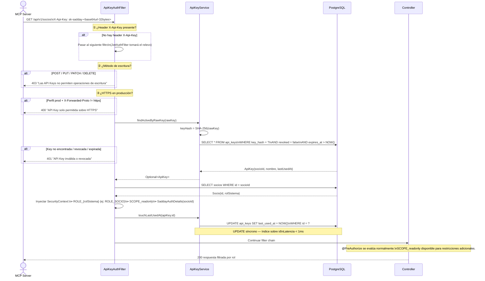
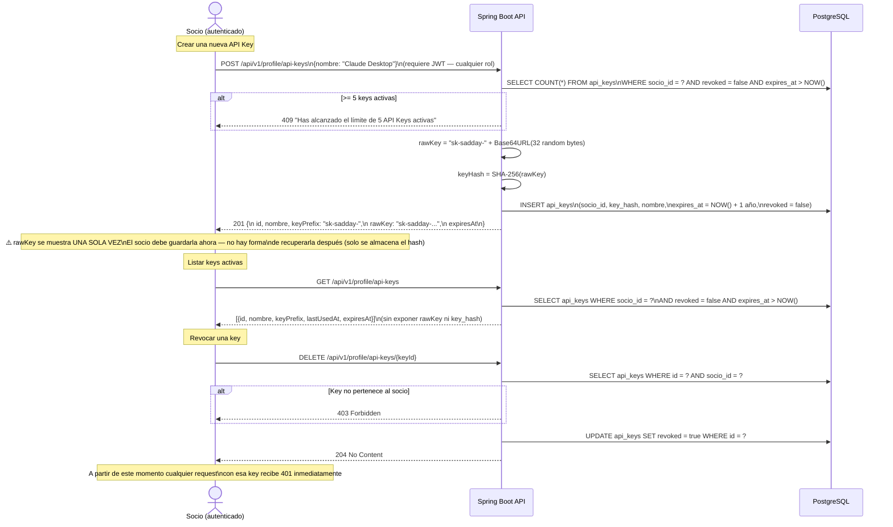
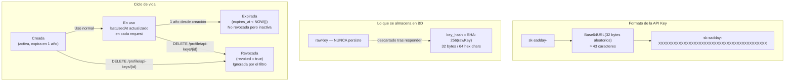
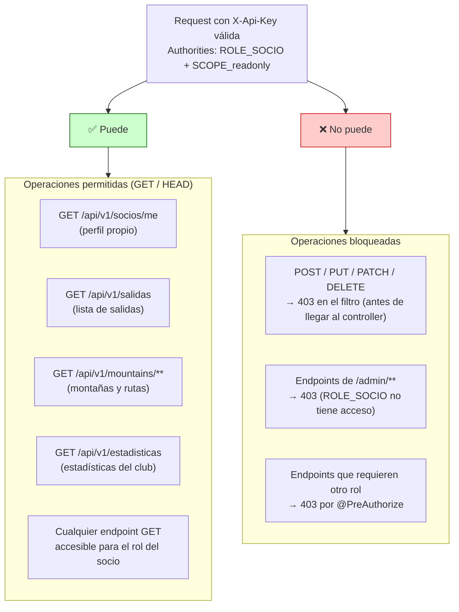

# Diagrama 13 — Flujo de API Keys (MCP Server)

## Propósito y Contexto

Las API Keys permiten que el MCP server acceda a la API de Sadday en nombre de un socio, sin exponer credenciales de usuario. Son de solo lectura — ninguna operación de escritura está permitida con este mecanismo.

---

## Flujo Completo: Request Autenticado con API Key

---

## Gestión de API Keys (CRUD desde la app web)

---

## Formato y Ciclo de Vida de la Key

---

## Control de Acceso — Qué puede y qué no puede hacer una API Key

