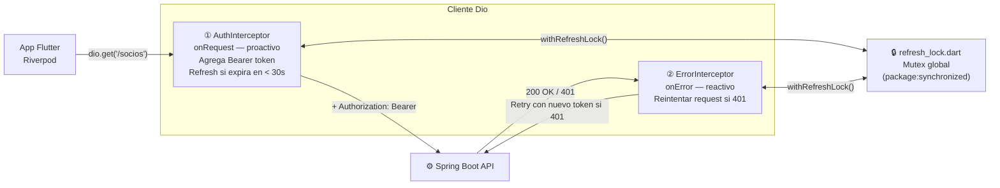
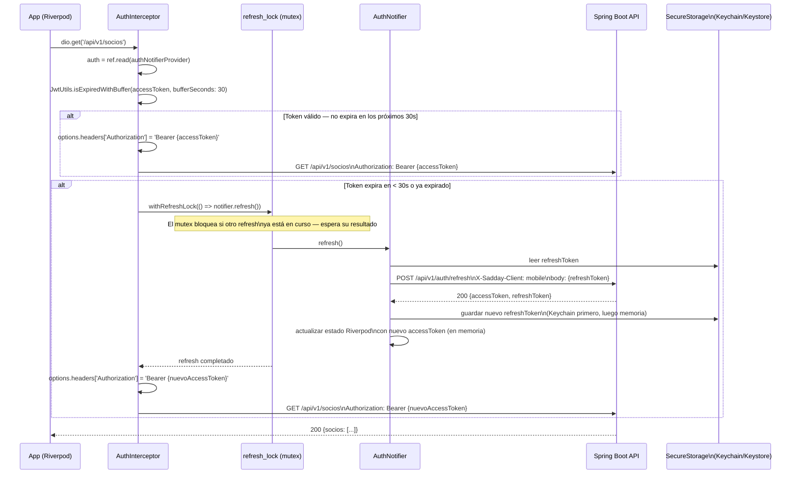
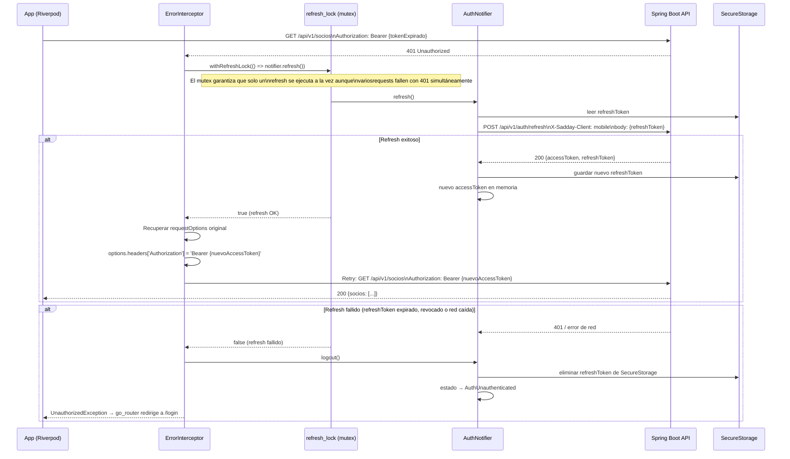
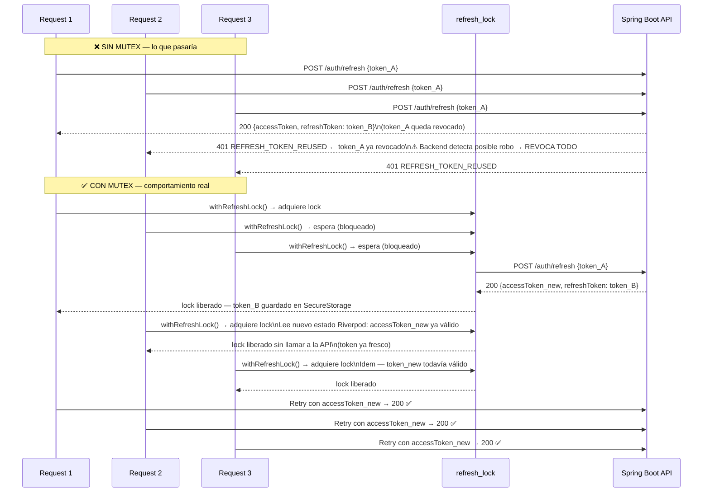
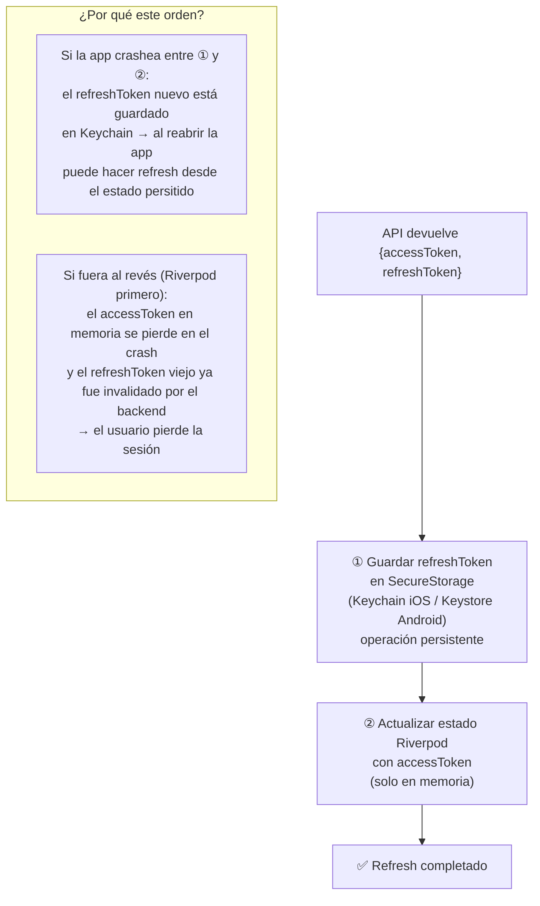

# Diagrama 14 — Flujo de Refresh Token Mobile y Mutex de Concurrencia

## Arquitectura de Interceptores

La app Flutter usa dos interceptores Dio en serie. Cada uno tiene un rol distinto:

---

## Flujo Proactivo — AuthInterceptor (onRequest)

Se ejecuta **antes** de cada request. Si el access token expira en los próximos 30 segundos, hace el refresh antes de enviar la petición.

---

## Flujo Reactivo — ErrorInterceptor (onError)

Se ejecuta **después** de recibir una respuesta de error. Si recibe un 401, intenta refrescar el token y reintentar el request original.

---

## El Mutex — Por Qué es Necesario

Sin mutex, 3 requests paralelos que reciben 401 simultáneamente dispararían 3 refresh en paralelo. El backend rota el refresh token en cada refresh: el segundo refresh usa un token ya inválido (el primero lo rotó) y el backend lo detecta como robo de token, revocando **todas las sesiones** del usuario.

---

## Orden de Guardado del Token — Crash Safety

El orden importa para evitar pérdida de sesión si la app se cierra entre operaciones:

---

## Referencia de Archivos

| Archivo | Rol |
|---|---|
| `mobile/lib/core/api/refresh_lock.dart` | Mutex global (`Lock` de `package:synchronized`) |
| `mobile/lib/core/api/interceptors/auth_interceptor.dart` | Interceptor proactivo — refresh antes de que expire |
| `mobile/lib/core/api/interceptors/error_interceptor.dart` | Interceptor reactivo — retry tras 401 |
| `mobile/lib/core/auth/auth_provider.dart` | `AuthNotifier.refresh()` — llama al backend y actualiza estado |
| `mobile/lib/core/auth/jwt_utils.dart` | `isExpiredWithBuffer(token, bufferSeconds: 30)` |
