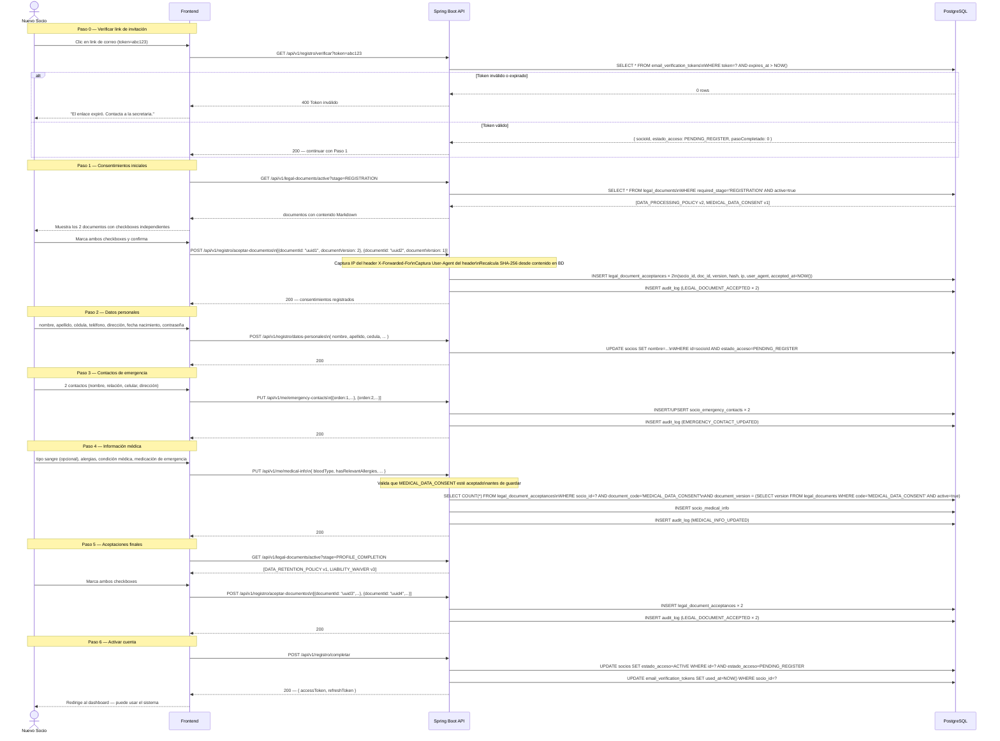
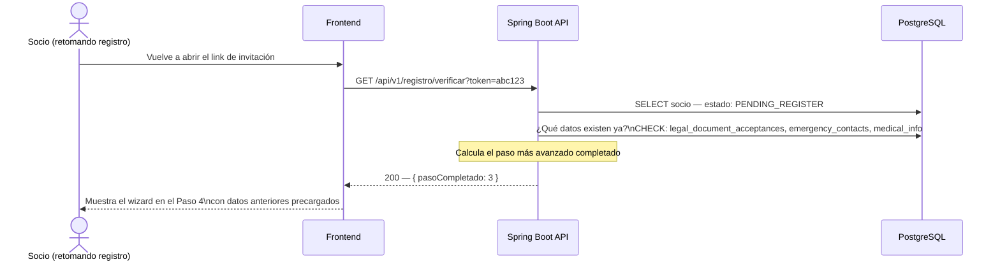

# Diagrama 15 — Flujo de Registro Multi-paso con Documentos Legales

## Flujo Completo de Registro (6 pasos)

```mermaid
sequenceDiagram
    actor SOC as Nuevo Socio
    participant FE as Frontend
    participant API as Spring Boot API
    participant DB as PostgreSQL

    Note over SOC,FE: Paso 0 — Verificar link de invitación
    SOC->>FE: Clic en link de correo (token=abc123)
    FE->>API: GET /api/v1/registro/verificar?token=abc123
    API->>DB: SELECT * FROM email_verification_tokens\nWHERE token=? AND expires_at > NOW()
    alt Token inválido o expirado
        DB-->>API: 0 rows
        API-->>FE: 400 Token inválido
        FE-->>SOC: "El enlace expiró. Contacta a la secretaria."
    else Token válido
        DB-->>API: { socioId, estado_acceso: PENDING_REGISTER, pasoCompletado: 0 }
        API-->>FE: 200 — continuar con Paso 1
    end

    Note over SOC,FE: Paso 1 — Consentimientos iniciales
    FE->>API: GET /api/v1/legal-documents/active?stage=REGISTRATION
    API->>DB: SELECT * FROM legal_documents\nWHERE required_stage='REGISTRATION' AND active=true
    DB-->>API: [DATA_PROCESSING_POLICY v2, MEDICAL_DATA_CONSENT v1]
    API-->>FE: documentos con contenido Markdown

    FE-->>SOC: Muestra los 2 documentos con checkboxes independientes
    SOC->>FE: Marca ambos checkboxes y confirma

    FE->>API: POST /api/v1/registro/aceptar-documentos\n[{documentId: "uuid1", documentVersion: 2}, {documentId: "uuid2", documentVersion: 1}]
    Note over API: Captura IP del header X-Forwarded-For\nCaptura User-Agent del header\nRecalcula SHA-256 desde contenido en BD
    API->>DB: INSERT legal_document_acceptances × 2\n(socio_id, doc_id, version, hash, ip, user_agent, accepted_at=NOW())
    API->>DB: INSERT audit_log (LEGAL_DOCUMENT_ACCEPTED × 2)
    API-->>FE: 200 — consentimientos registrados

    Note over SOC,FE: Paso 2 — Datos personales
    SOC->>FE: nombre, apellido, cédula, teléfono, dirección, fecha nacimiento, contraseña
    FE->>API: POST /api/v1/registro/datos-personales\n{ nombre, apellido, cedula, ... }
    API->>DB: UPDATE socios SET nombre=...\nWHERE id=socioId AND estado_acceso=PENDING_REGISTER
    API-->>FE: 200

    Note over SOC,FE: Paso 3 — Contactos de emergencia
    SOC->>FE: 2 contactos (nombre, relación, celular, dirección)
    FE->>API: PUT /api/v1/me/emergency-contacts\n[{orden:1,...}, {orden:2,...}]
    API->>DB: INSERT/UPSERT socio_emergency_contacts × 2
    API->>DB: INSERT audit_log (EMERGENCY_CONTACT_UPDATED)
    API-->>FE: 200

    Note over SOC,FE: Paso 4 — Información médica
    SOC->>FE: tipo sangre (opcional), alergias, condición médica, medicación de emergencia
    FE->>API: PUT /api/v1/me/medical-info\n{ bloodType, hasRelevantAllergies, ... }
    Note over API: Valida que MEDICAL_DATA_CONSENT esté aceptado\nantes de guardar
    API->>DB: SELECT COUNT(*) FROM legal_document_acceptances\nWHERE socio_id=? AND document_code='MEDICAL_DATA_CONSENT'\nAND document_version = (SELECT version FROM legal_documents WHERE code='MEDICAL_DATA_CONSENT' AND active=true)
    API->>DB: INSERT socio_medical_info
    API->>DB: INSERT audit_log (MEDICAL_INFO_UPDATED)
    API-->>FE: 200

    Note over SOC,FE: Paso 5 — Aceptaciones finales
    FE->>API: GET /api/v1/legal-documents/active?stage=PROFILE_COMPLETION
    API-->>FE: [DATA_RETENTION_POLICY v1, LIABILITY_WAIVER v3]
    SOC->>FE: Marca ambos checkboxes
    FE->>API: POST /api/v1/registro/aceptar-documentos\n[{documentId: "uuid3",...}, {documentId: "uuid4",...}]
    API->>DB: INSERT legal_document_acceptances × 2
    API->>DB: INSERT audit_log (LEGAL_DOCUMENT_ACCEPTED × 2)
    API-->>FE: 200

    Note over SOC,FE: Paso 6 — Activar cuenta
    FE->>API: POST /api/v1/registro/completar
    API->>DB: UPDATE socios SET estado_acceso=ACTIVE WHERE id=? AND estado_acceso=PENDING_REGISTER
    API->>DB: UPDATE email_verification_tokens SET used_at=NOW() WHERE socio_id=?
    API-->>FE: 200 — { accessToken, refreshToken }
    FE-->>SOC: Redirige al dashboard — puede usar el sistema
```

---

## Reanudación del registro

```mermaid
sequenceDiagram
    actor SOC as Socio (retomando registro)
    participant FE as Frontend
    participant API as Spring Boot API
    participant DB as PostgreSQL

    SOC->>FE: Vuelve a abrir el link de invitación
    FE->>API: GET /api/v1/registro/verificar?token=abc123
    API->>DB: SELECT socio — estado: PENDING_REGISTER
    API->>DB: ¿Qué datos existen ya?\nCHECK: legal_document_acceptances, emergency_contacts, medical_info
    Note over API: Calcula el paso más avanzado completado
    API-->>FE: 200 — { pasoCompletado: 3 }

    FE-->>SOC: Muestra el wizard en el Paso 4\ncon datos anteriores precargados
```
