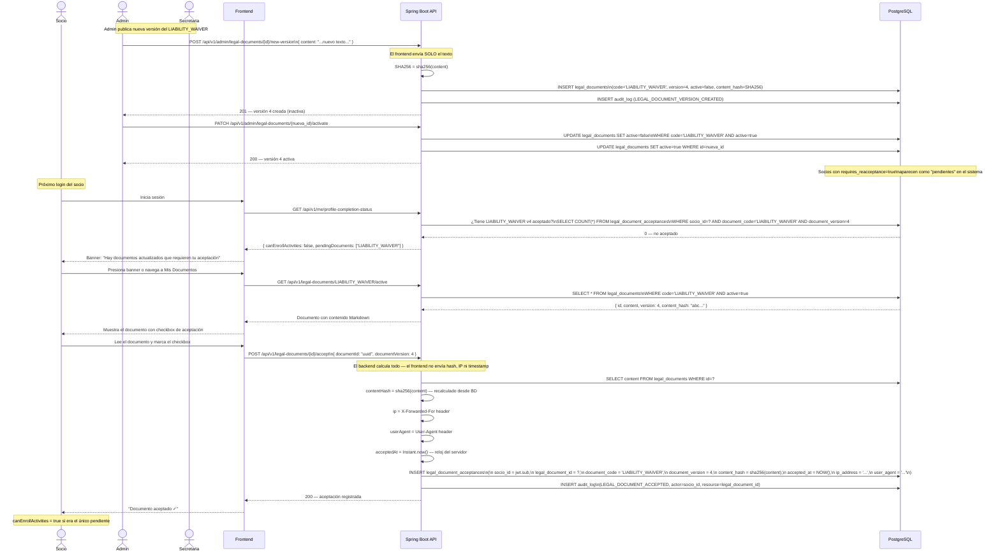
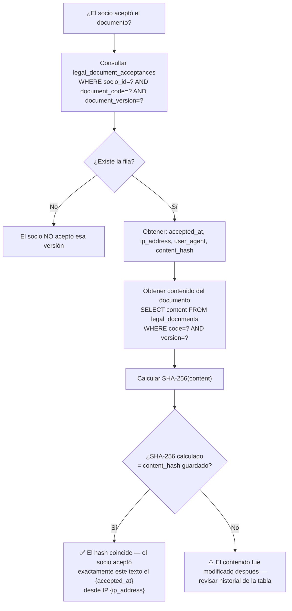

# Diagrama 16 — Aceptación de Documentos Legales y Cadena de Evidencia

## Flujo de Aceptación (socio ya registrado — nueva versión publicada)



---

## Cómo verificar una aceptación retrospectivamente



---

## Estructura de una aceptación en BD (evidencia legal)

```
legal_document_acceptances
─────────────────────────────────────────────────────────────────
id               | f3a2b1c0-...  (UUID inmutable)
socio_id         | 9e1a3d45-...  (quién aceptó)
legal_document_id| 7c8d2f11-...  (qué documento)
document_code    | LIABILITY_WAIVER
document_version | 4             (qué versión exacta)
content_hash     | a3f2e1...     (SHA-256 del texto exacto)
accepted_at      | 2026-06-07 14:23:11.834+00  (timestamp servidor)
ip_address       | 190.152.xx.xx (del request, no del frontend)
user_agent       | Mozilla/5.0 (iPhone; CPU iPhone OS 18_0...)
accepted         | true
created_at       | 2026-06-07 14:23:11.834+00
─────────────────────────────────────────────────────────────────
NOTA: Esta fila nunca se modifica ni elimina — es append-only.
```
