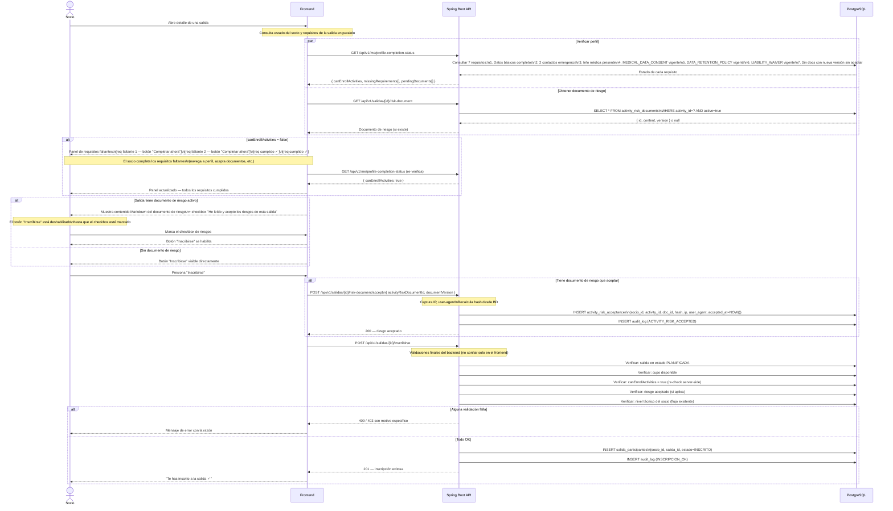
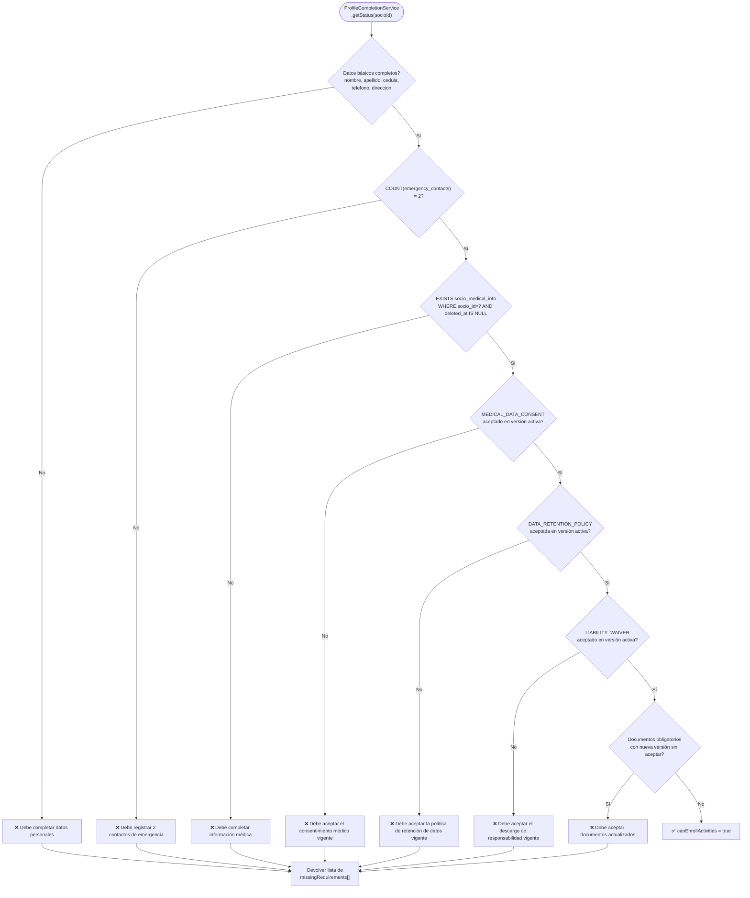

# Diagrama 17 — Inscripción a Salida con Validación de Perfil Completo y Riesgo

## Flujo Completo: Verificación de Requisitos + Aceptación de Riesgo + Inscripción

---

## Evaluación del perfil completo (lógica del backend)

