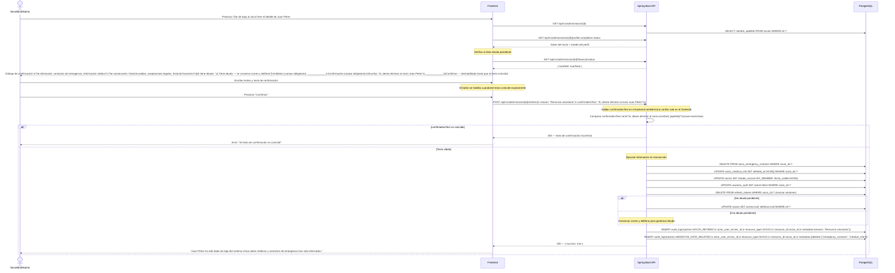
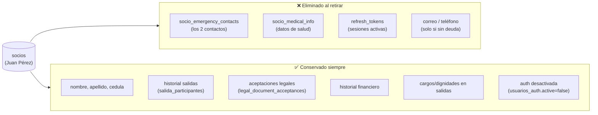
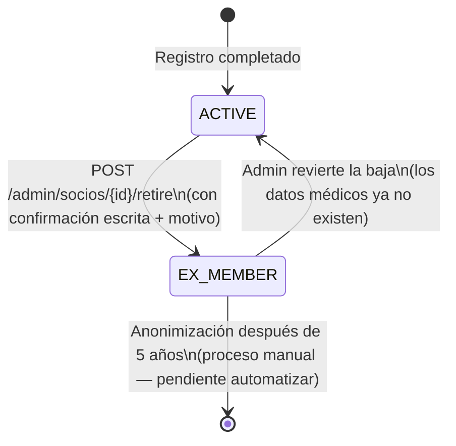

# Diagrama 18 — Flujo de Retiro de Socio y Eliminación de Datos Sensibles

## Flujo Completo: Confirmación + Eliminación + Auditoría

---

## Qué datos persisten después del retiro

---

## Estado del socio después del retiro

**Nota**: si un ex-socio es reactivado, deberá completar de nuevo su información médica y contactos de emergencia, ya que fueron eliminados al dar la baja.
